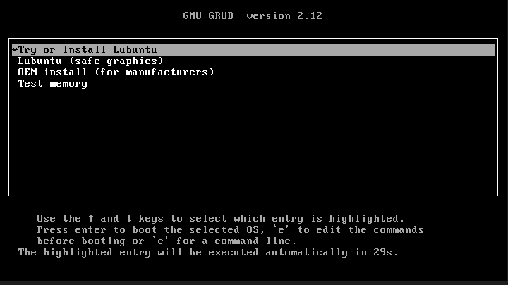
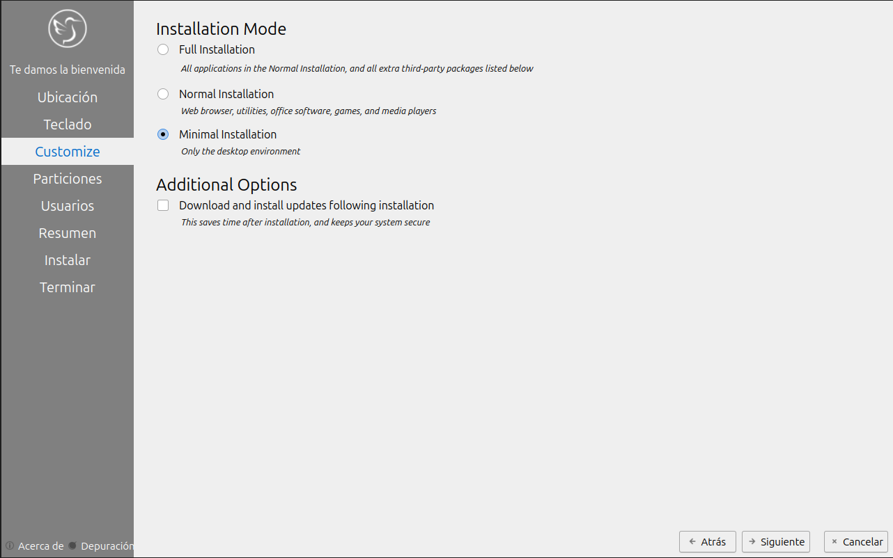
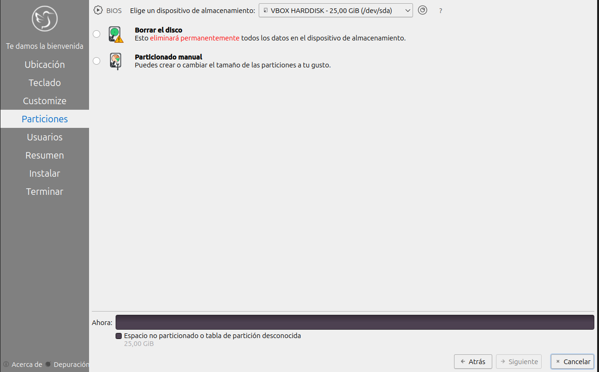
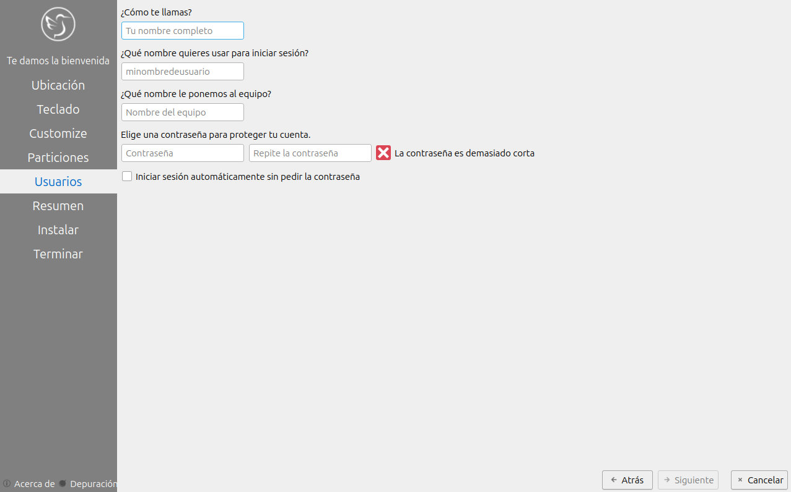
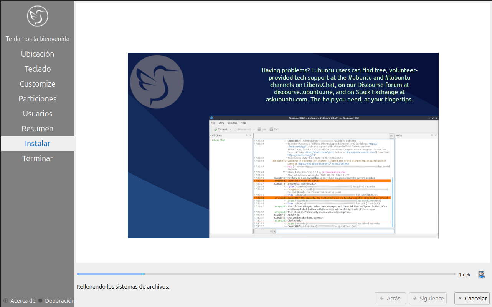
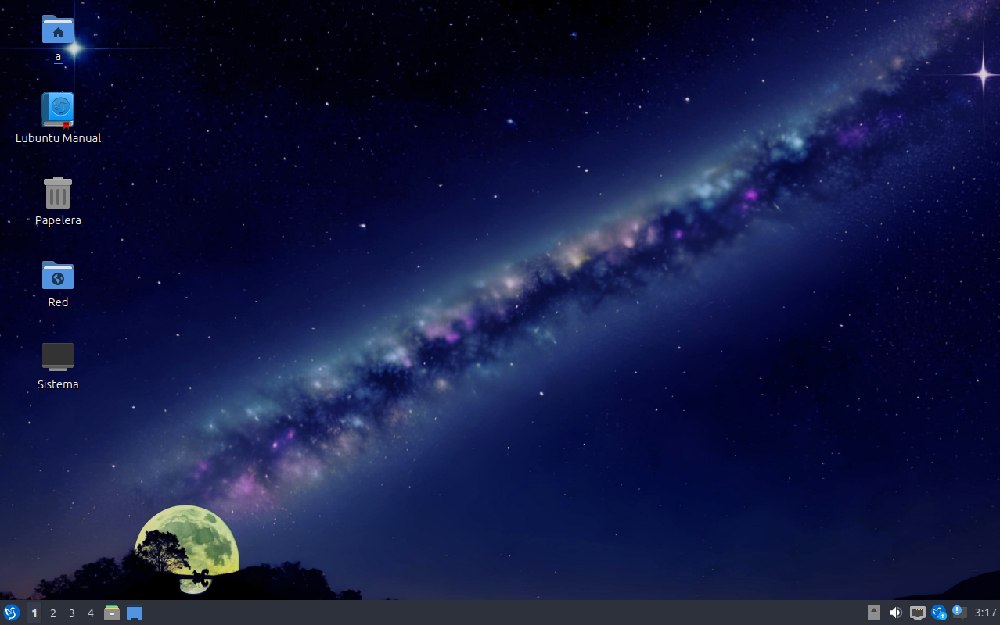

# Prueba ISO 02

## 1. Datos generales

- **Nombre de la ISO probada:** Lubuntu
- **Fecha:**  14/04/2026
- **Software de virtualización:**  Oracle VirtualBox  

## 2. Configuración de la VM

- **CPU asignada:**  2 núcleos
- **RAM asignada:**  4096 MB
- **Disco virtual:**  25 GB
- **Tipo de arranque configurado:**  BIOS Legacy
- **Otras opciones relevantes:**  Audio Predeterminado / 128 MB video memory / Controlador de almacenamiento SATA AHCI

## 3. Resultado del arranque

Aparece el menú de arranque con diferentes opciones, seleccioné la primera (try or install Lubuntu).

## 4. Resultado del instalador

Se ha iniciado el instalador, permitiendo elegir el idioma del SO y luego le das a Install Lubuntu. Te llevan a una nueva parte donde te comentan que te van ha hacer varias preguntas para configurar el Lubuntu, entre ellas tenemos: la zona horaria, tipo de teclado, tipo de instalación (full, normal o minimal), en mi caso seleccioné mínima para ir más rápido, en los ordenadores reales habría que hacer la instalación normal como mínimo. Luego te da la opción de hacer las particiones. Por último, te piden nombre y contraseña para el equipo. Cuando todo está terminado de instalar, reinicias.

## 5. Resultado final

He acabado en el escritorio, sin ningún problema.

## 6. Capturas relacionadas

## 7. Valoración

Aunque haya pasado la prueba en la máquina virtual, esto no garantiza el mismo rendimiento en el HP dc7800. La virtualización no puede replicar con exactitud el comportamiento del chipset, las limitaciones de la gráfica integrada ni la lentitud real de un disco duro mecánico.