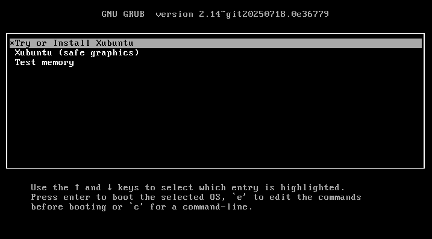
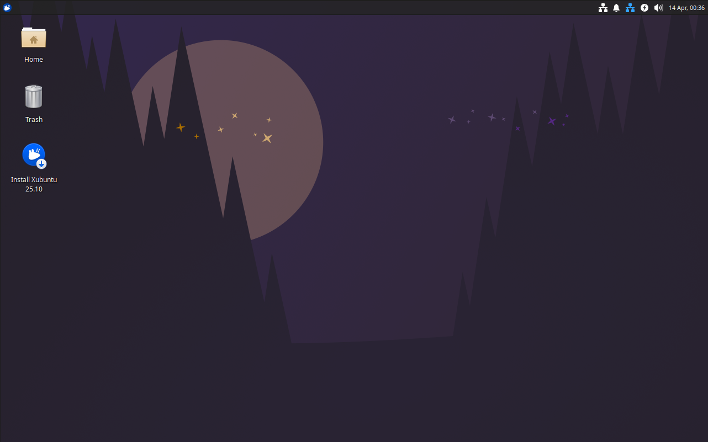
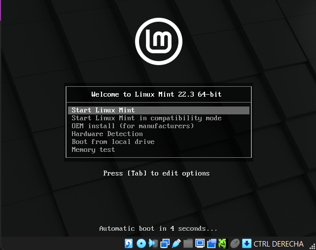
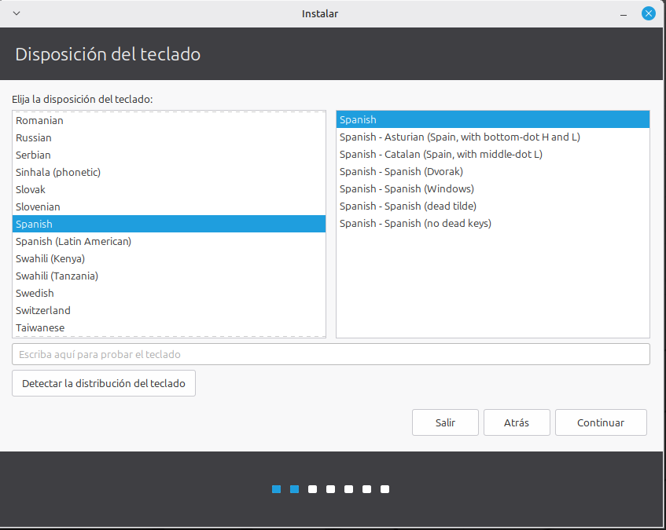
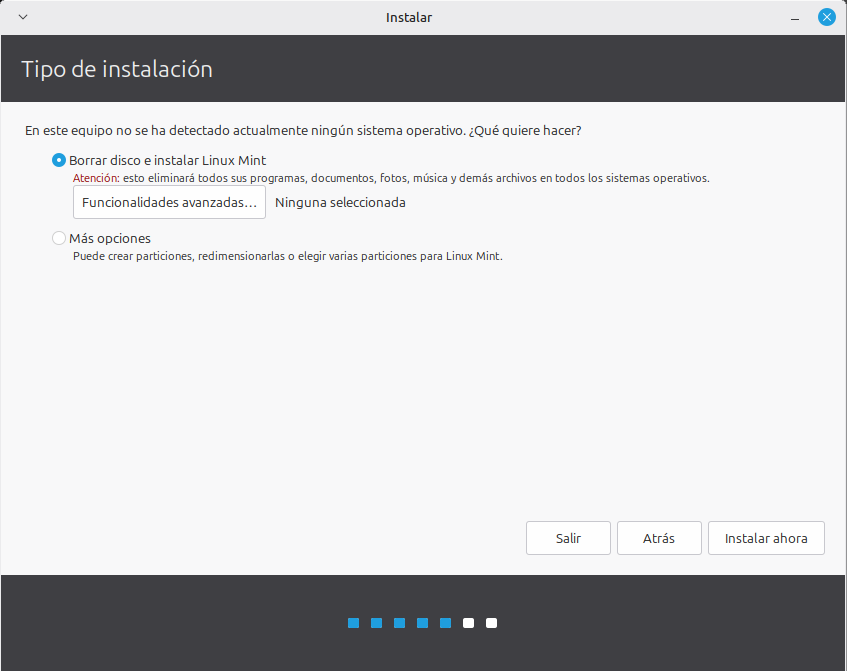
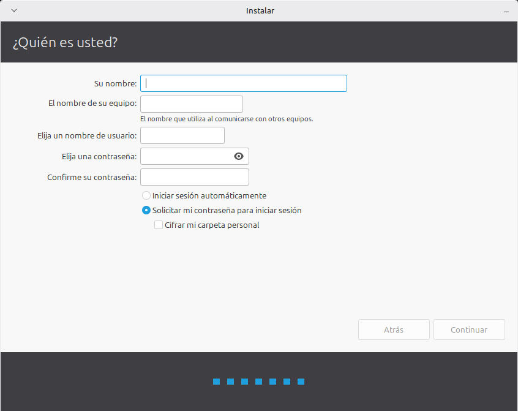
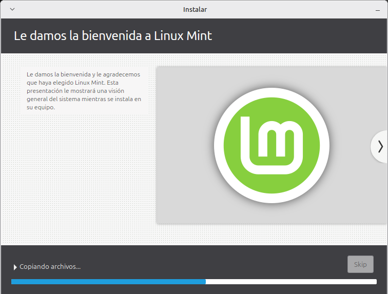
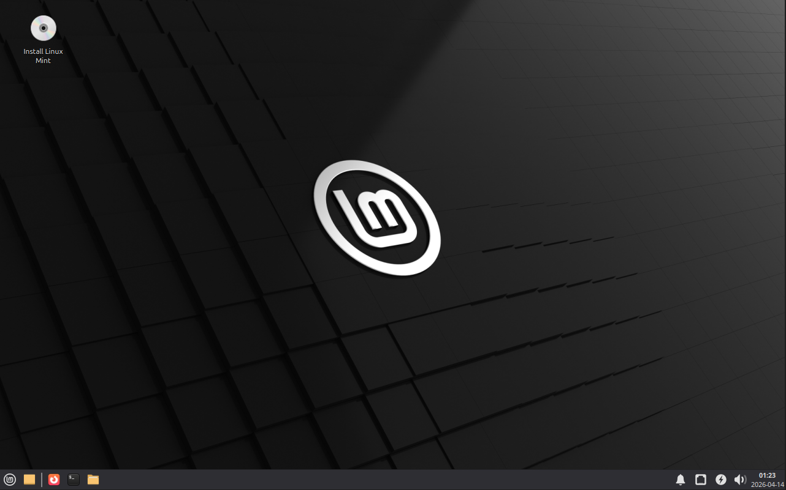

# Proyecto de FHW · RA3 · UT5

## Reto 01
# Selección de ISOs Linux ligeras para HP Compaq dc7800

**Alumno/a:**  Miguel Raposo García
**Grupo:**  1
**Curso:**  1 ASIR
**Fecha:**  14/04/2026

---

> En este reto se analiza un equipo real, se seleccionan 3 ISOs Linux adecuadas y se prueban las 3 en una máquina virtual antes de pasar al aula taller.

# Índice

1. Introducción  
2. Análisis del equipo real  
3. Selección y justificación de las 3 ISOs  
4. Configuración de la máquina virtual  
5. Pruebas realizadas con cada ISO  
6. Conclusión final y plan de instalación  
7. Bibliografía  

## 2. Introducción

En este reto se plantea una situación parecida a la de un taller técnico real: antes de instalar un sistema en un equipo antiguo, conviene preparar varias opciones y comprobarlas.

El equipo objetivo es un **HP Compaq dc7800**, un ordenador veterano que puede presentar limitaciones de hardware. Por ello, en lugar de apostar por una sola distribución, se seleccionan varias **ISOs Linux ligeras** y se validan previamente en una **máquina virtual**.

La idea es parecida a llevar tres llaves para una cerradura vieja: puede que la primera abra a la primera, puede que otra se atasque, y puede que una tercera sea la que finalmente permita trabajar sin problemas. Por eso en este reto se eligen **tres candidatas**, se comparan y se prueban.

Los objetivos concretos son:

- analizar el hardware del equipo real;
- seleccionar tres distribuciones Linux razonables;
- justificar técnicamente cada elección;
- probar las tres en una VM;
- documentar resultados con capturas;
- decidir un orden de instalación para el aula taller.

## 3. Análisis del equipo real

### 1. Identificación del equipo

- **Marca y modelo:** HP Compaq dc7800
- **Número o variante del equipo (si aparece):**  SFF
- **Ubicación o identificación en el aula:**  Grupo 1

### 2. Procesador

- **Modelo de CPU:**  Intel Core 2 Duo E6750
- **Número de núcleos (si se conoce):** 2
- **Arquitectura observada o probable:** 64 bits (x86_64) 

### 3. Memoria RAM

- **Cantidad total instalada:**  4GB
- **Tipo de memoria (si se conoce):**  DDR2 667MHz

### 4. Almacenamiento

- **Tipo de unidad (HDD/SSD):**  HDD
- **Capacidad:**  160GB
- **Observaciones:**  Conexión SATA, 3,5"

### 5. Arranque y firmware

- **¿Se ha observado BIOS o UEFI?:**  BIOS (legacy)
- **Observaciones del menú de arranque:**  Menú básico, permite seleccionar HDD, CD/DVD o USB. Puede requerir configuración manual para habilitar arranque desde USB.
- **Comentarios sobre el particionado previsto:**  Para que el sistema funcione mejor en este hardware, conviene crear solo una o dos particiones (raíz y home). Es mejor evitar ajustes complejos que puedan afectar al rendimiento.

### 6. Puertos y conectividad

- **USB disponibles:**  Varios puertos USB 2.0 (delanteros y traseros)
- **Red:**  Tarjeta Ethernet integrada + adaptador WiFi Belkin 2.4 GHz
- **Otros datos relevantes:**  Posee gráficos integrados (Intel GMA 3100). Posiblemente haya incompatibilidad de drivers WiFi en Linux.

### 7. Valoración inicial

Es un ordenador antiguo, con componentes lentos (HDD y DDR2), pero gracias a su procesador de 64 bits y una memoria RAM de 4 GB, todavía es capaz de ejecutar sistemas Linux ligeros con fluidez.

## 4. Selección de las 3 ISOs

### 4.1 Criterios usados

Me he buscado la mayor compatibildad entre el software y el hardware para que pueda ir fluido y que además tenga una interfaz agradable y sencilla.

### 4.2 Tabla comparativa

| ISO             | Versión    |         Arquitectura |             RAM mínima |                              Disco mínimo | Tamaño ISO | Ventajas                                                                                                                                                                                                                                                                                                                                                         | Inconvenientes                                                                                                                                                                          | Decisión                                 |
| ----------------- | ------------- | ---------------------: | ------------------------: | -------------------------------------------: | ------------: | ------------------------------------------------------------------------------------------------------------------------------------------------------------------------------------------------------------------------------------------------------------------------------------------------------------------------------------------------------------------ | ----------------------------------------------------------------------------------------------------------------------------------------------------------------------------------------- | ------------------------------------------- |
| Xubuntu         | 25.10       | 64-bit AMD64 / ARM64 | 1 GB (Min) / 2 GB (Rec) |                 8.6 GB (Min) / 20 GB (Rec) |     ~4.9 GB | Reduce la carga sobre el procesador y la memoria RAM. Al basarse en Ubuntu, garantiza estabilidad técnica, compatibilidad inmediata con el hardware de Intel y acceso a repositorios de software actualizados. Gracias a que mantiene X11 garantiza que la tarjeta gráfica funcione correctamente sin los problemas de compatibilidad que tendría con Wayland | Menus menos intuitivos, como con la tienda de aplicaciones.  La combinación del ecosistema Snap y el peso extra de las bibliotecas GTK exigirá demasiado al disco                | Opción intermedia para el dc7800         |
| Lubuntu         | 24.04       | 64-bit AMD64 / ARM64 | 1 GB (Min) / 2 GB (Rec) | 25 GB (Recomendación del Ecosistema Base) |     ~3.7 GB | Muy buena eficiencia térmica y de memoria. ISO muy compacta. Carencia de Wayland, lo que permite que la gráfica tenga un rendimiento superior. El entorno permitirá que el procesador vaya más rápido.                                                                                                                                                      | Imposición del ecosistema de contenedores Snap, lo que relentiza al equipo por culpa del disco duro mecanico. Ausencia de herramientas gráficas preconfiguradas para usuarios novatos | Ideal para el dc7800                      |
| Linux Mint XFCE | 22.3 (Zena) |               64-bit | 2 GB (Min) / 4 GB (Rec) |                 20 GB (Min) / 100 GB (Rec) |     ~2.8 GB | ISO muy compacta. No tiene Snap mejorando enormemente el arranque y la busqueda en ficheros. Inclusión de utilidades "X-Apps" y herramientas de sistema intuitivas y curadas por Mint. El uso nativo de X11 evita incompatibilidades con la tarjeta gráfica                                                                                                    | El sistema mantiene activos por defecto todos los "Mint Tools", lo que genera un consumo de recursos en segundo plano, por lo que no está tan pensada para rendimiento extremo         | La mejor opción para el HP Compaq dc7800 |

## Resumen de la comparación

**1. La más fuerte: Lubuntu**
Es la opción más robusta si el objetivo es maximizar la velocidad bruta. Dado al hardware del equipo, el entorno de Lubuntu es el que menos recursos consume. Además, al no tener integrardo el protocolo gráfico Wayland, y utilizar el sistema X11 es perfecto para que la gráfica integrada funcione sin colapsar.

**2. La más equilibrada: Linux Mint XFCE**
Es la opción más balanceada para este PC. Su mayor ventaja es que no usa paquetes Snap, ya que estos paquetes ralentizan mucho los tiempos de arranque y saturaría las lecturas en el disco duro mecánico. Al usar una base estable y un entorno XFCE muy familiar e intuitivo, este sería el que ofrece la mejor combinación entre bajo consumo y facilidad de uso.

**3. La opción de seguridad: Xubuntu**
Es la más segura ya que al estar en la base más moderna de Ubuntu nos permite tener los repositorios y herramientas actualizadas. Xubuntu garantiza que el servidor gráfico clásico X11 siga funcionando para no tener problemas de compatibilidad con el hardware antiguo. Es muy buena opción por su comunidad oficial de soporte y documentación, aunque el peso del ecosistema Snap la hará un poco más pesada y lenta en los tiempos de carga.

### 4.3 Ficha resumida de ISO 01

## 1. Identificación

- **Nombre de la distribución:**  Xubuntu
- **Versión:**  25.10 LTS
- **Edición o sabor:**  XFCE Ubuntu
- **Arquitectura:**  64-bit AMD64 / ARM64
- **Enlace oficial de descarga:**  https://xubuntu.org/download/

## 2. Requisitos y características

- **RAM mínima indicada por la fuente:**  1 GB
- **Espacio en disco mínimo:**  8.6 GB
- **Tipo de entorno de escritorio:**  XFCE
- **Tamaño aproximado de la ISO:**  4.9 GB

## 3. Motivos de selección

Reduce la carga sobre el procesador y la memoria RAM. Al basarse en Ubuntu, garantiza estabilidad técnica, compatibilidad inmediata con el hardware de Intel y acceso a repositorios de software actualizados. Gracias a que mantiene X11 garantiza que la tarjeta gráfica funcione correctamente sin los problemas de compatibilidad que tendría con Wayland. También es muy buena opción por su comunidad oficial de soporte y documentación.

## 4. Posibles riesgos o dudas

La combinación del ecosistema Snap y el peso extra de las bibliotecas GTK exigirá demasiado al disco

## 5. Papel dentro del plan

- [ ] Opción principal
- [ ] Alternativa
- [X] Respaldo

## 6. Fuente consultada

- **Web o documentación oficial:**  https://xubuntu.org

### 4.4 Ficha resumida de ISO 02

## 1. Identificación

- **Nombre de la distribución:**  Lubuntu
- **Versión:**  24.04.3
- **Edición o sabor:**  LXQt Desktop
- **Arquitectura:** 64-bit AMD64 / ARM64 
- **Enlace oficial de descarga:**  https://cdimage.ubuntu.com/lubuntu/releases/noble/release/

## 2. Requisitos y características

- **RAM mínima indicada por la fuente:**  1 GB
- **Espacio en disco mínimo:**  5 GB
- **Tipo de entorno de escritorio:**  LXQt
- **Tamaño aproximado de la ISO:**  3.4 GB

## 3. Motivos de selección

El entorno de Lubuntu es el que menos recursos consume. Muy buena eficiencia térmica y de memoria. ISO muy compacta. Carencia de Wayland, lo que permite que la gráfica tenga un rendimiento superior. El entorno permitirá que el procesador vaya más rápido.

## 4. Posibles riesgos o dudas

Imposición del ecosistema de contenedores Snap, lo que relentiza al equipo por culpa del disco duro mecanico. Ausencia de herramientas gráficas preconfiguradas para usuarios novatos

## 5. Papel dentro del plan

- [ ] Opción principal
- [X] Alternativa
- [ ] Respaldo

## 6. Fuente consultada

- **Web o documentación oficial:**  https://lubuntu.me

### 4.5 Ficha resumida de ISO 03

# ISO 03

## 1. Identificación

- **Nombre de la distribución:** Linux Mint XFCE
- **Versión:**  22.3 (Zena)
- **Edición o sabor:** Linux Mint XFCE Edition
- **Arquitectura:**  64-bit
- **Enlace oficial de descarga:**  https://linuxmint.com/edition.php?id=327

## 2. Requisitos y características

- **RAM mínima indicada por la fuente:** 2 GB
- **Espacio en disco mínimo:**  20 GB
- **Tipo de entorno de escritorio:**  XFCE
- **Tamaño aproximado de la ISO:** 2.9 GB

## 3. Motivos de selección

Es la opción más balanceada para este PC. Su mayor ventaja es que no usa paquetes Snap, ya que estos paquetes ralentizan mucho los tiempos de arranque y saturaría las lecturas en el disco duro mecánico. Al usar una base estable y un entorno XFCE muy familiar e intuitivo, este sería el que ofrece la mejor combinación entre bajo consumo y facilidad de uso.

## 4. Posibles riesgos o dudas

El sistema mantiene activos por defecto todos los "Mint Tools", lo que genera un consumo de recursos en segundo plano, por lo que no está tan pensada para rendimiento extremo.

## 5. Papel dentro del plan

- [X] Opción principal
- [ ] Alternativa
- [ ] Respaldo

## 6. Fuente consultada

- **Web o documentación oficial:**  https://linuxmint.com/download.php

## 5. Configuración de la máquina virtual

## Software utilizado

- **Aplicación:** Oracle VirtualBox  
- **Versión:**  7.2.4

## Configuración aplicada

- **CPU:**  2 núcleos
- **RAM:**  4096 MB
- **Disco virtual:**  25 GB
- **Controlador de almacenamiento:**  SATA AHCI
- **Red:**  NAT
- **Audio / vídeo / otros ajustes relevantes:**  Audio Predeterminado / 128 MB video memory / arranque en BIOS Legacy

## Relación con el equipo real

Explica aquí qué partes del HP Compaq dc7800 has intentado simular y qué partes no se pueden reproducir fielmente en la VM.

La memoria RAM, los núcleos del procesador, el controlador de almacenamiento y la red es igual que en el equipo real. Por otra parte, el almacenamiento es algo menor pero suficiente para la práctica.

## Observación importante

La máquina virtual sirve como **banco de pruebas previo**, pero no garantiza al 100 % el mismo comportamiento que el equipo real.

## 6. Resultados de las pruebas

### 6.1 ISO 01

## 1. Datos generales

- **Nombre de la ISO probada:** Xubuntu
- **Fecha:**  14/04/2026
- **Software de virtualización:**  Oracle VirtualBox  

## 2. Configuración de la VM

- **CPU asignada:**  2 núcleos
- **RAM asignada:**  4096 MB
- **Disco virtual:**  25 GB
- **Tipo de arranque configurado:**  BIOS Legacy
- **Otras opciones relevantes:**  Audio Predeterminado / 128 MB video memory / Controlador de almacenamiento SATA AHCI

## 3. Resultado del arranque

Aparece el menú de arranque con diferentes opciones, seleccioné la primera (try or install Xubuntu).

## 4. Resultado del instalador

Ha entrado al instalador, ha pasado un tiempo y se ha iniciado el SO.

## 5. Resultado final

He acabado en el escritorio, sin ningún problema.

## 6. Capturas relacionadas

## 7. Valoración

Aunque haya pasado la prueba en la máquina virtual, esto no garantiza el mismo rendimiento en el HP dc7800. La virtualización no puede replicar con exactitud el comportamiento del chipset, las limitaciones de la gráfica integrada ni la lentitud real de un disco duro mecánico.

### 6.2 ISO 02

## 1. Datos generales

- **Nombre de la ISO probada:** Lubuntu
- **Fecha:**  14/04/2026
- **Software de virtualización:**  Oracle VirtualBox  

## 2. Configuración de la VM

- **CPU asignada:**  2 núcleos
- **RAM asignada:**  4096 MB
- **Disco virtual:**  25 GB
- **Tipo de arranque configurado:**  BIOS Legacy
- **Otras opciones relevantes:**  Audio Predeterminado / 128 MB video memory / Controlador de almacenamiento SATA AHCI

## 3. Resultado del arranque

Aparece el menú de arranque con diferentes opciones, seleccioné la primera (try or install Lubuntu).

## 4. Resultado del instalador

Se ha iniciado el instalador, permitiendo elegir el idioma del SO y luego le das a Install Lubuntu. Te llevan a una nueva parte donde te comentan que te van ha hacer varias preguntas para configurar el Lubuntu, entre ellas tenemos: la zona horaria, tipo de teclado, tipo de instalación (full, normal o minimal), en mi caso seleccioné mínima para ir más rápido, en los ordenadores reales habría que hacer la instalación normal como mínimo. Luego te da la opción de hacer las particiones. Por último, te piden nombre y contraseña para el equipo. Cuando todo está terminado de instalar, reinicias.

## 5. Resultado final

He acabado en el escritorio, sin ningún problema.

## 6. Capturas relacionadas

## 7. Valoración

Aunque haya pasado la prueba en la máquina virtual, esto no garantiza el mismo rendimiento en el HP dc7800. La virtualización no puede replicar con exactitud el comportamiento del chipset, las limitaciones de la gráfica integrada ni la lentitud real de un disco duro mecánico.

### 6.3 ISO 03

## 1. Datos generales

- **Nombre de la ISO probada:** Linux Mint XFCE
- **Fecha:**  14/04/2026
- **Software de virtualización:**  Oracle VirtualBox  

## 2. Configuración de la VM

- **CPU asignada:**  2 núcleos
- **RAM asignada:**  4096 MB
- **Disco virtual:**  25 GB
- **Tipo de arranque configurado:**  BIOS Legacy
- **Otras opciones relevantes:**  Audio Predeterminado / 128 MB video memory / Controlador de almacenamiento SATA AHCI 

## 3. Resultado del arranque

Aparece el menú de arranque con diferentes opciones, seleccioné la primera (start Linux Mint).

## 4. Resultado del instalador

Ha entrado al escritorio directamente, arriba a la izquierda aparace el instalador en el que comienzas seleccionando el idioma, continuas con el tipo de teclado, luego para instalar los codecs multimedia, la siguiente opción es elegir las particiones, luego con la zona horaria y por último, eliges el nombre del equipo y la contraseña. Reinicias.

## 5. Resultado final

He acabado en el escritorio sin ninguna complicación.

## 6. Capturas relacionadas

## 7. Valoración

Aunque haya pasado la prueba en la máquina virtual, esto no garantiza el mismo rendimiento en el HP dc7800. La virtualización no puede replicar con exactitud el comportamiento del chipset, las limitaciones de la gráfica integrada ni la lentitud real de un disco duro mecánico.

## 7. Conclusión final

## 1. Resumen del análisis

Al haberlas porbado unicamente en un entorno virtual, no puedes decidirte completamente. Pero por interfaz y fluidez me quedo con el Mint XFCE.

## 2. Decisión final

- **ISO elegida como opción principal:**  Linux Mint XFCE
- **ISO elegida como alternativa:**  Lubuntu
- **ISO elegida como respaldo:**  Xubuntu

## 3. Justificación de la decisión

He elegido como opción principal el Linux Mint XFCE ya que es la opción más balanceada para este PC. Su mayor ventaja es que no usa paquetes Snap, ya que estos paquetes ralentizan mucho los tiempos de arranque y saturaría las lecturas en el disco duro mecánico. Al usar una base estable y un entorno XFCE muy familiar e intuitivo, este sería el que ofrece la mejor combinación entre bajo consumo y facilidad de uso.
Y como alternativa he preferido el Lubuntu ya que esté es el que menos recursos consume por lo que va a ser el más fluido, ya que Xubuntu es el más robusto de todos los que he elegido.

## 4. Plan para el aula taller

Comenzaría con el Mint XFCE y si por alguna casualidad este no funciona, probaría con el Lubuntu. Y como última opción el Xubuntu.

## 5. Aprendizaje obtenido

He aprendido ha según las características de hardware de un PC, elegir sistemas operativos adecuados para él, priorizando la fluidez y un entorno intuitivo. Además he reforzado mi conocimiento con el uso de máquinas virtuales.

## 8. Bibliografía

# Bibliografía y fuentes

Incluye aquí **solo fuentes realmente consultadas**.  
Prioriza siempre la **web oficial** de cada distribución y, cuando sea posible, la documentación oficial.

## Ejemplo de formato

- Nombre de la distribución. Página oficial. URL.
- Nombre de la distribución. Página de descarga. URL.
- Manual o documentación consultada. URL.

## Fuentes utilizadas por el grupo

I Compared Linux Mint XFCE, Zorin OS Lite, and Xubuntu — Which One Is the Lightest? https://www.youtube.com/watch?v=8DPTdhpNkUg

Lubuntu https://lubuntu.me/

wayland – Lubuntu https://lubuntu.me/tag/wayland/

Lubuntu Vs Xubuntu | Which Lightweight Ubuntu Desktop Is Best for You in 2026? https://www.youtube.com/watch?v=IPg0pdDw8Lg

Lubuntu 26.04 LTS (Resolute Raccoon) Daily Build - Ubuntu cdimage https://cdimage.ubuntu.com/lubuntu/daily-live/current/

X11 on GNOME is finally dead as its newest version goes all in on Wayland https://www.xda-developers.com/x11-on-gnome-is-finally-dead-as-its-newest-version-goes-all-in-on-wayland/

Lubuntu 26.04 should have labwc-tweaks - Reddit https://www.reddit.com/r/Lubuntu/comments/1phpp5d/lubuntu_2604_should_have_labwctweaks/

Blog – Lubuntu https://lubuntu.me/blog/

System Requirements - Xfce Docs https://docs.xfce.org/xfce/system-requirements

Xubuntu – Download https://xubuntu.org/download/

Xubuntu 26.04 LTS (Resolute Raccoon) Daily Build - Ubuntu cdimage https://cdimage.ubuntu.com/xubuntu/daily-live/current/

Lubuntu vs Xubuntu vs Mint XFCE : r/linuxquestions - Reddit https://www.reddit.com/r/linuxquestions/comments/1qfgkdg/lubuntu_vs_xubuntu_vs_mint_xfce/

Download Linux Mint 22.3 https://linuxmint.com/download.php

Linux Mint 22.3 Zena is here – a great release that will quickly make you forget about Windows 10 - RealLinuxUser.com https://www.reallinuxuser.com/linux-mint-22-3-zena-is-here-a-great-release-that-will-quickly-make-you-forget-about-windows-10/

Frequently Asked Questions - Linux Mint https://linuxmint.com/faq.php

Linux Mint 22 | Specs, reviews and EoL info - InvGate https://invgate.com/itdb/linux-mint-22

Linux Mint 22.3 "Zena" https://linuxmint.com/edition.php?id=327

Ventoy como instalarlo en un usb para arrancar isos https://www.youtube.com/watch?v=byiG4agU8_g
