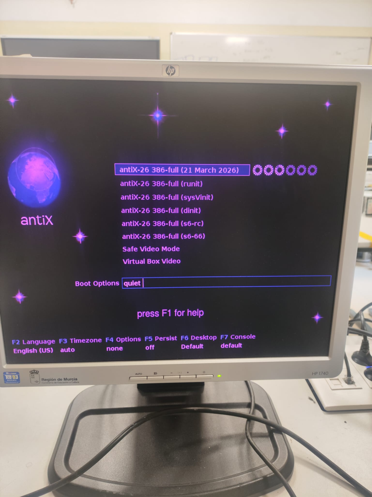
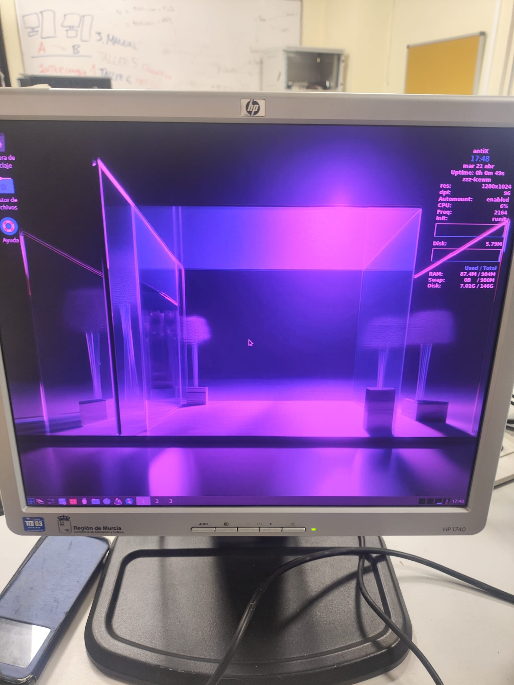
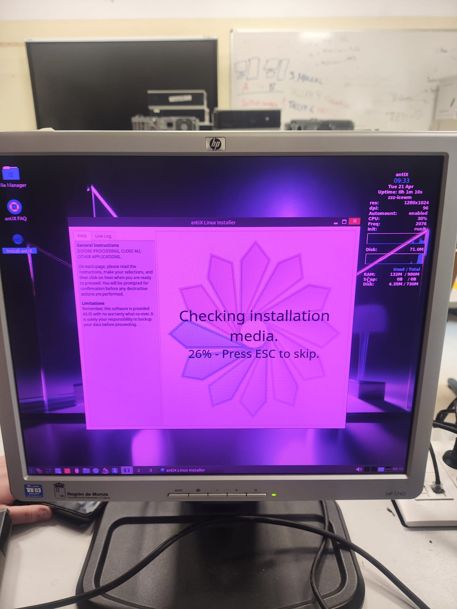
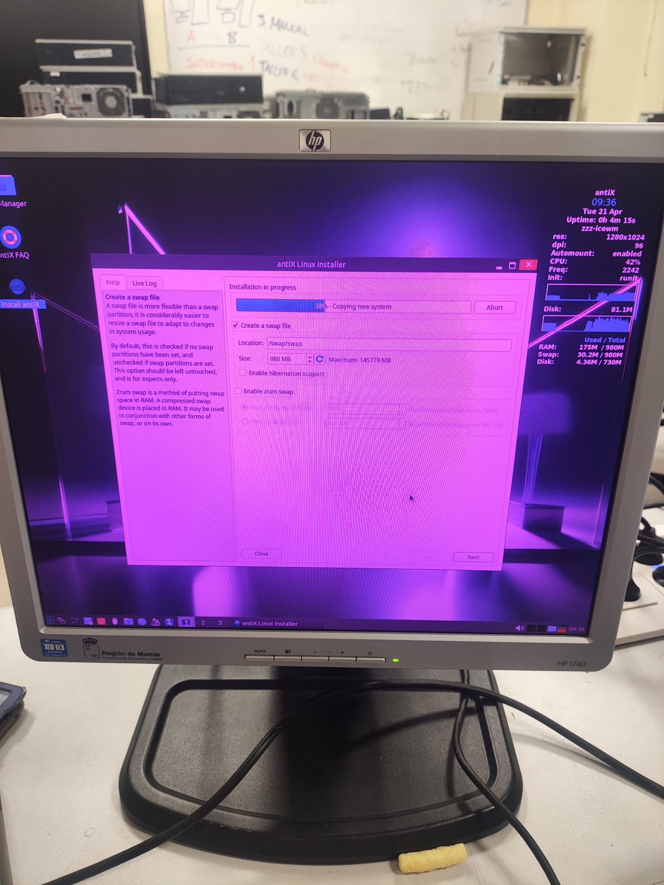
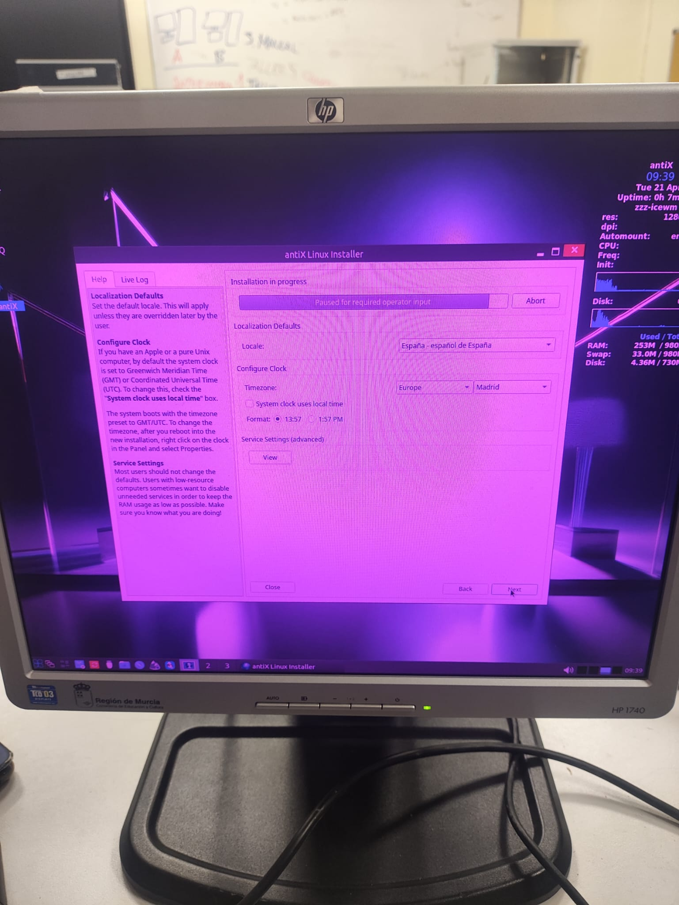
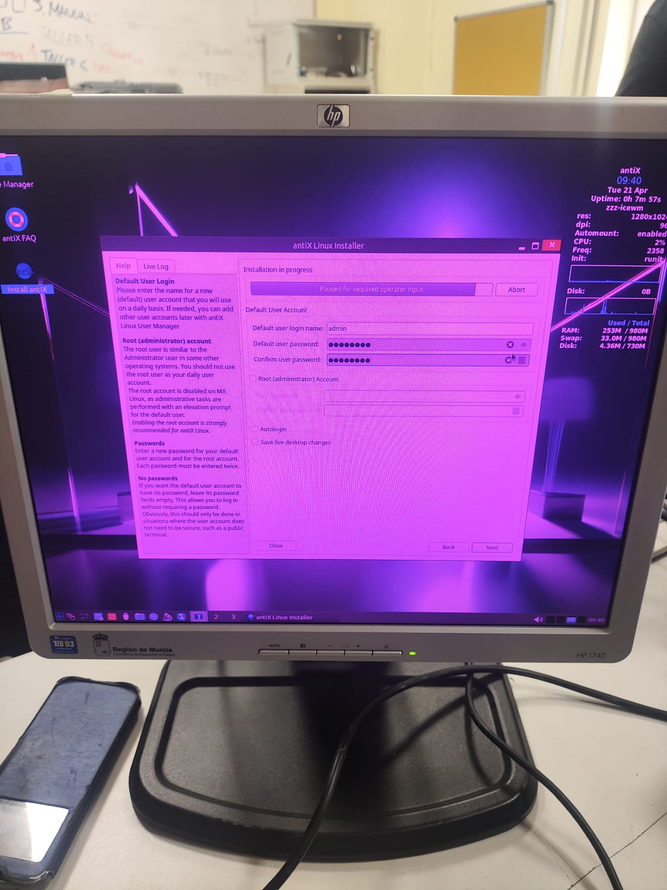
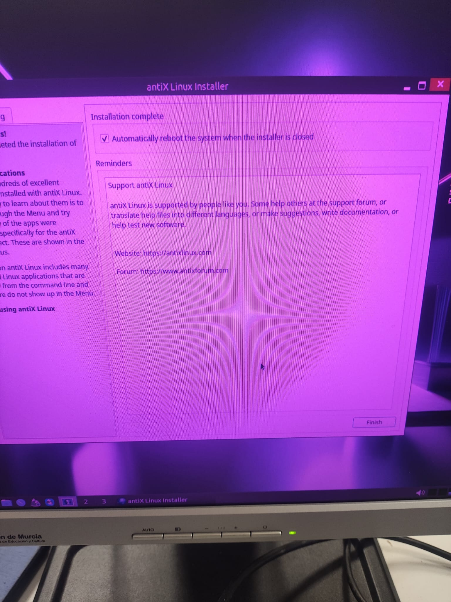
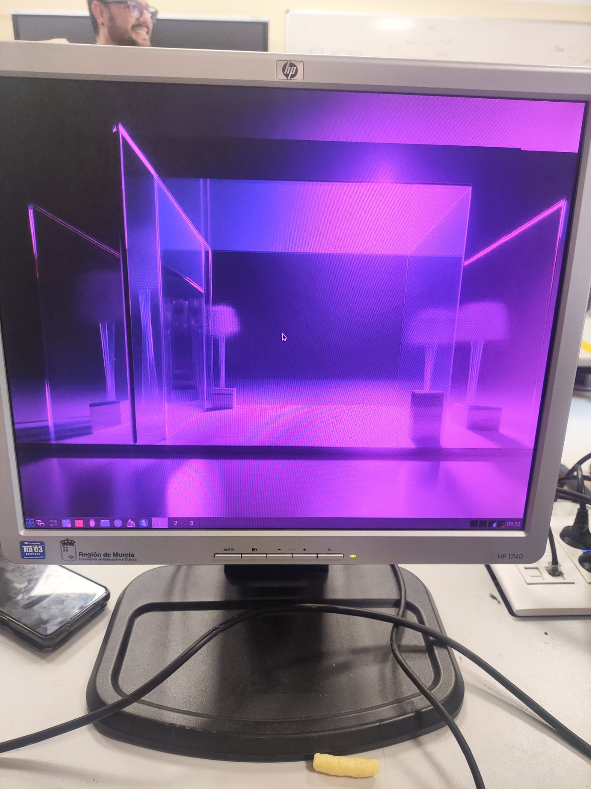

# Ficha · Intento de instalación 2

## 1. Datos básicos

- ISO utilizada: antiX
- Fecha y hora aproximada: 21/04/2026 15:00
- Puesto dentro del plan: alternativa

## 2. Arranque

- ¿Se seleccionó la ISO desde Ventoy? Sí
- ¿La ISO arrancó correctamente? Sí
- Evidencia:

## 3. Instalación

- ¿Se llegó al instalador? Sí
- Tipo de instalación elegido: Basic
- Esquema de particionado usado: Swap
- Pasos principales realizados:
  1. Ejecutamos el instalador.
  2. Seleccionamos la instalación básica.
  3. Partricionado con swap.
  4. Configuración hora y locaclización.
  5. Configuración usuario.
  6. Instalación completada y reinicio.
  7. Instalación completada.

## 4. Resultado del intento

- ¿La instalación finalizó correctamente? Sí
- ¿El sistema arrancó después? Sí
- Estado final: éxito

## 5. Problemas encontrados

- Problema 1:
- Problema 2:
- Problema 3:

## 6. Soluciones aplicadas

- Solución 1:
- Solución 2:
- Solución 3:

## 7. Decisión tomada

Esta fue un exíto y no tubimos ningún problema.

## 8. Evidencias

- Captura de arranque:

- Captura del instalador:

- Captura del resultado final o del error:
