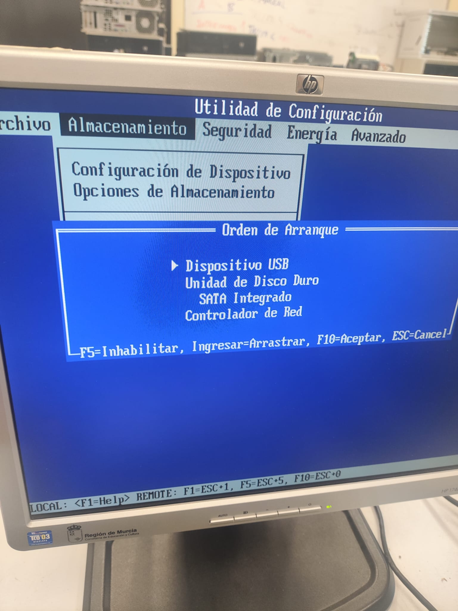
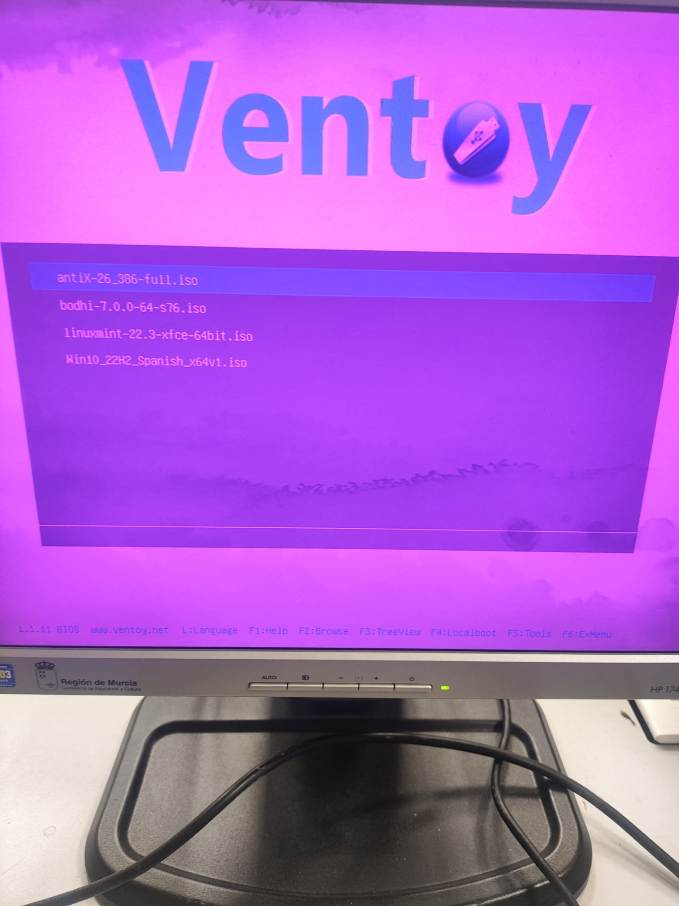
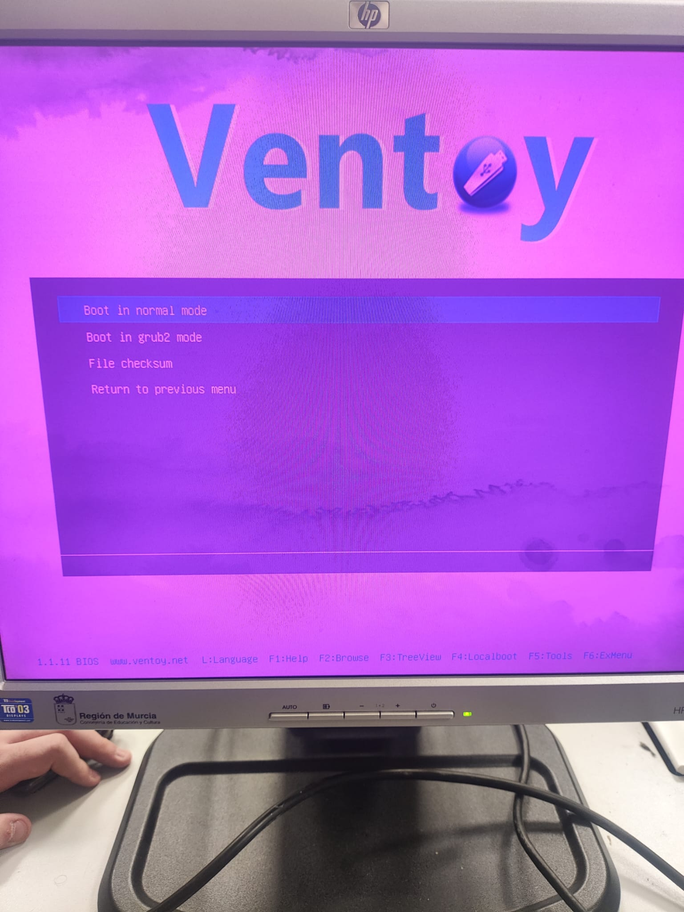

# Ficha · Registro general de la instalación

## 1. Datos de la sesión de trabajo

- Fecha: 21/04/2026
- Aula o taller:  Taller
- Miembros del grupo: Yllán, Abraham, Alfonso
- Equipo utilizado: HP Compaq dc7800

## 2. Preparación previa

- ¿El USB con Ventoy estaba listo? Sí
- ¿Estaban copiadas las 3 ISOs? Sí
- ¿Se sabía el orden de intento? Sí

## 3. Arranque del equipo

- Tecla o método usado para seleccionar el arranque: F9
- ¿Entró correctamente en el menú de arranque? Sí
- ¿Se detectó el USB? No de primeras, luego de reconfigurar el Ventoy, si que se detectó.
- ¿Ventoy arrancó correctamente? Al final sí

## 4. Resultado global

- ISO finalmente instalada: antiX
- ¿La instalación terminó correctamente? Sí
- ¿El sistema arranca después de instalar? Sí
- Observaciones generales: El sistema va muy fluuido a pesar de tener un unico gigabyte de memoria RAM.

## 5. Evidencias clave

- Foto o captura del menú de arranque:

- Foto o captura del menú de Ventoy:

- Foto o captura del sistema ya instalado:
