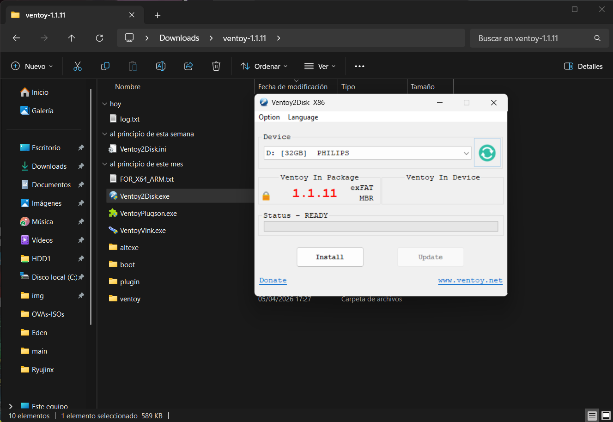
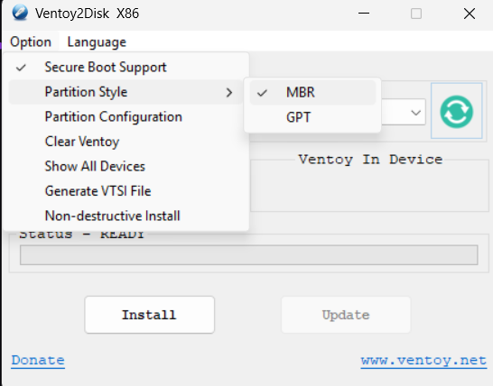
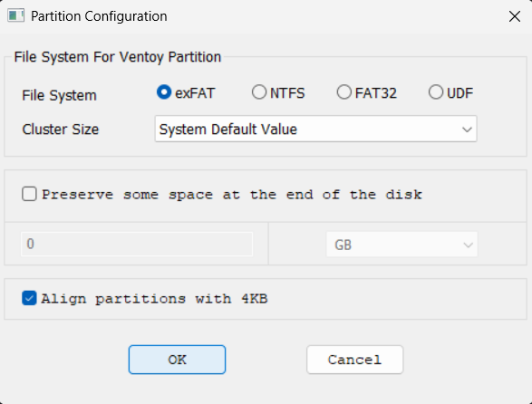
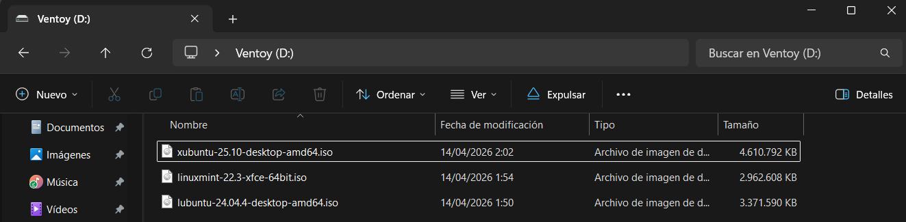
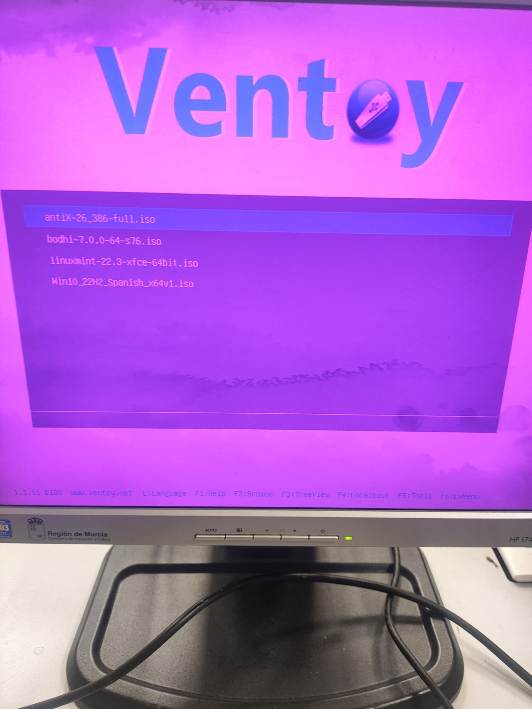
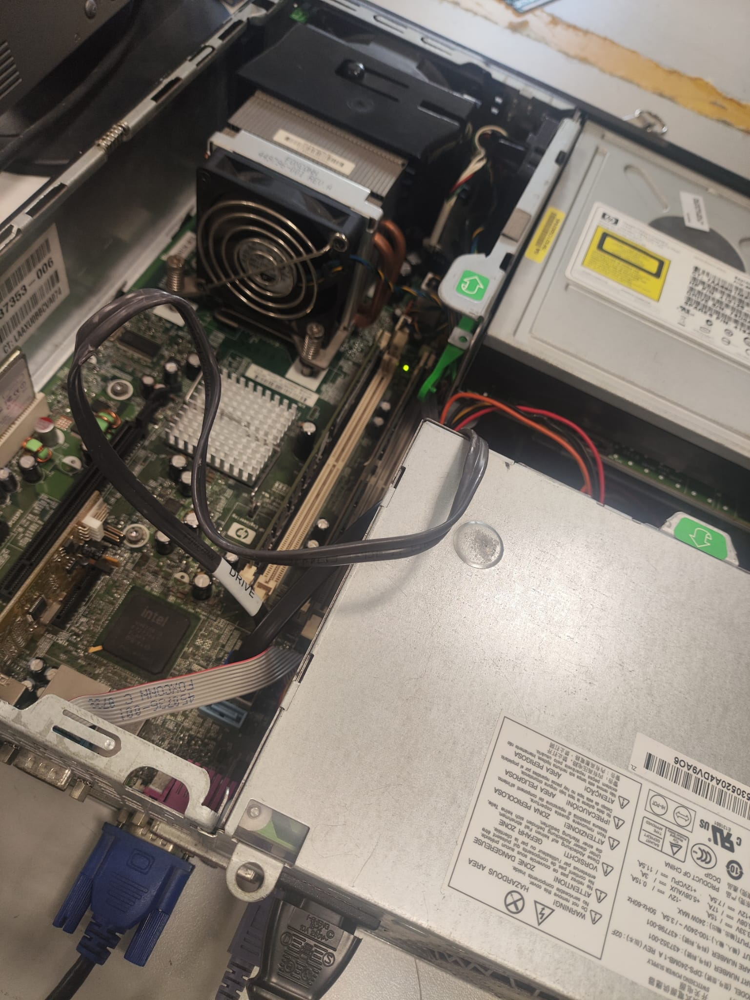
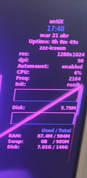

# ENTREGA ÚNICA · Reto 02

> Este documento reúne toda la información necesaria para exportar la entrega final a PDF.

---

## 1. Portada

**Alumno/a:**  Miguel Raposo García
**Grupo:**  1
**Curso:**  1º ASIR
**Fecha:**  24/04/2026

---

> En este reto se prepara un USB con Ventoy, se dejan cargadas las 3 ISOs seleccionadas en el Reto 01 y se instala al menos una de ellas en el equipo real HP Compaq dc7800, documentando todo el proceso.

## Índice

1. Introducción  
2. Preparación del USB con Ventoy  
3. Relación de las 3 ISOs disponibles en el USB  
4. Orden de intento de instalación  
5. Proceso de instalación en el equipo real  
6. Problemas encontrados y soluciones aplicadas  
7. Evidencia de sistema instalado  
8. Conclusión final  
9. Bibliografía  

> Consejo: actualiza este índice si añades o quitas apartados en la entrega final.

## 2. Introducción

En este reto el objetivo es pasar de la preparación previa a la **instalación real** de una distribución Linux en el **HP Compaq dc7800**.

En el reto anterior se eligieron tres distribuciones y se probaron en una máquina virtual.  
Ahora toca trabajar con el equipo físico, utilizando **Ventoy** como medio de arranque para tener disponibles las tres ISOs en un único USB.

La idea es sencilla: llevar al aula taller una especie de **mochila técnica**.  
Si la primera ISO falla, ya tenemos una segunda y una tercera preparadas, sin tener que rehacer el USB desde cero.

Este documento debe dejar constancia de:
- cómo se preparó el USB con Ventoy,
- qué tres ISOs se copiaron,
- en qué orden se intentó la instalación,
- qué problemas aparecieron,
- qué soluciones se aplicaron,
- y qué sistema quedó finalmente instalado.

## 3. Preparación del USB con Ventoy

## 1. Datos básicos del pendrive

- Marca y modelo: PHILIPS FM32FD165B
- Capacidad: 32GB
- Sistema desde el que se preparó: Win11

## 2. Preparación de Ventoy

- Programa utilizado: ventoy
- Versión de Ventoy: 1.1.11
- Pasos seguidos para instalar Ventoy en el USB:
  1. Abrir el archivo Ventoy2Disk.exe
  2. Seleccionar el USB que vas a formatear para instalarle el Ventoy
  3. Configurar el particionado a MBR, hay que meterse en Opcion -> Partition Style -> MBR
  4. Configuarar la configurarción del particionad, hay que meterse en Opción -> Partition Configuration -> File System (exFAT), Cluster Size (System Default Value), Align partition with 4KB
  5. Clickas en Install, para instalar el ventoy en el USB. Hay que tener cuidado ya que este rpoceso formatea el USB por lo que hay que guardar los datos en caso de qwue contenga alguno importante.
  6. Meter las ISOs dentro del fichero del USB que ahora se llama Ventoy.

## 3. Precauciones tomadas

- ¿Se comprobó que el USB correcto era el seleccionado? Sí
- ¿Se hizo copia de seguridad de los datos del pendrive antes de formatearlo? Sí
- ¿Se verificó que Ventoy quedó instalado correctamente? Sí

## 4. Evidencias

- Captura o foto del proceso de instalación de Ventoy: 

- Captura o foto del contenido del USB ya preparado:

- Observaciones:

## 5. Valoración

Explica brevemente si la preparación del USB fue sencilla o si surgió alguna dificultad.

Es bastante sencillo, solo tienes que fijarte bien en todo y tener muy en cuenta el equipo en el que lo vas a usar.

### 3.3 Relación de ISOs en el USB

## ISO 01

- Distribución: Linux Mint (XFCE)
- Versión: 22.3
- Nombre del archivo ISO: linuxmint-22.3-xfce-64bit.iso
- Papel previsto: principal

## ISO 02

- Distribución: Lubuntu
- Versión: 24.04.4
- Nombre del archivo ISO: lubuntu-24.04.4-desktop-amd64.iso
- Papel previsto: alternativa

## ISO 03

- Distribución: Xubuntu
- Versión: 25.10
- Nombre del archivo ISO: xubuntu-25.10-desktop-amd64.iso
- Papel previsto: respaldo

## Evidencias

- Captura del explorador mostrando las 3 ISOs copiadas:

- Captura del menú de Ventoy donde aparezcan las 3 ISOs:

## 4. Plan de instalación

## Orden previsto

1. **Primera opción:** Linux Mint XFCE
   - Motivo: He elegido como opción principal el Linux Mint XFCE ya que es la opción más balanceada para este PC. Su mayor ventaja es que no usa paquetes Snap, ya que estos paquetes ralentizan mucho los tiempos de arranque y saturaría las lecturas en el disco duro mecánico. Al usar una base estable y un entorno XFCE muy familiar e intuitivo, este sería el que ofrece la mejor combinación entre bajo consumo y facilidad de uso.
2. **Segunda opción:** Lubuntu
   - Motivo: Y como alternativa he preferido el Lubuntu ya que esté es el que menos recursos consume por lo que va a ser el más fluido.
3. **Tercera opción:** Xubuntu
   - Motivo: Para el final he dejado el Xubuntu ya que es el más robusto de todos y el que iría peor seguramente.

## Justificación breve

He elegido este orden porque prioriza la eficiencia del hardware y la agilidad operativa en un entorno con recursos limitados. La elección de Linux Mint XFCE como primera opción se debe a que al prescindir de paquetes Snap, evita la saturación de lectura en discos mecánicos, garantizando arranques rápidos y una interfaz intuitiva que equilibra bajo consumo con facilidad de uso. Como segunda alternativa, Lubuntu asegura la máxima fluidez posible gracias a su mínima demanda de RAM, siendo perfecta si el hardware tiene problemas y acaba teniendo menos RAM de lo esperado. Finalmente, Xubuntu como tercera opción se debe a su mayor robustez ya que un peso superior comprometería el rendimiento, resultando en una peor experiencia en el PC.

## Regla de cambio

Indica cuándo decidiréis pasar de una ISO a la siguiente.  

- No arranca el medio.
- Se bloquea el instalador.
- No detecta el disco.
- Fallo en el particionado.
- La instalación falla repetidamente.
- El sistema no arranca tras instalarse.

## 5. Desarrollo de la instalación en el HP Compaq dc7800

### 5.1 Arranque desde USB

- Método o tecla usada: F9
- ¿Se detectó correctamente el USB? Sí
- ¿Ventoy arrancó? Sí

### 5.2 Intento con ISO 01

## 1. Datos básicos

- ISO utilizada: Linux Mint
- Fecha y hora aproximada: 18/04/2026 16:50
- Puesto dentro del plan: principal

## 2. Arranque

- ¿Se seleccionó la ISO desde Ventoy?
No
- ¿La ISO arrancó correctamente?
No
- Evidencia:

## 3. Instalación

- ¿Se llegó al instalador?
No  
- Tipo de instalación elegido:
 
EJEMPLOS: 

- Instalación limpia usando todo el disco
- Instalación guiada automática
- Instalación manual
- Borrar disco e instalar Linux
- Instalación personalizada
- Instalación en modo gráfico
- Instalación en modo texto

- Esquema de particionado usado:
  
EJEMPLOS: 

- Particionado automático
- Una sola partición raíz / en ext4
- Partición raíz / + partición swap
- Partición / + /home + swap
- GPT con partición EFI + / en ext4 + swap
- MBR con partición primaria ext4 para / y partición swap
  
- Pasos principales realizados(TODOS LOS RELEVANTES):
  1.
  2.
  3.
  4.

## 4. Resultado del intento

- ¿La instalación finalizó correctamente?
No
- ¿El sistema arrancó después?
No
- Estado final: fallo

## 5. Problemas encontrados

- Problema 1: Problema con la RAM ya que había varios módulos que no iban.
- Problema 2: No detecta el Ventoy, ya que estaba mal configurado de primeras.
- Problema 3:

## 6. Soluciones aplicadas

- Solución 1: Descartamos uno a uno los modulo que funcionaban, quedando al final solo un módulo de RAM.
- Solución 2: Configuramos bien el Ventoy.
- Solución 3:

## 7. Decisión tomada

Al final pasamos a otra ISO de otro compañero ya que estábamos teniendo problemas con mi USB.

## 8. Evidencias

- Captura de arranque:

- Captura del instalador:

- Captura del resultado final o del error:

### 5.3 Intento con ISO 02

## 1. Datos básicos

- ISO utilizada: antiX
- Fecha y hora aproximada: 21/04/2026 15:00
- Puesto dentro del plan: alternativa

## 2. Arranque

- ¿Se seleccionó la ISO desde Ventoy? Sí
- ¿La ISO arrancó correctamente? Sí
- Evidencia:

## 3. Instalación

- ¿Se llegó al instalador? Sí
- Tipo de instalación elegido: Basic
- Esquema de particionado usado: Swap
- Pasos principales realizados:
  1. Ejecutamos el instalador.
  2. Seleccionamos la instalación básica.
  3. Partricionado con swap.
  4. Configuración hora y locaclización.
  5. Configuración usuario.
  6. Instalación completada y reinicio.
  7. Instalación completada.

## 4. Resultado del intento

- ¿La instalación finalizó correctamente? Sí
- ¿El sistema arrancó después? Sí
- Estado final: éxito

## 5. Problemas encontrados

- Problema 1:
- Problema 2:
- Problema 3:

## 6. Soluciones aplicadas

- Solución 1:
- Solución 2:
- Solución 3:

## 7. Decisión tomada

Esta fue un exíto y no tubimos ningún problema.

## 8. Evidencias

- Captura de arranque:

- Captura del instalador:

- Captura del resultado final o del error:

## 6. Sistema finalmente instalado

## Distribución finalmente instalada

- Nombre: antiX
- Versión: 26
- Entorno de escritorio: IceWM
- Arquitectura: 32 bits

## Evidencias obligatorias

- Foto o captura de la pantalla de inicio de sesión:
Lo configuramos para que no pidiera la contraseña
- Foto o captura del escritorio o entorno ya iniciado:

- Foto o captura de información básica del sistema:

## Estado del equipo al finalizar

- ¿Arranca sin el USB? Sí
- ¿Se ve estable el sistema? Sí
- ¿Hubo que reiniciar varias veces? No
- Observaciones:

## Valoración final de la instalación

El sitema va de manera fluida, y al apagar y volver a encender varias veces se mete directamente al sistema operativo sin dar ningún problema.

## 7. Problemas encontrados y soluciones aplicadas

En esta sección se recopilan los fallos o dificultades del proceso.  
No importa que hayan sido pequeños o grandes: lo importante es que queden bien explicados.

## Incidencia 1

- Descripción: No arranca el dispositivo y se reproducen cinco pitidos.
- Cuándo apareció: Al principio de la práctica.
- Posible causa: Problemas con la RAM, varios módulos estaban defectuosos.
- Solución aplicada: Los comprobamos uno a uno para ver cuales iban correctamente, al final solo quedó un módulo.
- Resultado: El dispositivo arranca.

## Incidencia 2

- Descripción: No se detecta el USB, por lo que no se ejecuta el Ventoy
- Cuándo apareció: En el primer arranque
- Posible causa: El Ventoy estaba mal configurado con un estilo de partición GPT en vez de MBR.
- Solución aplicada: Reconfiguramos el Ventoy.
- Resultado: Lee el USB y se ejecuta el Ventoy.

## Aprendizaje técnico

Hemos aprendido que los cinco pitidos de error junto a que no arranque el equipo significa que hay problemas con la memoria RAM. también hemos aprendido ha identificar los módulos que dan problemas para poder descartarlos.

También hemos aprendido que es muy importante la configuración del Ventoy para que el PC lo detecte.

## 9. Bibliografía

- [Ventoy](https://www.ventoy.net/)
- https://www.youtube.com/watch?v=byiG4agU8_g