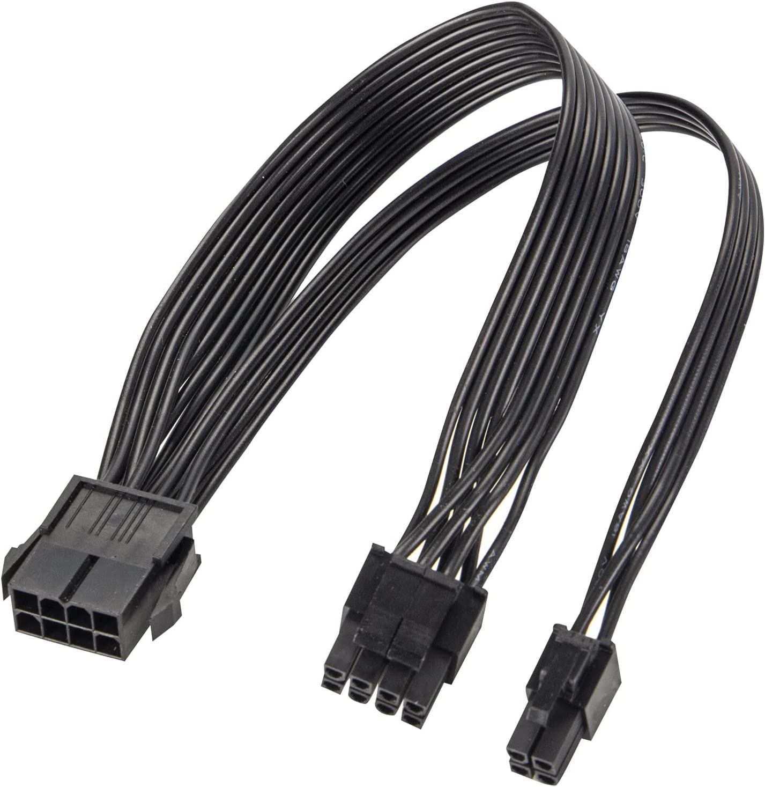

# EPS de 8 pines

**Descripción breve:** Se puede utilizar para la alimentación de una placa base con interfaz EPS de 4 u 8 pines.

**Pines/Carriles/Voltajes/Velocidad:** 8 pines / 1 / +12 V DC / NO

**Uso principal:** Alimentación de una placa base con interfaz EPS

**Compatibilidad actual:** Alta

## Identificación física

- Bloque de 8 pines separable en dos de 4 pines con pinza arriba, color negro, conectado en la parte superior izquierda. 

## Notas técnicas

- Valor normalizado del cable: 18 AWG
- Versiones:
    - EPS12V 8-pin
    - EPS12V 4+4 pin
    - Dual EPS (8+8)
 
## Fotos

## Fuente
- https://www.delock.de/produkt/80974/pdf.html?sprache=es
