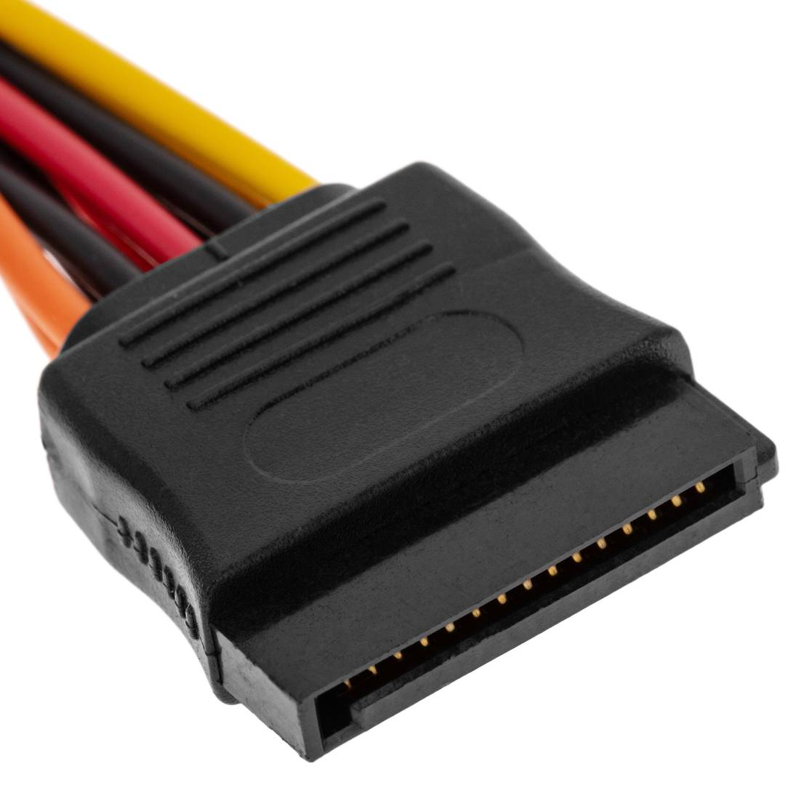

# SATA Power

**Descripción breve:** Este cable de alimentación permite convertir la interfaz de las fuentes de alimentación ATX comunes al formato SATA para suministrar energía a las unidades SATA.

**Pines/Carriles/Voltajes/Velocidad:** 15 pines / 3,3 V / 5 V / 12 V

**Uso principal:** Proveer energía eléctrica a dispositivos de almacenamiento SATA.

**Compatibilidad actual:** Media

## Identificación física

- Forma plana y delgada con la muesca en forma de "L", de color negro con los cables de color amarillo, rojo, naranja y negro. Ubicada en la parte trasera de discos duros, SSD o unidades ópticas

## Notas técnicas

- Corriente continua de entregando energía eléctrica de +3.3 V, +5 V y +12 V.
 
## Fotos

## Fuente
- https://www.delock.de/produkt/60100/pdf.html?sprache=en