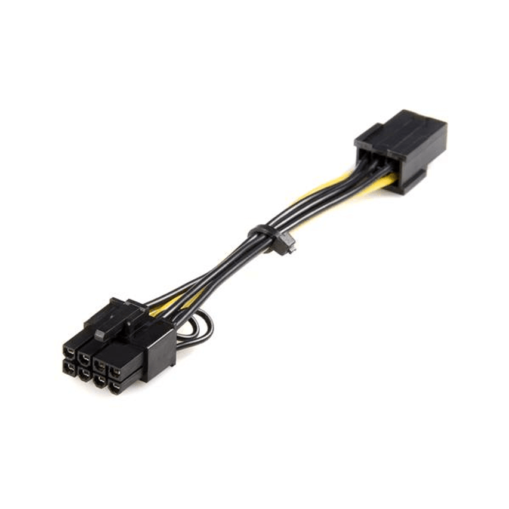

# PCIe de 6 pines a 8 pines (6+2)

**Descripción breve:**  Se puede utilizar para la
alimentación de tarjetas PCIe con interfaz de 6 u 8 pines y es el más
adecuado para aplicaciones de minería de datos, debido a su
compatibilidad con las placas adaptadoras.

**Pines/Carriles/Voltajes/Velocidad:** 
- 6 pines  / 12 V 
- 8 pines (6+2) / 12 V 

**Uso principal:** Alimentar a las GPU.

**Compatibilidad actual:** Alta

## Identificación física

- Conector de 8 pines divisble en uno de 6 y otro de 2, color negro y se conecta en el lateral de la GPU

## Notas técnicas

- Valor normalizado del cable: 20 AWG
 
## Fotos

## Fuente
- https://www.delock.de/produkt/83004/pdf.html?sprache=es