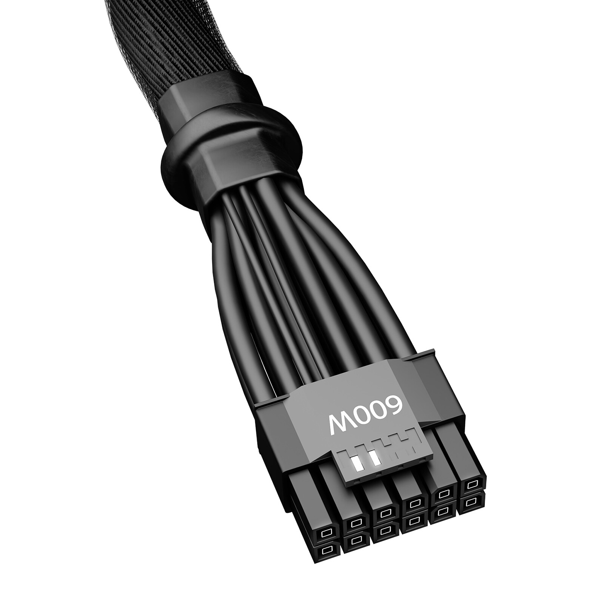

# 12VHPWR

**Descripción breve:** Cable para tarjetas gráficas con el conector 12VHPWR 600 W para alimentarlas.

**Pines/Carriles/Voltajes/Velocidad:** 16 pines (12 de potencia y 4 de señal) / 1  / +12V DC / No

**Uso principal:** Alimentación de graficas de alto consumo de series 40 en superior que requieren una potencia de 600W.

**Compatibilidad actual:** Alta

## Identificación física

- Forma rectangular con los 12 pines de potencia distribuidos en dos filas de 6 pines y con los otros 4 pines de señal encima siendo estos más pequeños, tiene señalado encima de ellos el voltaje de 600W y se conecta en el lateral de la gráfica o en la fuente de alimentación
## Notas técnicas

- Suministra 600W a 12V CD.

## Fotos

## Fuente
- https://seasonic.com/es/12vhpwr-cable
