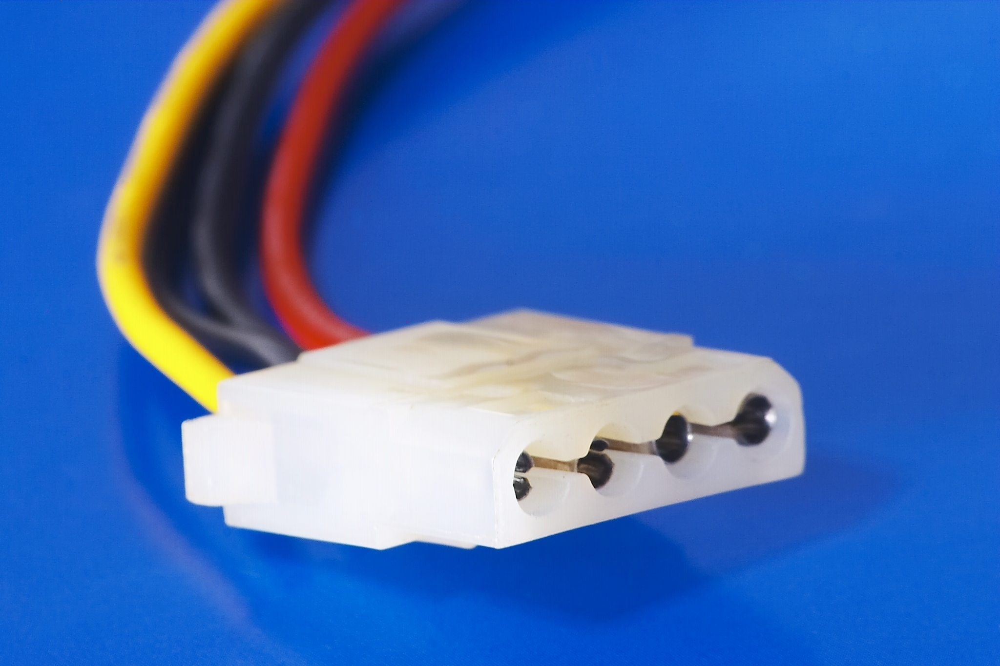

# Molex 

**Descripción breve:** Este conector daba servicio a muchos componentes del PC, especialmente a los discos duros, DVD/CD-ROM, tarjetas de expansión, etc. Podíamos encontrarlos por todos lados, pero ahora ha sido sustituido por el conector SATA, principalmente.

**Pines/Carriles/Voltajes/Velocidad:** 4 pines / 2  / +5V, +12V DC / No

**Uso principal:** Suministración de energía a dispositivos periféricos como discos duros, unidades ópticas e incluso ventiladores internos.

**Compatibilidad actual:**  Baja

## Identificación física

- Pieza rectangular y fina de color blanca con 4 pines y cables de colores amarillo, negro y rojo.

## Notas técnicas

- Potencia máxima de 132W.

## Fotos

## Fuente
- https://www.profesionalreview.com/2019/12/31/conector-molex-todo-lo-que-necesitas-saber