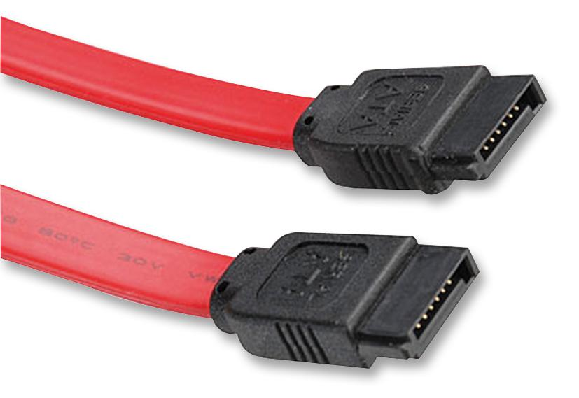

# SATA (Serial ATA)

**Descripción breve:** Interfaz de datos en serie para conectar HDD/SSD/unidades ópticas.  

**Pines/Carriles/Voltajes/Velocidad:** 7 pines · 1.5/3/6 Gbps (SATA I/II/III) 

**Uso principal:** Conexión de almacenamiento interno común  

**Compatibilidad actual:** Alta

## Identificación física
- Conector plano en forma de L; cables delgados, longitud típica ≤1 m.

## Notas técnicas
- Hot-swap según controladora; no lleva alimentación (va por conector SATA power).

## Fotos

## Fuentes
- https://media.startech.com/cms/pdfs/sata12_datasheet-es.pdf
