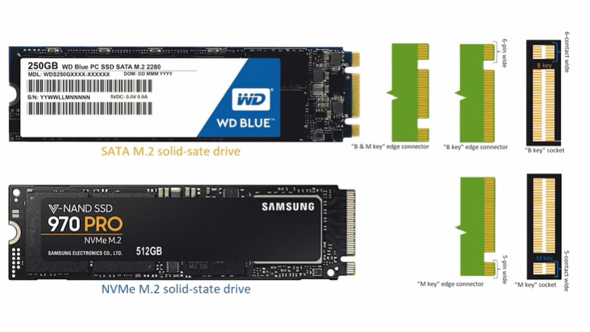

# M.2 (NVMe/SATA)

**Descripción breve:** El conector M.2 SATA permite conectar unidades SSD usando el protocolo SATA, ofreciendo velocidades similares a los discos duros tradicionales, mientras que el M.2 NVMe usa el protocolo PCIe, logrando velocidades mucho más altas y un acceso más rápido a los datos. Ambos son compactos y se insertan directamente en la placa madre. 

**Pines/Carriles/Voltajes/Velocidad:** 
- SATA: 67 pines / 0 / 3,3V / 6 Gbps
- NVMe:  67 pines / hasta 4 / 3,3V / 16 Gbps teóricamente 

**Uso principal:** Tranferencia de datos desde las SSD al controlador de la placa madre.  

**Compatibilidad actual:** Alta

## Identificación física
- Situado en el extremo de las SSD con más de 60 pines, con ranuras que hacen forma de "M" en el SATA y "B" en el NVMe.

## Notas técnicas
- Compatible con SATA III (6 Gb/s), depende del chipset de la placa madre para la transferencia de datos.

## Fotos

## Fuentes
- https://www.kingston.com/es/blog/pc-performance/two-types-m2-vs-ssd
