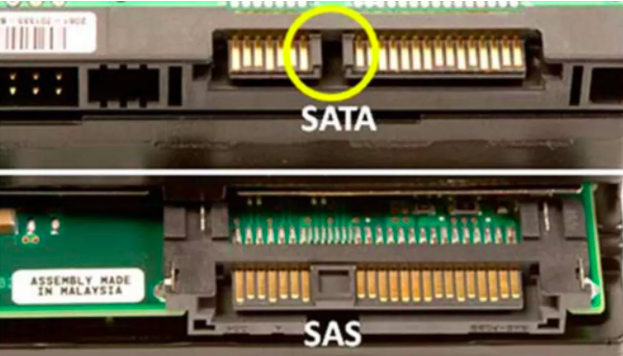

# SAS (Serial Attached SCSI)

**Descripción breve:** Es una interfaz de transferencia de datos en serie  paralela. A pesar de que SAS sigue utilizando comandos SCSI para interaccionar con los dispositivos, esta aumenta la velocidad y permite conexión y desconexión rápida «en caliente», sin tener que apagar ni reiniciar el equipo.

**Pines/Carriles/Voltajes/Velocidad:**   7 u 29 según versión / 0 / 3.3 V, 5 V, 12 V / Hasta 24 Gbps

**Uso principal:** Almacenamiento empresarial y servidores, donde se requiere alta velocidad, confiabilidad y conectividad de múltiples discos para bases de datos, centros de datos y sistemas críticos. 

**Compatibilidad actual:** Alta (servidores y empresas)

## Identificación física
- Similar a un conector SATA, pero más robusto y con más pines.

## Notas técnicas
- Soporta discos SAS y SATA (solo lectura SATA).

## Fotos

## Fuentes
- https://grxelec.com/p/what-is-a-sas-connector
