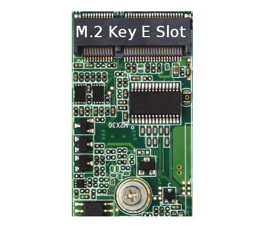

# M.2 (Wi-Fi y Bluetooth)

**Descripción breve:** Conector que permite instalar módulos inalámbricos con las funciones de Wi-Fi y Bluetooth en una sola tarjeta. La ranura es tipo M.2 Key E y se conecta directamente al bus PCIe y USB, ofreciendo alta velocidad de transmisión y bajo consumo de energía.

**Pines/Carriles/Voltajes/Velocidad:** Muchos pines / 1 / +1,8V, 3,3V / 5 GT/s

**Uso principal:** Instalar módulos inalámbricos que proporcionen Wi-Fi y Bluetooth al equipo.
**Compatibilidad actual:** Alta

## Identificación física
- Ranura pequeña con M.2 Key E escrito encima ubicada cerca del panel trasero de puertos. 
## Notas técnicas
- Suministra una tensión de 3.3 V.

## Fotos

## Fuentes
- https://www.sinsmarts.com/es/blog/what-is-the-m-2-expansion-slot-a-complete-guide-to-its-features-and-uses/?srsltid=AfmBOoqbcIAhDYNZJj_0ps4mx6Oq72g7JkST-7mDrJSVbSRf9-bPorT0
