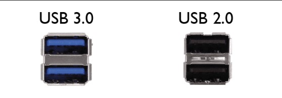

# USB A

**Descripción breve:** Conector estándar usado para periféricos y almacenamiento externo que permite transferencia de datos y suministro de energía. 

**Pines/Carriles/Voltajes/Velocidad:**  
- 2.0: 4 pines / 1 / +5 V / 60 MB/s
- 3.X: 9 pines / 2 / +5 V / 600 MB/s

**Uso principal:**  Conectar y alimentar dispositivos periféricos permitiendo transferencia de datos y suministro de energía entre el dispositivo y el PC. 

**Compatibilidad actual:** Alta

## Identificación física
- Forma rectangular con la pieza interior de color negro en el caso del 2.0 y de color azul en 3.X ubicado en la placa trasera del PC o en la misma caja en la parte superior.

## Notas técnicas
- USB Tipo A 3.x capaz de alcanzar velocidades de hasta 5 o 10 Gb/s según la versión.

## Fotos

## Fuentes
- https://www.acerstore.cl/blogs/news/conoce-la-diferencia-entre-usb-2-0-y-3-0
