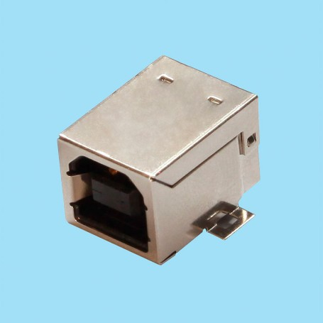

# USB B (2.0)

**Descripción breve:**  Utilizado principalmente en impresoras, escáneres y dispositivos de audio o industriales. Se emplea para transferencia de datos y alimentación eléctrica entre el equipo periférico y el computador.

**Pines/Carriles/Voltajes/Velocidad:** 4 pines / 1 / +5V / 480 Mb/s 

**Uso principal:** Transferencia de datos y alimentación del PC al aparato periférico.

**Compatibilidad actual:** Baja

## Identificación física
- Forma casi cuadrada con la parte superior ligeramente biselada.

## Notas técnicas
- Suministro de 500 mA en USB 2.0

## Fotos

## Fuentes
- https://ic-online.com/es/news/post/your-usb-b-plug-connector-the-unsung-hero