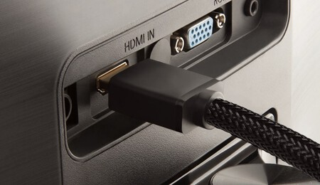

# HDMI 2.1
**Descripción breve:** versión mejorada del conector HDMI que soporta resoluciones hasta 10K, 120 Hz, HDR dinámico y velocidades de hasta 48 Gbps, ofreciendo mejor calidad de imagen, sonido y menor latencia en equipos modernos. 

**Pines/Carriles/Voltajes/Velocidad:** 19 pines / 8 / +5V / 48 Gbps

**Uso principal:** Transmitir video y audio digital de alta calidad entre dispositivos, siendo ideal para televisores, consolas de última generación, PC de alto rendimiento y sistemas de cine en casa.

**Compatibilidad actual:** Alta 

## Identificación física
- Conector rectangular plano con extremos ligeramente biselados en la parte inferior.

## Notas técnicas
- Ancho de banda máximo de 48 Gbps.

## Fotos

## Fuentes
- https://www.xataka.com/televisores/hdmi-2-1-que-que-sera-innovaciones-televisores-importantes-proximos-anos
