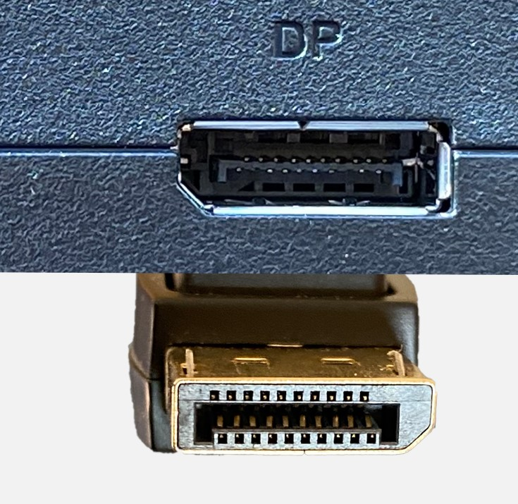

#  DisplayPort 2.x

**Descripción breve:** Estándar de transmisión de video y audio digital de alta capacidad, diseñado para pantallas de alta resolución y altas tasas de refresco.  

**Pines/Carriles/Voltajes/Velocidad:** 20 pines / 6 / +3,3V / 80 Gbps

**Uso principal:** Se emplea en monitores profesionales, tarjetas gráficas modernas y estaciones de trabajo de alto rendimiento.

**Compatibilidad actual:** Alta

## Identificación física
- Conector con forma rectangular pero con una esquina biselada.

## Notas técnicas
- Ancho de banda máximo de 80 Gbps.

## Fotos

## Fuentes
- https://hardzone.es/reportajes/que-es/displayport-especificaciones-caracteristicas