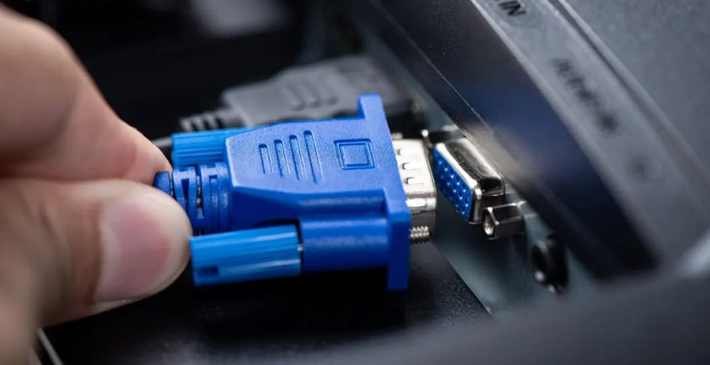

# VGA

**Descripción breve:** Conector analógico de video usado para transmitir señales RGB y sincronización entre computadoras y monitores o proyectores. Soporta resoluciones de hasta 2048×1536, pero no transporta audio ni datos digitales.

**Pines/Carriles/Voltajes/Velocidad:** 15 pines / 6 / +0,7V / 400 Mbps

**Uso principal:** Transmitir video analógico desde computadoras o laptops antiguas hacia monitores CRT, LCD o proyectores.

**Compatibilidad actual:** Baja

## Identificación física
- Conector rectangular con 15 pines distribuidos en 3 filas, con una carcasa de plástico que incluye tornillos de fijación a ambos lados.

## Notas técnicas
- Unicamente analógico, solo video.

## Fotos

## Fuentes
- https://www.pcbasic.com/es/blog/vga_connector_pinout.html
