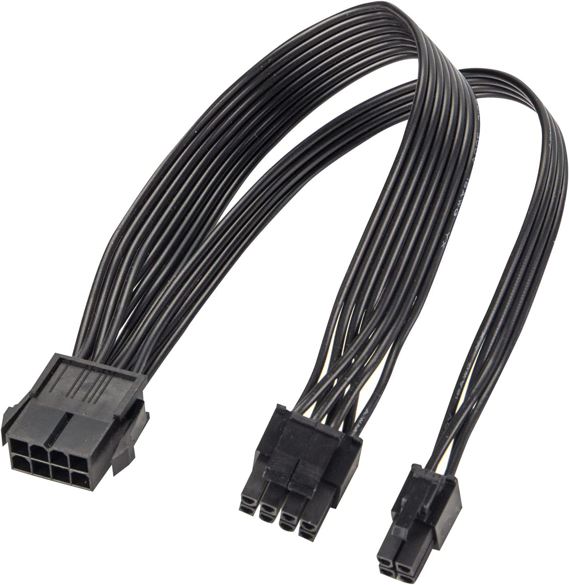
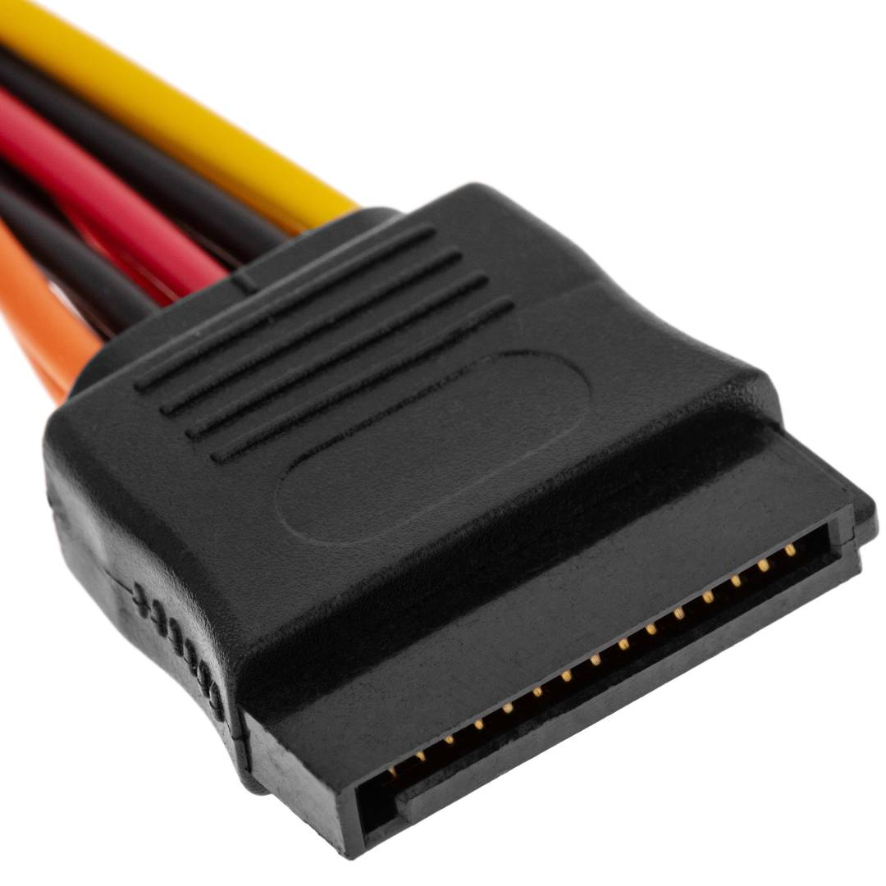
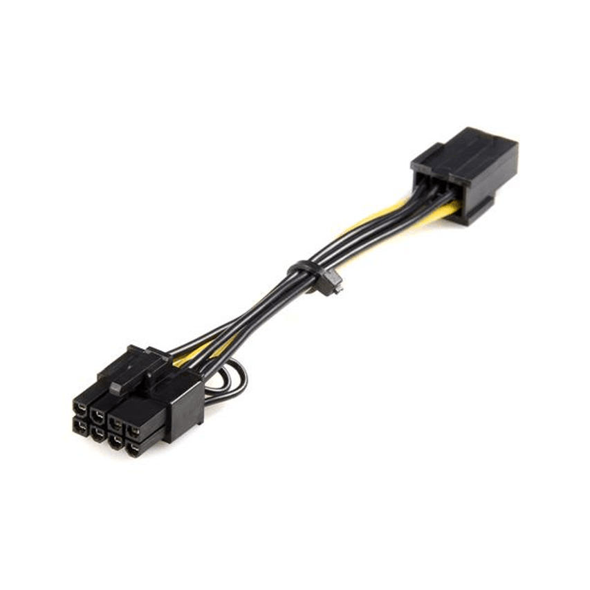
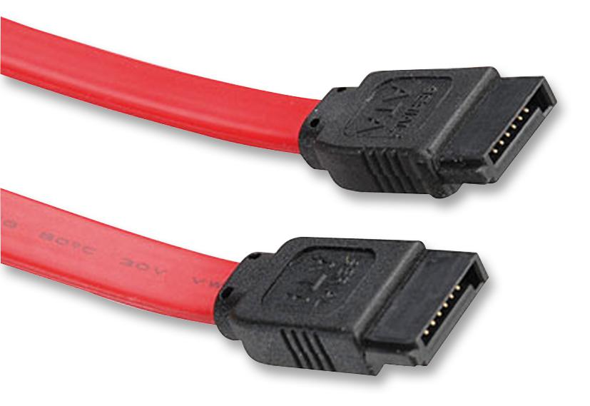
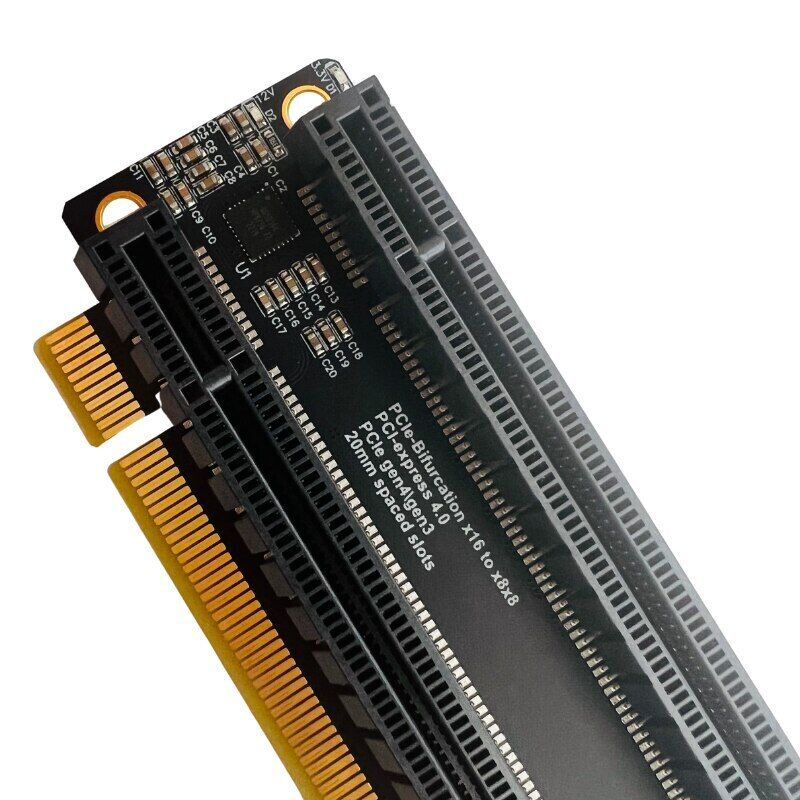
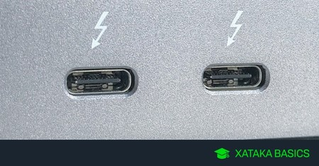
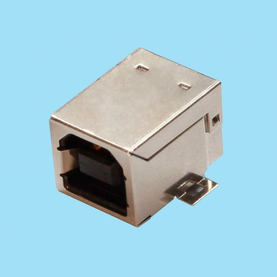
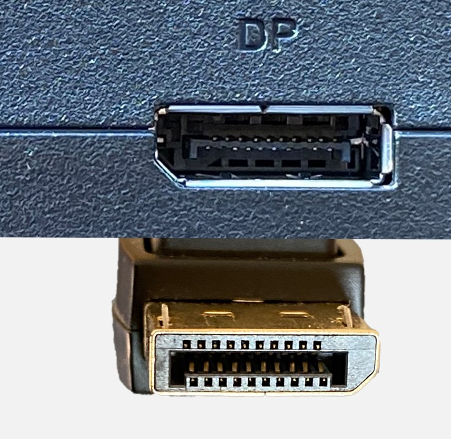
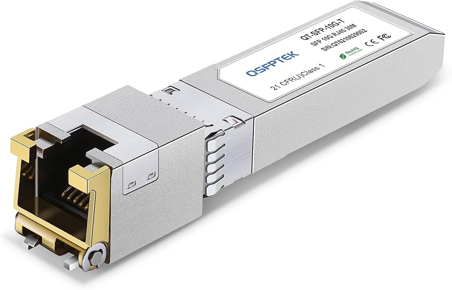
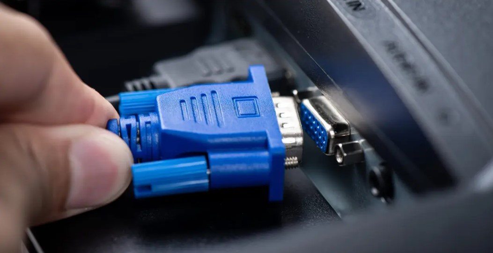

# ENTREGA ÚNICA - Reto 01

> Exporta este archivo como **PDF único** con nombre:  
> `apellido1_apellido2_nombre_FHW01_Tarea`  *(sin ñ ni tildes)*

## Índice

- [Portada](#portada)
- [1. Introducción](#1-introduccion)
- [2. Conectores internos (energía)](#2-conectores-internos-energia)
- [3. Conectores de datos](#3-conectores-de-datos)
- [4. Slots de expansión](#4-slots-de-expansion)
- [5. Conectores externos](#5-conectores-externos)
- [6. Bibliografía](#6-bibliografia)

## Portada
**Módulo:** Fundamentos de Hardware (ASIR)  
**Alumno/a:** Miguel García Raposo  
**Curso:** 2025/26

## 1. Introducción
Piensa el PC como una **ciudad**:  
- **Conectores** = **carreteras y puentes** (energía y datos).  
- **Slots** = **parcelas** para ampliar (tarjetas).

Objetivo del reto: **identificar** y **explicar** conectores/slots **actuales** y, si procede, **legacy** aún en uso.

## 2. Conectores internos (energía)
# ATX de 24 pines

**Descripción breve:** Conector principal que alimenta la placa base en sistemas ATX/ATX12V.

**Pines/Carriles/Voltajes/Velocidad:** 24 pines / 3 / +3.3V, +5 V, +12 V, -12 V, +5 VSB  / NO

**Uso principal:** Alimentación de la placa base  

**Compatibilidad actual:** Alta

## Identificación física
- Bloque rectangular de 24 pines con clip, situado en el borde de la placa base.

## Notas técnicas
- Estándar ATX12V 2.x. No confundir con el EPS de CPU (4/8 pines).

## Fotos

## Fuentes
- https://www.delock.de/produkt/80973/pdf.html?sprache=es

# EPS de 8 pines

**Descripción breve:** Se puede utilizar para la alimentación de una placa base con interfaz EPS de 4 u 8 pines.

**Pines/Carriles/Voltajes/Velocidad:** 8 pines / 1 / +12 V DC / NO

**Uso principal:** Alimentación de una placa base con interfaz EPS

**Compatibilidad actual:** Alta

## Identificación física

- Bloque de 8 pines separable en dos de 4 pines con pinza arriba, color negro, conectado en la parte superior izquierda. 

## Notas técnicas

- Valor normalizado del cable: 18 AWG
- Versiones:
    - EPS12V 8-pin
    - EPS12V 4+4 pin
    - Dual EPS (8+8)
 
## Fotos

## Fuente
- https://www.delock.de/produkt/80974/pdf.html?sprache=es

# SATA Power

**Descripción breve:** Este cable de alimentación permite convertir la interfaz de las fuentes de alimentación ATX comunes al formato SATA para suministrar energía a las unidades SATA.

**Pines/Carriles/Voltajes/Velocidad:** 15 pines / 3 / +3.3 V, +5 V, +12 V DC / NO

**Uso principal:** Proveer energía eléctrica a dispositivos de almacenamiento SATA.

**Compatibilidad actual:** Media

## Identificación física

- Forma plana y delgada con la muesca en forma de "L", de color negro con los cables de color amarillo, rojo, naranja y negro. Ubicada en la parte trasera de discos duros, SSD o unidades ópticas

## Notas técnicas

- Corriente continua de entregando energía eléctrica de +3.3 V, +5 V y +12 V.
 
## Fotos

## Fuente
- https://www.delock.de/produkt/60100/pdf.html?sprache=en

# PCIe de 8 pines (6+2)

**Descripción breve:**  Se puede utilizar para la
alimentación de tarjetas PCIe con interfaz de 6 u 8 pines y es el más
adecuado para aplicaciones de minería de datos, debido a su
compatibilidad con las placas adaptadoras.

**Pines/Carriles/Voltajes/Velocidad:** 8 pines (6+2) / 1 / +12V CD / NO

**Uso principal:** Alimentar a las GPU.

**Compatibilidad actual:** Alta

## Identificación física

- Conector de 8 pines divisble en uno de 6 y otro de 2, color negro y se conecta en el lateral de la GPU

## Notas técnicas

- Valor normalizado del cable: 20 AWG
 
## Fotos

## Fuente
- https://www.delock.de/produkt/83004/pdf.html?sprache=es

# 12VHPWR

**Descripción breve:** Cable para tarjetas gráficas con el conector 12VHPWR 600 W para alimentarlas.

**Pines/Carriles/Voltajes/Velocidad:** 16 pines (12 de potencia y 4 de señal) / 1  / +12V DC / No

**Uso principal:** Alimentación de graficas de alto consumo de series 40 en superior que requieren una potencia de 600W.

**Compatibilidad actual:** Alta

## Identificación física

- Forma rectangular con los 12 pines de potencia distribuidos en dos filas de 6 pines y con los otros 4 pines de señal encima siendo estos más pequeños, tiene señalado encima de ellos el voltaje de 600W y se conecta en el lateral de la gráfica o en la fuente de alimentación
## Notas técnicas

- Suministra 600W a 12V CD.

## Fotos

## Fuente
- https://seasonic.com/es/12vhpwr-cable

# Molex 

**Descripción breve:** Este conector daba servicio a muchos componentes del PC, especialmente a los discos duros, DVD/CD-ROM, tarjetas de expansión, etc. Podíamos encontrarlos por todos lados, pero ahora ha sido sustituido por el conector SATA, principalmente.

**Pines/Carriles/Voltajes/Velocidad:** 4 pines / 2  / +5V, +12V DC / No

**Uso principal:** Suministración de energía a dispositivos periféricos como discos duros, unidades ópticas e incluso ventiladores internos.

**Compatibilidad actual:**  Baja

## Identificación física

- Pieza rectangular y fina de color blanca con 4 pines y cables de colores amarillo, negro y rojo.

## Notas técnicas

- Potencia máxima de 132W.

## Fotos

## Fuente
- https://www.profesionalreview.com/2019/12/31/conector-molex-todo-lo-que-necesitas-saber

## 3. Conectores de datos
# SATA (Serial ATA)

**Descripción breve:** Interfaz de datos en serie para conectar HDD/SSD/unidades ópticas.  

**Pines/Carriles/Voltajes/Velocidad:** 7 pines · 1.5/3/6 Gbps (SATA I/II/III) 

**Uso principal:** Conexión de almacenamiento interno común  

**Compatibilidad actual:** Alta

## Identificación física
- Conector plano en forma de L; cables delgados, longitud típica ≤1 m.

## Notas técnicas
- Hot-swap según controladora; no lleva alimentación (va por conector SATA power).

## Fotos

## Fuentes
- https://media.startech.com/cms/pdfs/sata12_datasheet-es.pdf

# M.2 (NVMe/SATA)

**Descripción breve:** El conector M.2 SATA permite conectar unidades SSD usando el protocolo SATA, ofreciendo velocidades similares a los discos duros tradicionales, mientras que el M.2 NVMe usa el protocolo PCIe, logrando velocidades mucho más altas y un acceso más rápido a los datos. Ambos son compactos y se insertan directamente en la placa madre. 

**Pines/Carriles/Voltajes/Velocidad:** 
- SATA: 67 pines / 0 / 3,3V / 6 Gbps
- NVMe:  67 pines / hasta 4 / 3,3V / 16 Gbps teóricamente 

**Uso principal:** Tranferencia de datos desde las SSD al controlador de la placa madre.  

**Compatibilidad actual:** Alta

## Identificación física
- Situado en el extremo de las SSD con más de 60 pines, con ranuras que hacen forma de "M" en el SATA y "B" en el NVMe.

## Notas técnicas
- Compatible con SATA III (6 Gb/s), depende del chipset de la placa madre para la transferencia de datos.

## Fotos

## Fuentes
- https://www.kingston.com/es/blog/pc-performance/two-types-m2-vs-ssd

# SAS (Serial Attached SCSI)

**Descripción breve:** Es una interfaz de transferencia de datos en serie  paralela. A pesar de que SAS sigue utilizando comandos SCSI para interaccionar con los dispositivos, esta aumenta la velocidad y permite conexión y desconexión rápida «en caliente», sin tener que apagar ni reiniciar el equipo.

**Pines/Carriles/Voltajes/Velocidad:**   7 u 29 según versión / 0 / 3.3 V, 5 V, 12 V / Hasta 24 Gbps

**Uso principal:** Almacenamiento empresarial y servidores, donde se requiere alta velocidad, confiabilidad y conectividad de múltiples discos para bases de datos, centros de datos y sistemas críticos. 

**Compatibilidad actual:** Alta (servidores y empresas)

## Identificación física
- Similar a un conector SATA, pero más robusto y con más pines.

## Notas técnicas
- Soporta discos SAS y SATA (solo lectura SATA).

## Fotos

## Fuentes
- https://grxelec.com/p/what-is-a-sas-connector

## 4. Slots de expansión

# Slot: PCI Express x16 (Gen4/Gen5)

**Descripción breve:** Ranura de expansión de altas prestaciones usada para GPUs/aceleradoras. 

**Pines/Carriles/Voltajes/Velocidad:** x16 carriles · Gen4 16 GT/s · Gen5 32 GT/s  

**Uso principal:** Tarjetas gráficas; también aceleradoras y NVMe en adaptador  

**Compatibilidad actual:** Alta

## Identificación física
- Ranura larga con pestaña; color variable por fabricante.

## Notas técnicas
- Ancho de banda efectivo depende de generación y carriles disponibles (CPU/Chipset).

## Fotos

## Fuentes
- https://www.intel.la/content/www/xl/es/gaming/resources/what-is-pcie-4-and-why-does-it-matter.html

# M.2 (Wi-Fi y Bluetooth)

**Descripción breve:** Conector que permite instalar módulos inalámbricos con las funciones de Wi-Fi y Bluetooth en una sola tarjeta. La ranura es tipo M.2 Key E y se conecta directamente al bus PCIe y USB, ofreciendo alta velocidad de transmisión y bajo consumo de energía.

**Pines/Carriles/Voltajes/Velocidad:** Muchos pines / 1 / +1,8V, 3,3V / 5 GT/s

**Uso principal:** Instalar módulos inalámbricos que proporcionen Wi-Fi y Bluetooth al equipo.
**Compatibilidad actual:** Alta

## Identificación física
- Ranura pequeña con M.2 Key E escrito encima ubicada cerca del panel trasero de puertos. 
## Notas técnicas
- Suministra una tensión de 3.3 V.

## Fotos

## Fuentes
- https://www.sinsmarts.com/es/blog/what-is-the-m-2-expansion-slot-a-complete-guide-to-its-features-and-uses/?srsltid=AfmBOoqbcIAhDYNZJj_0ps4mx6Oq72g7JkST-7mDrJSVbSRf9-bPorT0

## 5. Conectores externos
# USB-C (USB4/PD)

**Descripción breve:** Conector reversible para datos, vídeo y alimentación (PD).  

**Pines/Carriles/Voltajes/Velocidad:** 24 pines · USB4 hasta 40 Gbps · PD hasta 100–240 W (según perfil)  

**Uso principal:** Carga y conexión de periféricos/monitores/docks  

**Compatibilidad actual:** Alta (ojo: no todo USB-C soporta TB/PD)

## Identificación física
- Ovalado y simétrico; símbolos: rayo (Thunderbolt), “SS” (SuperSpeed).

## Notas técnicas
- Requisitos de cable para 40 Gbps/240 W; DP Alt Mode para vídeo si no es TB.

## Fotos

## Fuentes
- https://www.avast.com/es-es/c-thunderbolt-vs-usb-c

# USB A

**Descripción breve:** Conector estándar usado para periféricos y almacenamiento externo que permite transferencia de datos y suministro de energía. 

**Pines/Carriles/Voltajes/Velocidad:**  
- 2.0: 4 pines / 1 / +5 V / 60 MB/s
- 3.X: 9 pines / 2 / +5 V / 600 MB/s

**Uso principal:**  Conectar y alimentar dispositivos periféricos permitiendo transferencia de datos y suministro de energía entre el dispositivo y el PC. 

**Compatibilidad actual:** Alta

## Identificación física
- Forma rectangular con la pieza interior de color negro en el caso del 2.0 y de color azul en 3.X ubicado en la placa trasera del PC o en la misma caja en la parte superior.

## Notas técnicas
- USB Tipo A 3.x capaz de alcanzar velocidades de hasta 5 o 10 Gb/s según la versión.

## Fotos

## Fuentes
- https://www.acerstore.cl/blogs/news/conoce-la-diferencia-entre-usb-2-0-y-3-0

# USB B (2.0)

**Descripción breve:**  Utilizado principalmente en impresoras, escáneres y dispositivos de audio o industriales. Se emplea para transferencia de datos y alimentación eléctrica entre el equipo periférico y el computador.

**Pines/Carriles/Voltajes/Velocidad:** 4 pines / 1 / +5V / 480 Mb/s 

**Uso principal:** Transferencia de datos y alimentación del PC al aparato periférico.

**Compatibilidad actual:** Baja

## Identificación física
- Forma casi cuadrada con la parte superior ligeramente biselada.

## Notas técnicas
- Suministro de 500 mA en USB 2.0

## Fotos

## Fuentes
- https://ic-online.com/es/news/post/your-usb-b-plug-connector-the-unsung-hero

# HDMI 2.1
**Descripción breve:** versión mejorada del conector HDMI que soporta resoluciones hasta 10K, 120 Hz, HDR dinámico y velocidades de hasta 48 Gbps, ofreciendo mejor calidad de imagen, sonido y menor latencia en equipos modernos. 

**Pines/Carriles/Voltajes/Velocidad:** 19 pines / 8 / +5V / 48 Gbps

**Uso principal:** Transmitir video y audio digital de alta calidad entre dispositivos, siendo ideal para televisores, consolas de última generación, PC de alto rendimiento y sistemas de cine en casa.

**Compatibilidad actual:** Alta 

## Identificación física
- Conector rectangular plano con extremos ligeramente biselados en la parte inferior.

## Notas técnicas
- Ancho de banda máximo de 48 Gbps.

## Fotos

## Fuentes
- https://www.xataka.com/televisores/hdmi-2-1-que-que-sera-innovaciones-televisores-importantes-proximos-anos

#  DisplayPort 2.x

**Descripción breve:** Estándar de transmisión de video y audio digital de alta capacidad, diseñado para pantallas de alta resolución y altas tasas de refresco.  

**Pines/Carriles/Voltajes/Velocidad:** 20 pines / 6 / +3,3V / 80 Gbps

**Uso principal:** Se emplea en monitores profesionales, tarjetas gráficas modernas y estaciones de trabajo de alto rendimiento.

**Compatibilidad actual:** Alta

## Identificación física
- Conector con forma rectangular pero con una esquina biselada.

## Notas técnicas
- Ancho de banda máximo de 80 Gbps.

## Fotos

## Fuentes
- https://hardzone.es/reportajes/que-es/displayport-especificaciones-caracteristicas

# RJ45 10G

**Descripción breve:** Es una interfaz física estandarizada que se utiliza comúnmente para la terminación de cables de par trenzado, principalmente en redes Ethernet.

**Pines/Carriles/Voltajes/Velocidad:** 8 pines / 4 / ±2.5 V, ±2.8 V / 10 Gbps

**Uso principal:** Se utiliza en servidores, switches, estaciones de trabajo y redes empresariales donde se requiere alta velocidad y baja latencia, manteniendo compatibilidad hacia atrás con redes de 1 Gbps.

**Compatibilidad actual:** Alta

## Identificación física
- Ranura rectanngular en la que se engancha una pestaña en la parte de arriba.

## Notas técnicas
- Retrocompatible con 1 Gbps, 100 Mbps y 10 Mbps.

## Fotos

## Fuentes
- https://seetronic.com/es/blog/what-is-an-rj45-connector

# VGA

**Descripción breve:** Conector analógico de video usado para transmitir señales RGB y sincronización entre computadoras y monitores o proyectores. Soporta resoluciones de hasta 2048×1536, pero no transporta audio ni datos digitales.

**Pines/Carriles/Voltajes/Velocidad:** 15 pines / 6 / +0,7V / 400 Mbps

**Uso principal:** Transmitir video analógico desde computadoras o laptops antiguas hacia monitores CRT, LCD o proyectores.

**Compatibilidad actual:** Baja

## Identificación física
- Conector rectangular con 15 pines distribuidos en 3 filas, con una carcasa de plástico que incluye tornillos de fijación a ambos lados.

## Notas técnicas
- Unicamente analógico, solo video.

## Fotos

## Fuentes
- https://www.pcbasic.com/es/blog/vga_connector_pinout.html

## 6. Bibliografía
Prioriza estándares y documentación oficial: USB-IF, PCI-SIG, VESA, HDMI.org, FormFactors.org, fabricantes.
 - ATX de 24 pines: https://www.delock.de/produkt/80973/pdf.html?sprache=es
 - EPS de 8 pines: https://www.delock.de/produkt/80974/pdf.html?sprache=es
 - SATA Power: https://www.delock.de/produkt/60100/pdf.html?sprache=en
 - PCIe de 8 pines (6+2): https://www.delock.de/produkt/83004/pdf.html?sprache=es
 - 12VHPWR: https://seasonic.com/es/12vhpwr-cable
 - SATA Datos: https://media.startech.com/cms/pdfs/sata12_datasheet-es.pdf
 - M.2 (NVMe/SATA): https://www.kingston.com/es/blog/pc-performance/two-types-m2-vs-ssd
 - SAS: https://grxelec.com/p/what-is-a-sas-connector
 - PCI Express x16: https://www.intel.la/content/www/xl/es/gaming/resources/what-is-pcie-4-and-why-does-it-matter.html
 - M.2 (Wi-Fi y Bluetooth): https://www.sinsmarts.com/es/blog/what-is-the-m-2-expansion-slot-a-complete-guide-to-its-features-and-uses/?srsltid=AfmBOoqbcIAhDYNZJj_0ps4mx6Oq72g7JkST-7mDrJSVbSRf9-bPorT0
 - USB-C (USB4/PD): https://www.avast.com/es-es/c-thunderbolt-vs-usb-c
 - USB A: https://www.acerstore.cl/blogs/news/conoce-la-diferencia-entre-usb-2-0-y-3-0
 - USB B: https://ic-online.com/es/news/post/your-usb-b-plug-connector-the-unsung-hero
 - HDMI: https://ic-online.com/es/news/post/your-usb-b-plug-connector-the-unsung-hero
 - DisplayPort: https://hardzone.es/reportajes/que-es/displayport-especificaciones-caracteristicas
 - RJ45: https://seetronic.com/es/blog/what-is-an-rj45-connector
 - VGA: https://www.pcbasic.com/es/blog/vga_connector_pinout.html

