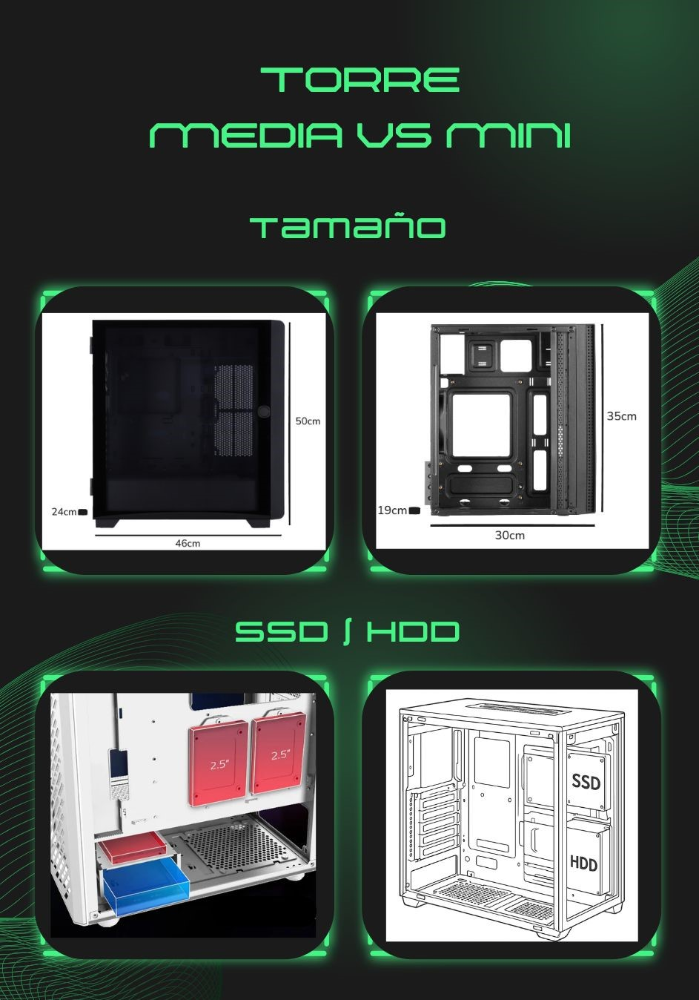

# Reto 02 — Análisis de Chasis (UT2 · RA1)

**Alumno/a:** García Raposo, Miguel

**Grupo:**  1º ASIR

**Fecha:**  09/11/2025

**Repositorio:** https://github.com/miguelraposog/FHW

# Índice

1. [Portada](00-portada.md)
2. [Introducción](02-introduccion.md)
3. [Tabla de materiales](10-tabla_materiales/tabla_comparativa.md)
4. [Formatos y diagrama](20-formatos_y_diagrama/diagrama_impacto.md)
5. [Caso práctico](30-caso_practico/caso_practico.md)
6. [Reflexión personal](40-reflexion_personal/tu_reflexion.md)
7. [Entrega y checklist](99-entrega_y_checklist.md)

# Introducción

En este documento analizamos **materiales** (acero SECC, aluminio, plástico, vidrio templado y compuestos) y **formatos** de chasis (p. ej., Torre Completa vs Mini Torre), para entender cómo afectan a **capacidad de componentes**, **refrigeración** y **experiencia de usuario**. Finalmente, resolvemos un **caso práctico** de recomendación.

## 1) Tabla comparativa de materiales
| Material              | Ventajas (3–4)                                                                                                                                          | Desventajas (2–3)                                                                                         | Aplicaciones comunes (ejemplos)                                                                         |
| ----------------------- | ---------------------------------------------------------------------------------------------------------------------------------------------------------- | ------------------------------------------------------------------------------------------------------------ | --------------------------------------------------------------------------------------------------------- |
| Acero SECC            | Alta resistencia, durabilidad, protección a interferencias electromagneticas y bajo coste                                                               | Peso elevado y facil propagación del calor en el interior                                                 | Chasis, paneles exteriores, bandejas de montaje o soportes                                              |
| Aluminio              | Ligereza, muy buena disipación térmica, blindaje electromagnético y estética de gama alta                                                            | Mayor coste y fragilidad por su facilidad a abollarse                                                      | Gabinete, disipador, marcos de las LED o carcasas de baterías                                          |
| Plastico              | Bajo coste, ligereza, facil moldeado y aislamiento electrico                                                                                             | Baja rigidez, mala disipacion del calor, puede llegar a tener desgaste estético o verse como baja calidad | Componentes internos para aislamiento o soportes, ventanas laterales (PC o PMMA) o carcasas y cubiertas |
| Vidrio templado       | Buena visión, elevada resitencia y aporta rigidez                                                                                                       | Fragilidad, mayor peso, dificultad para el flujo de aire y mayor entrada de polvo por las rendijas         | Paneles laterales y frontales                                                                           |
| Materiales compuestos | Dependiendo de ls materiales elegidos: ligereza, optimización de la resistencia a corrosión,  flexibilidad de diseño y aislaminto electricomagnético | Conjunto de las desventajas anteriores dependiendo de los materiales utilizados                            | Conjunto de las aplicaciones anteriores                                                                 |

## 2) Formatos: diagrama y análisis
**Formatos elegidos:** Torre Media vs Mini Torre

## Diagrama 

## Impacto del tamaño
- **Capacidad de componentes:** 
    - **Torre Media**: 
        - Tamaño de placa base: ATX, Micro-ATX, Mini-ITX
        - Puede contener GPU de tamaños alrededor de 300-400mm, cabiendo GPU largas.
        - Nº bahías 3,5'': 2-4
        - Nº bahías 2,5'': 2-4
        - Altura CPU: 160–180 mm
    - **Torre Mini**:
        - Tamaño de placa base: Micro-ATX, Mini-ITX
        - Puede contener GPU de tamaños alrededor de 200-320mm, no cabiendo GPU largas.
        - Nº bahías 3,5'': 0-2
        - Nº bahías 2,5'': 1-2
        - Altura CPU: 120–150 mm
- **Refrigeración:** 
    - **Torre Media**:
        - N.º de ventiladores admitidos: 4–6
        - Tamaño de ventiladores: 120 mm, 140 mm e incluso 200 mm
        - Espacio para radiadores AIO: 360 mm
        - Refrigeración líquida (custom loop): Sí
        - Presión de aire: Fácil de ajustar para positiva
    - **Torre Mini**:
        - N.º de ventiladores admitidos: 2-4
        - Tamaño de ventiladores: 120 mm, 140 mm e incluso 200 mm
        - Espacio para radiadores AIO: 240 mm
        - Refrigeración líquida (custom loop): Muy limitada
        - Presión de aire: Complicada por los pocos ventiladores que cambian rápido el equilibrio

- **Uso típico:** 
    - **Torre Media**: usada principalmente para gaming y workstations ya que requieren buena refrigeración y capacidad de expansión.

    - **Torre Mini**: habitual en equipos de ofimática, HTPC y setups compactos de gaming ya que no se busca una capacidad de expansión y la potencia y refligeración quedan en un segundo plano.

## 3) Caso práctico
**Necesidades del cliente:** 
- Máxima capacidad de almacenamiento (varios HDD/SSD)
- Múltiples tarjetas gráficas (diseño/simulación)
- Buena refrigeración

## 1) Formato recomendado
**Elección:** Torre completa / Full tower  

**Por qué:** Esta es la mejor opción ya que contiene un gran espacio interior en el que caben varias tarjetas gráficas al poder contener una placa basa eATX y con ello traer también de 8-10 ranuras PCIe. Tabién al ser así de grandes, tienen un excelente diseño para el flujo de aire positivo. No hay que olvidarse de la gran cantidad de bahías para HDD y SDD. En cuanto a la refrigeración, esta opción podría permitir refrigereción líquida customizada y radiadores AIO de gran tamaño para mantener temperaturas estables.

## 2) Material recomendado
**Elección:**  Chasis con en acero SECC, paneles exteriores de aluminio, panel lateral de cristal templado.

**Por qué:**

El acero SECC nos da la mejor rigidez y soporte para múltiples GPUs y gran capacidad de almacenamiento, manteniendo un coste razonable. Al poner los paneles de aluminio conseguimos reducir el peso, además de aportan una estética más premium, mientras que el cristal templado podemos mostrar el interior del equipo, añadiendo valor visual y mejorando más la estética. Por último, buscar separadores de goma para reducir vibraciones.

Con esta combinación de materiales se consigue una disipación eficiente mediante un buen flujo de aire y espacio para radiadores grandes o sistemas de refrigeración líquida, sin que el material limite el rendimiento térmico. Los  soportes de goma minimizan vibraciones generadas por discos duros y ventiladores. Esta configuración asegura un equilibrio óptimo entre rigidez, peso, coste, estética, disipación y control de vibraciones.

## 4) Reflexión personal
En mi opinión, el chasis es un componente del PC decisivo para el funcionamiento óptimo del ordenador. Al fin y al cabo, este es el que soporta todos los componentes y el que permite la buena refrigeracíon y protección de estos. Para la experiencia del usuario, es importante que el ordenador haga el menor ruido posible y es gracias a la buena elección de materiales de la torre que llegamos a conseguir esto, por ejemplo, si no hubiera buenos aislantes, podríamos recibir corriente nosotros mismos o que hibiera interferencia entre los componentes; también, sin la elección adecuada de materiales podría el ordenador podría producir demasidas vibraciones por el movimiento de los ventiladores.    
Para que los componentes puedan rendir al máximo es importante tener en cuenta su temperatura, por ellos es importante conseguir un flujo de aire positivo para la optima reflrigeración. Entonces se necesita suficiente espacio para ventiladores y radiadores, sin olvidar la presencia de filtros para intentar llenar el interior del PC lo menos posible de polvo.
Además, es importante que nuestra caja tenga los suficientes puertos actualizados para poder trabajar ya que sin estos o con puertos muy antiguos relentizaríamos el trbajo exponencialmente.    
Por último, a todos nos interesa que nuestra caja se vea lo más bonita posible y en eso también influyen los materiales ya que estos son el acabado final.
