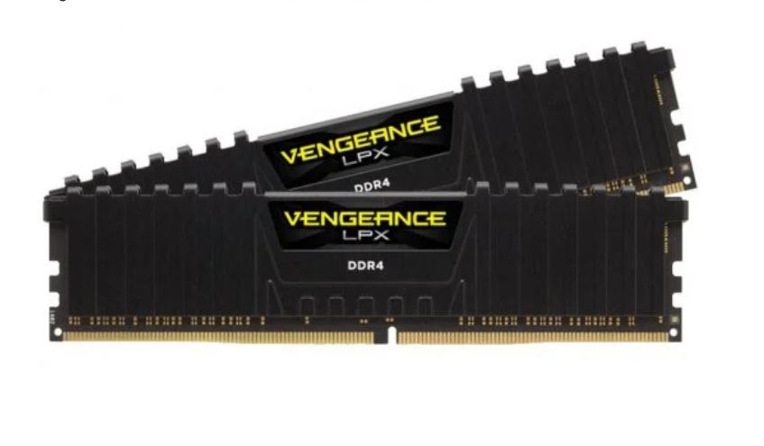
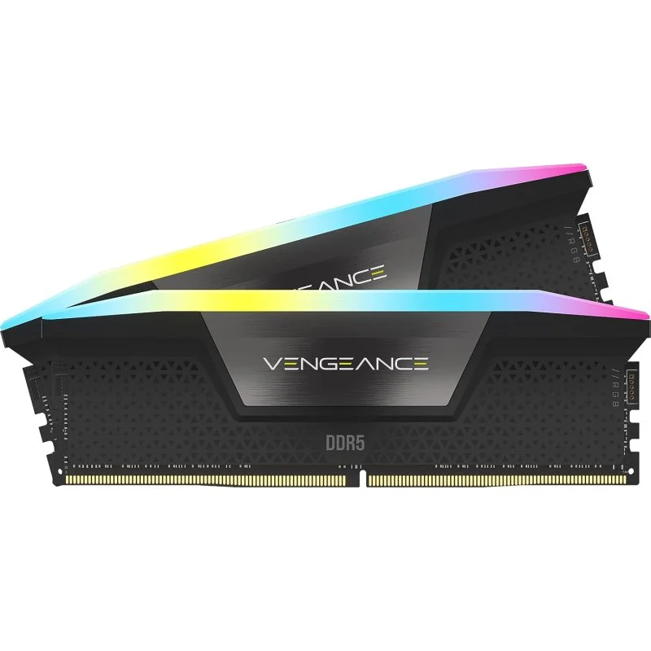
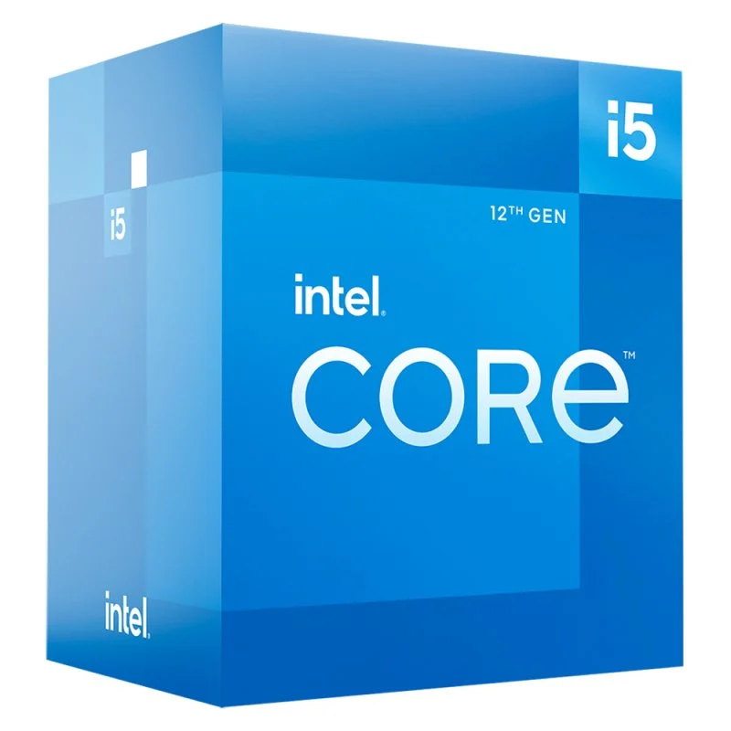
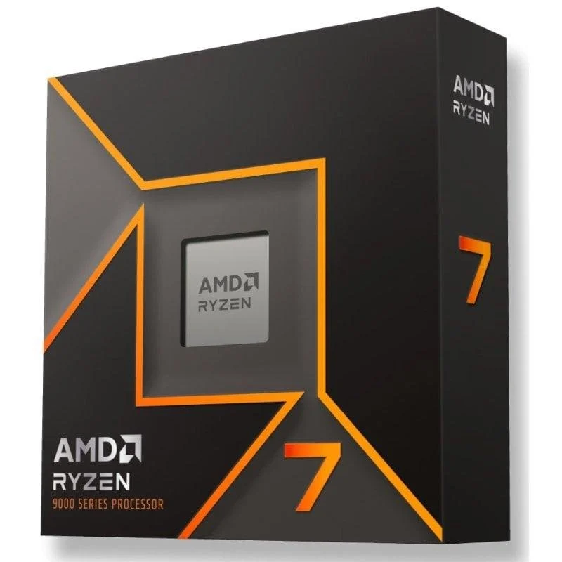

# Parte 2 — Componentes y DDR5 (archivo único)

## 1) Búsqueda de componentes

Para cada uno: **marca/modelo**, **características**, **precio**, **URL**, **captura**, **justificación**.

### RAM oficina

- Marca/Modelo: Corsair Vengeance LPX DDR4
- Capacidad/Velocidad/Tipo: 16GB 2X8GB, 3200MHz, DDR4 CL16
- Precio: 105,18€
- URL: https://www.pccomponentes.com/corsair-vengeance-lpx-ddr4-3200-pc4-25600-16gb-2x8gb-cl16-negro
- Captura: 
- Justificación: Al necesitarse para oficina no se necesita gran cantidad de velocidad, por ello he elegido una ddr4. Como se va ha trabajar con varios programas simultaneamente he decidido que con 16GB puede ir bien.

### RAM gaming

- Marca/Modelo: Corsair Vengeance RGB DDR5
- Capacidad/Velocidad/Tipo: 32GB 2x16GB, 6000MHz, DDR5 CL30
- Precio: 765,91€
- URL: https://www.pccomponentes.com/corsair-vengeance-rgb-ddr5-6000mhz-32gb-2x16gb-cl30-negra
- Captura: 
- Justificación: Creo que esta es una muy buena opción ya que tiene una gran velocidad al ser CL30 y poseer 6000MHz. Además he elegido 32GB ya que me parece lo buena opción para gaming ya que los juegos como los AAA o shooter necesitan cargar sus graficos y texturas rápidamente y me parece que con 32 es suficiente.

### CPU oficina

- Marca/Modelo: Intel Core i5-12400
- Núcleos/Hilos/Frecuencia: 6 núcleos, 12 hilos, 2,5GHz
- TDP/Gráfica integrada (si aplica): Intel UHD Graphics 730
- Precio: 224,90€
- URL: https://www.pccomponentes.com/intel-core-i5-12400-25-ghz
- Captura: 
- Justificación: He elegido Intel ya que normalmente saus procesadores son mejores para tareas sencillas de un solo hilo. En concreto he seleccionado esta ya que tiene gráfica integrada y así no hay que preocuparse por comprar una tarjeta gráfica y poder tener un presupuesto menor ya que en un PC de oficina no hay necesidad de una buena GPU. Además tiene hilos y frecuencia suficientes para cualquier tarea que puede llegar a realizar.

### CPU gaming

- Marca/Modelo: AMD Ryzen 7 9700X
- Núcleos/Hilos/Frecuencia: 8 núcleos, 16 hilos, 3.8/5.5GHz
- TDP: No
- Precio: 289,90€
- URL: https://www.pccomponentes.com/procesador-amd-ryzen-7-9700x-38-55ghz
- Captura: 
- Justificación: He elegido esta ya que creo que para gaming la potencia bruta de los procesadores Ryzen es preferible antes que intel. Em concreto he seleccionado este porque tiene buena cantidad de hilos para tener aplicaciones en segundo plano y también para que los juegos vayan fluidos. Obviamente va sin gráfica integrada ya que lo recomendable es que se compre una tarjeta gráfica aparte.

## 2) Tabla comparativa RAM (DDR4 vs DDR5)

| Atributo       | DDR4                             | DDR5         |
| ---------------- | ---------------------------------- | -------------- |
| Velocidad      | 2400-3200MHz                     | 4800-6400MHz |
| Consumo        | 1,2 V                            | 1,1 V        |
| Precio         | Barato                           | Caro         |
| Compatibilidad | Baja, con placas madres antiguas | Alta         |

## 3) Investigación DDR5

- Ventajas respecto a DDR4:
  - Sobretodo en la velocidad, llegando a conseguir más del doble de velocidad.
  - En cuanto a la regulación de la alimentación, la DDR4 era regulada en la placa base, mientras que las DDR5 tienen su propio circuito integrado de gestión de la alimentación.
  - Menor consumo.
  - Mayor capacidad
- Usos principales donde más se nota:
  - Gaming
  - Workstations
  - Edición profesional
  - Big Data
- Ejemplo de dispositivo/situación especialmente ventajosa:
  - Estás jugando un juego AAA y hay muchas cosas en pantalla.
  - Edición de videos en 4K.
  - Edición 3D en Blender.
  - Desarrollo de IA
