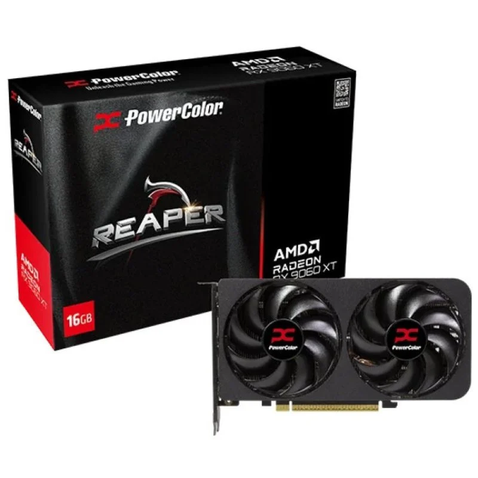
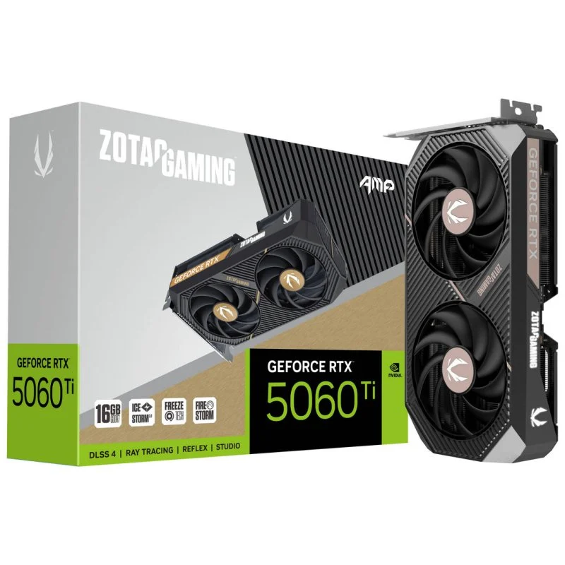
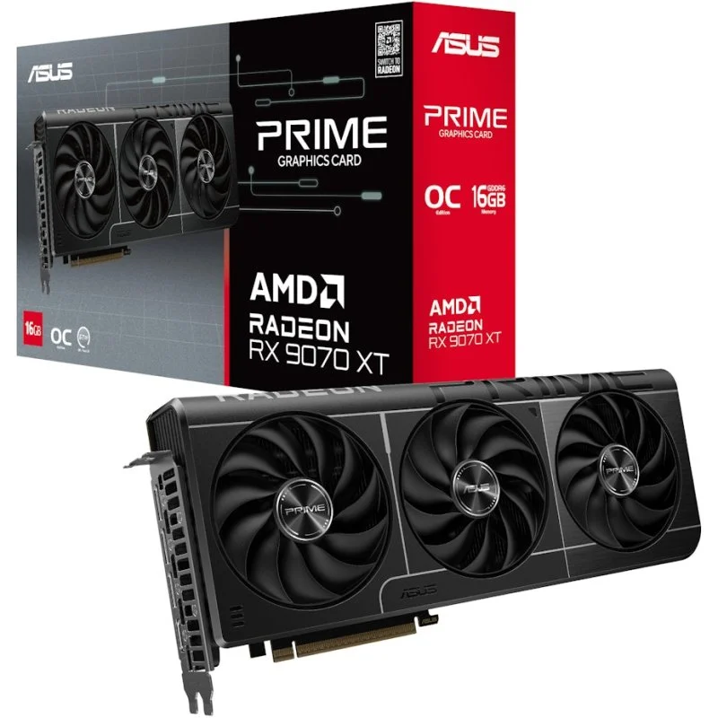
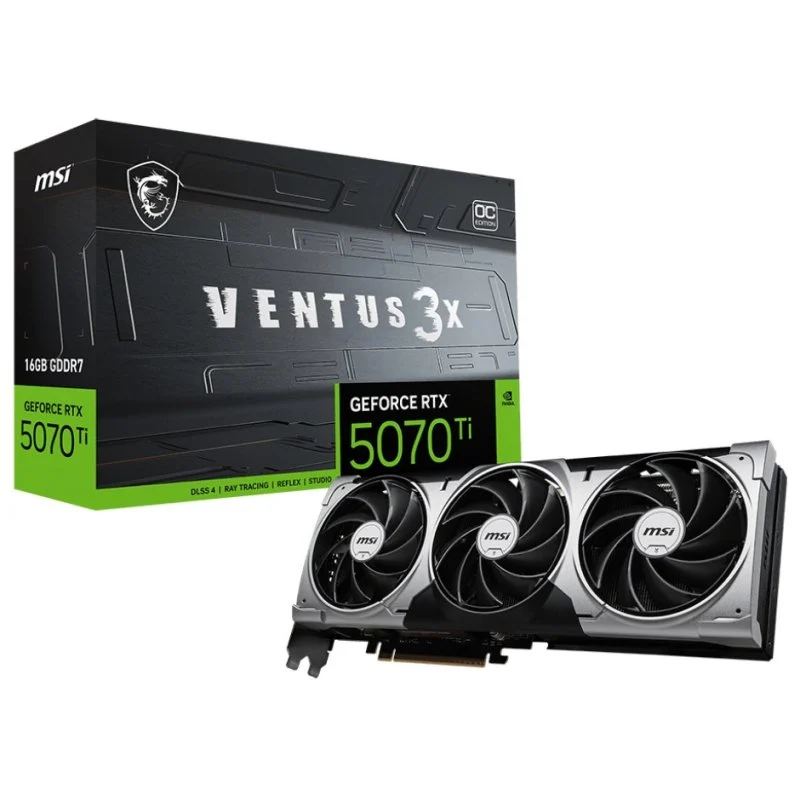

# Parte 3 — GPUs y precios reales (Black Friday 2025)

> Vídeo: **“Mejores Tarjetas Gráficas Calidad - Precio | TOP GPUs GAMING Black Friday 2025”**
> URL: https://www.youtube.com/watch?v=ILOtkTXLUvg

## 0) Portada

- Alumno/a: _Miguel García Raposo
- Grupo: ASIR1
- Fecha: 05/12/2025

## 1) Introducción (5–10 líneas)

Breve resumen del vídeo y de lo que vas a hacer en esta parte.

## 2) Tramos del vídeo y modelos mencionados

### 2.1 Tramo ~350 €

- Minuto inicio–fin: **4:45 – 9:30**
- GPUs citadas (2): **RX 9060 XT 16GB GDDR6**, **RTX 5060Ti 16GB GDDR7**

### 2.2 Tramo 600–800 €

- Minuto inicio–fin: **11:30 – 14:10**
- GPUs citadas (2): **RX 9070 XT 16GB GDDR6**, **RTX 5070Ti 16GB GDDR7**

**¿Se repite algún modelo entre tramos?** Explica brevemente.
Se repiten modelos pero cambiando la cantidad de VRAM, generalmente entre 8GB y 16GB como es el caso de la 5060Ti que menciona quea prefiere la 16GB aún sobre pasando los 400€. Esto permite qeua loas juegos vayan más fluidos.

## 3) Precios reales en tiendas

> Inserta imágenes en `assets/img/30-parte3/` y enlaza con ruta relativa.

### 3.1 GPU del tramo 350 € — Modelo A

- Tienda: PC Componentes
- Nombre exacto en tienda: Tarjeta Gráfica PowerColor Reaper AMD Radeon RX 9060 XT 16GB GDDR6 FSR 4
- Precio (€): 405,36€
- URL: https://www.pccomponentes.com/tarjeta-grafica-powercolor-reaper-amd-radeon-rx-9060-xt-16gb-gddr6-fsr-4
- Imagen: 

### 3.2 GPU del tramo 350 € — Modelo B

- Tienda: PC Componentes
- Nombre exacto en tienda: Tarjeta Gráfica ZOTAC GAMING GeForce RTX 5060 Ti AMP 16GB GDDR7 Reflex 2 RTX AI DLSS4
- Precio (€): 479,90€
- URL: https://www.pccomponentes.com/tarjeta-grafica-zotac-gaming-geforce-rtx-5060-ti-amp-16gb-gddr7-reflex-2-rtx-ai-dlss4
- Imagen: 

### 3.3 GPU del tramo 600–800 € — Modelo C

- Tienda: PC Componentes
- Nombre exacto en tienda: Tarjeta Gráfica ASUS PRIME AMD Radeon RX 9070 XT OC 16GB GDDR6 FSR 4
- Precio (€): 739,90€
- URL: https://www.pccomponentes.com/tarjeta-grafica-asus-prime-amd-radeon-rx-9070-xt-oc-16gb-gddr6-fsr-4
- Imagen: 

### 3.4 GPU del tramo 600–800 € — Modelo D

- Tienda: PC Componentes
- Nombre exacto en tienda: Tarjeta Gráfica MSI GeForce RTX 5070 Ti VENTUS 3X OC 16GB GDDR7 Reflex 2 RTX AI DLSS4
- Precio (€): 937,47€
- URL: https://www.pccomponentes.com/tarjeta-grafica-msi-geforce-rtx-5070-ti-ventus-3x-oc-16gb-gddr7-reflex-2-rtx-ai-dlss4
- Imagen: 

> Nota: Si no encuentras el mismo **ensamblador**, indica la diferencia manteniendo la misma **GPU**.

## 4) Tabla comparativa (precios reales)

| Tramo (vídeo) | GPU (modelo del vídeo)                                  | Tienda        | Precio (€) | URL                                                                                                                 | Imagen             |
| ---------------- | ---------------------------------------------------------- | --------------- | ------------: | --------------------------------------------------------------------------------------------------------------------- | -------------------- |
| 350 €         | PowerColor Reaper AMD Radeon RX 9060 XT 16GB GDDR6Modelo | PCComponentes |    405,36€ | https://www.pccomponentes.com/tarjeta-grafica-powercolor-reaper-amd-radeon-rx-9060-xt-16gb-gddr6-fsr-4              | *(insertar abajo)* |
| 350 €         | ZOTAC GAMING GeForce RTX 5060 Ti AMP 16GB GDDR7Modelo    | PCComponentes |    479,90€ | https://www.pccomponentes.com/tarjeta-grafica-zotac-gaming-geforce-rtx-5060-ti-amp-16gb-gddr7-reflex-2-rtx-ai-dlss4 | *(insertar abajo)* |
| 600–800 €    | ASUS PRIME AMD Radeon RX 9070 XT OC 16GB GDDR6Modelo     | PCComponentes |    739,90€ | https://www.pccomponentes.com/tarjeta-grafica-asus-prime-amd-radeon-rx-9070-xt-oc-16gb-gddr6-fsr-4                  | *(insertar abajo)* |
| 600–800 €    | MSI GeForce RTX 5070 Ti VENTUS 3X OC 16GB GDDR7Modelo    | PCComponentes |    937,47€ | https://www.pccomponentes.com/tarjeta-grafica-msi-geforce-rtx-5070-ti-ventus-3x-oc-16gb-gddr7-reflex-2-rtx-ai-dlss4 | *(insertar abajo)* |

## 5) Conclusión (5–8 líneas)

- ¿Los precios reales se parecen a lo que sugiere el vídeo?
  - Son parecidos aunque la mayoría están por arriba de lo que pone en el video. Aunque Black Friday ya ha pasado y por eso han vuelto a asu precio normal.
- ¿Cuál de las cuatro ofrece mejor **calidad-precio** y por qué?
  - Hablando de las dos gamas, media y alta, por igual AMD ofrece mejores especificaciones por menor precio, aunque Nvidia al tener su tecnología implantada en gran cantidad de juegos quiza se vuelve una opción a elegir. Pero sin duda calidad precio AMD es la mejor.
- Observaciones finales.
  - ADM: mejores características por menor precio.
  - Nvidia: más cara pero posee su tecnolgía que está presente en gran cantidad de juegos.

## 6) Fuentes

- Tiendas: enlaces listados arriba.
  - https://www.pccomponentes.com/tarjeta-grafica-powercolor-reaper-amd-radeon-rx-9060-xt-16gb-gddr6-fsr-4
  - https://www.pccomponentes.com/tarjeta-grafica-zotac-gaming-geforce-rtx-5060-ti-amp-16gb-gddr7-reflex-2-rtx-ai-dlss4
  - https://www.pccomponentes.com/tarjeta-grafica-asus-prime-amd-radeon-rx-9070-xt-oc-16gb-gddr6-fsr-4
  - https://www.pccomponentes.com/tarjeta-grafica-msi-geforce-rtx-5070-ti-ventus-3x-oc-16gb-gddr7-reflex-2-rtx-ai-dlss4
- Vídeo: URL al inicio del documento.
  - https://www.youtube.com/watch?v=ILOtkTXLUvg
