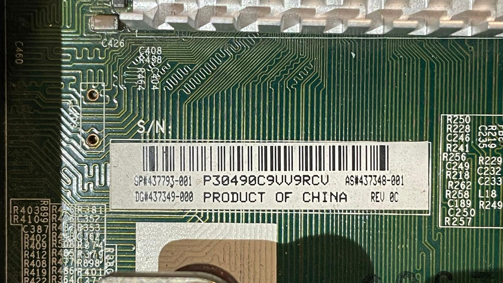
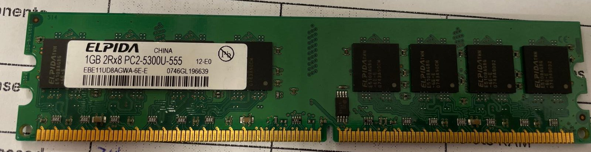
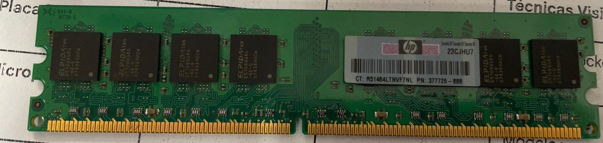
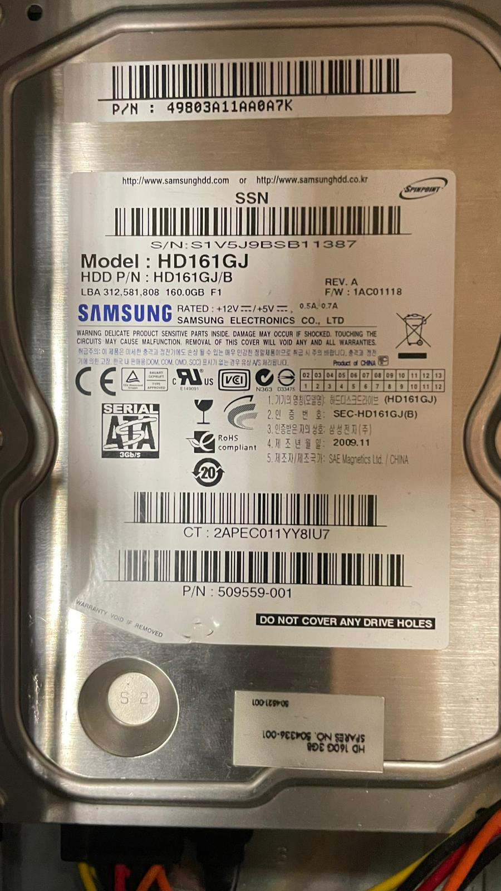
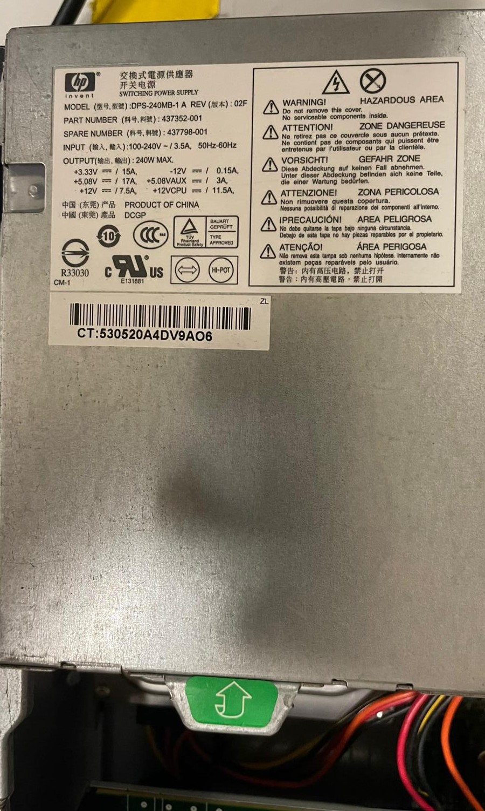
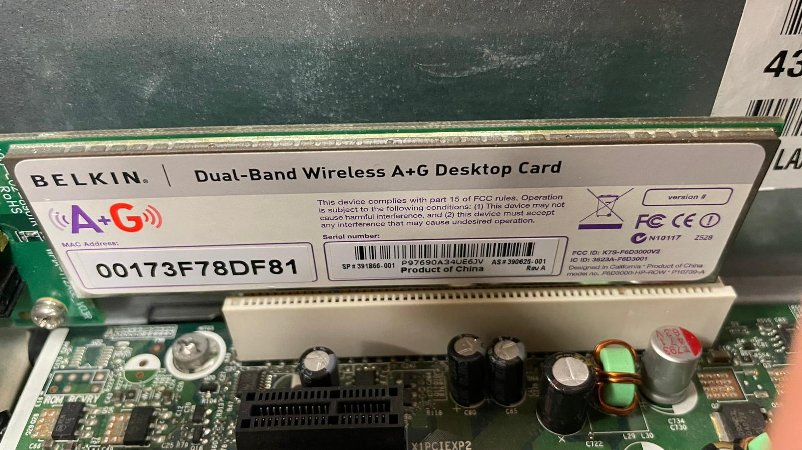
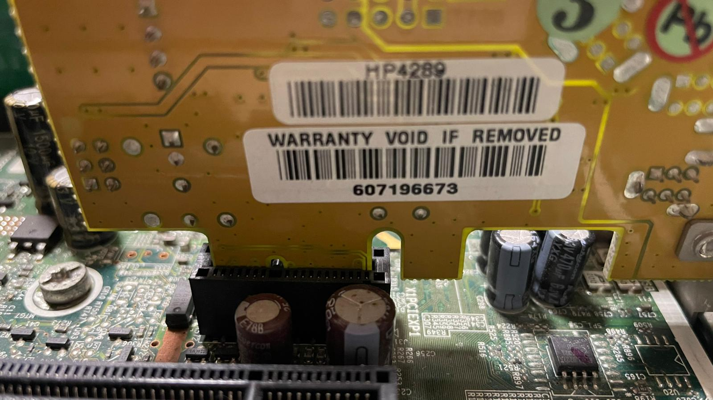

# 10 — Toma de datos (taller)

| Componente                  | Marca/Fabricante                                                               | Modelo/Serie                                                               | Características técnicas visibles               | Foto                                                                                                                                                                |
| ----------------------------- | -------------------------------------------------------------------------------- | ---------------------------------------------------------------------------- | --------------------------------------------------- | --------------------------------------------------------------------------------------------------------------------------------------------------------------------- |
| **Placa base**              | HP                                                                             | 437793-001 Compact dc7800 SFF                                              | Intel Q35 Express / LGA 775Socket/ 4 ranuras DDR2 |                                                                                                |
| **Microprocesador**         | Intel                                                                          | Core 2 Duo E6750                                                           | Core 2 Duo E6750 / 2.66 GHz                       |                                                                                                              |
| **Memoria RAM**             | HP / Elpida                                                                    | PC2-6400U-666                                                              | DDR2, 1 GBx4, 667MHz                              |                                                 |
| **Disco HDD/SSD**           | Samsung                                                                        | HD161GJ 3,5"                                                               | SATA, 160 GB                                      |                                                                                           |
| **Fuente de alimentación** | HP                                                                             | DPS-240MB-1 SFF                                                            | 240V , Sin certificación, 3.5A, 60Hz             |                                                                                                             |
| **Otros (GPU/Tarjetas)**    | GPU integrada / Tarjeta de red (BELKIN) / Tarjeta gráfica de video (Silicon ) | Belkin Dual-band Wireless A+G Desktop Card / Silicon Image Orion ADD2-N HP |                                                   |   |
