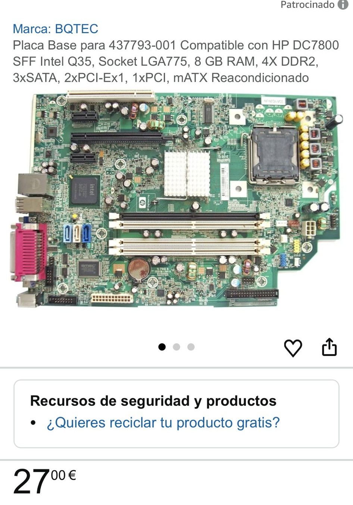
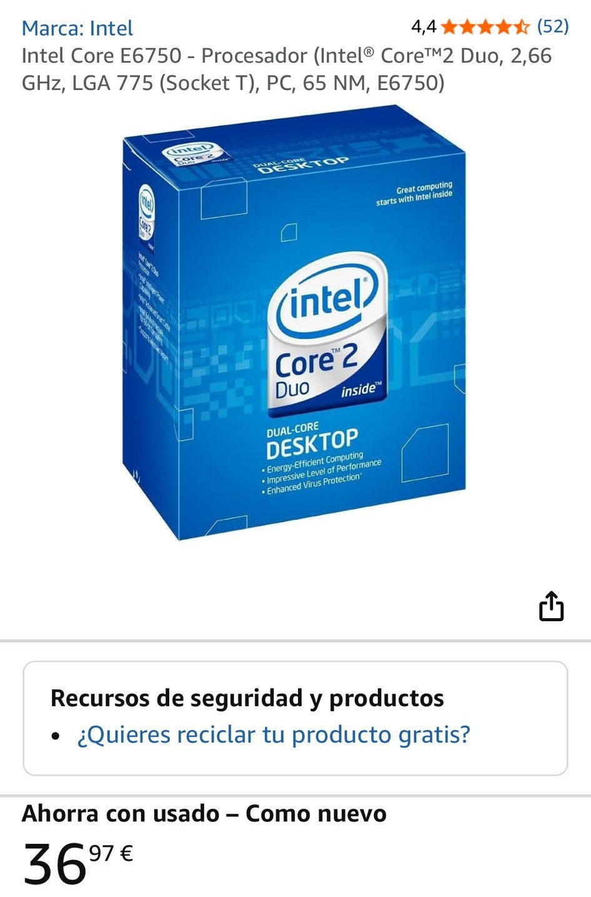
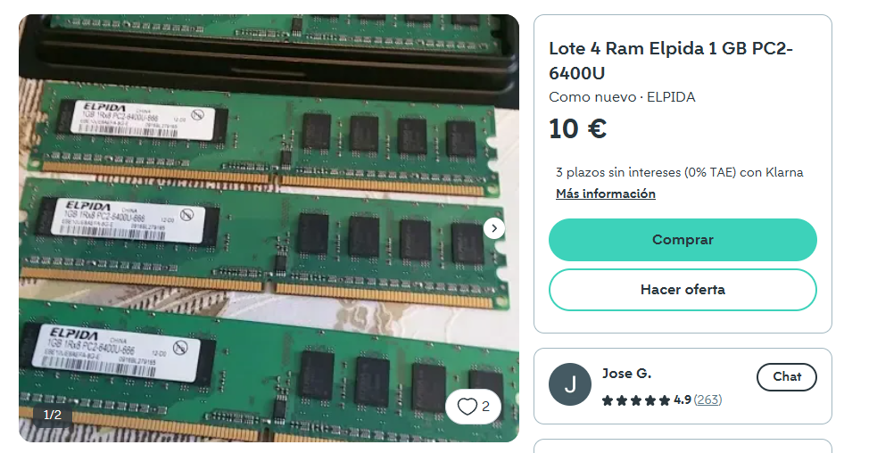
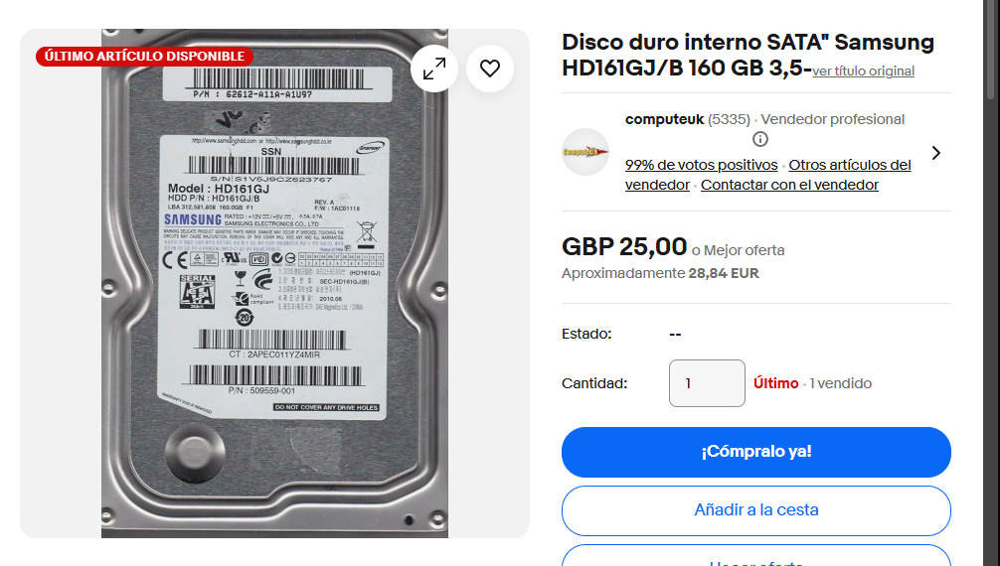
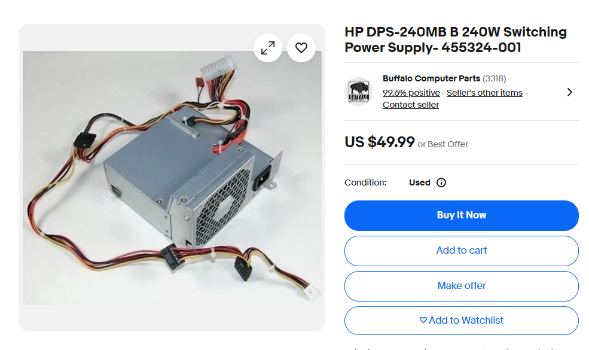

# 30 — Mercado y recambios

> Imagina que el equipo falla. Selecciona **tres** componente para recambio.

- **Componente a sustituir:** Placa base HP 437793-001 Compact dc7800 SFF
- **¿Existe el mismo modelo exacto en tiendas?** (Sí / No / Solo segunda mano): Sí
- **Alternativa compatible (socket/ranura):**  LGA775
- **Precio aproximado (€):**  27,00€
- **URL:** https://www.amazon.es/437793-001-Compatible-DC7800-Socket-2xPCI-Ex1/dp/B0CVHJLRTP 
- **Captura:** 

**Justificación breve:** Porque es exáctamente la misma.

- **Componente a sustituir:**  Intel Core 2 Duo E6750
- **¿Existe el mismo modelo exacto en tiendas?** (Sí / No / Solo segunda mano):  Segunda mano
- **Alternativa compatible (socket/ranura):**  LGA775
- **Precio aproximado (€):**  37,97€
- **URL:**  https://www.amazon.es/Intel-Core-E6750-Procesador-Socket/dp/B000R9BJ2C
- **Captura:** 

**Justificación breve:** Porque es exáctamente la misma.

- **Componente a sustituir:**  HP Elpida PC2-6400U-666 1GBx4
- **¿Existe el mismo modelo exacto en tiendas?** (Sí / No / Solo segunda mano):  
- **Alternativa compatible (socket/ranura):**  DDR2
- **Precio aproximado (€):**  10€ + 3€ envio
- **URL:**  https://es.wallapop.com/item/ram-elpida-1-gb-pc2-6400u-492830253?srsltid=AfmBOoqw5OJaz9WxoLI6ZvTvet_jOrb3mT81Tr6dIcmfY7wdlK674VWN1FY
- **Captura:** 

**Justificación breve:** Porque es exáctamente la misma.

- **Componente a sustituir:**  Samsung HD161GJ 3,5"
- **¿Existe el mismo modelo exacto en tiendas?** (Sí / No / Solo segunda mano): Segunda mano
- **Alternativa compatible (socket/ranura):**  SATA
- **Precio aproximado (€):**  28,84€
- **URL:**  https://www.ebay.es/itm/123199960860
- **Captura:** 

**Justificación breve:** Porque es exáctamente la misma.

- **Componente a sustituir:**  HP DPS-240MB-1 SFF
- **¿Existe el mismo modelo exacto en tiendas?** (Sí / No / Solo segunda mano): Segunda mano
- **Alternativa compatible (socket/ranura):**  
- **Precio aproximado (€):**  50,00€
- **URL:**  https://www.ebay.com/itm/325802823960
- **Captura:** 

**Justificación breve:** Porque es exáctamente la misma.