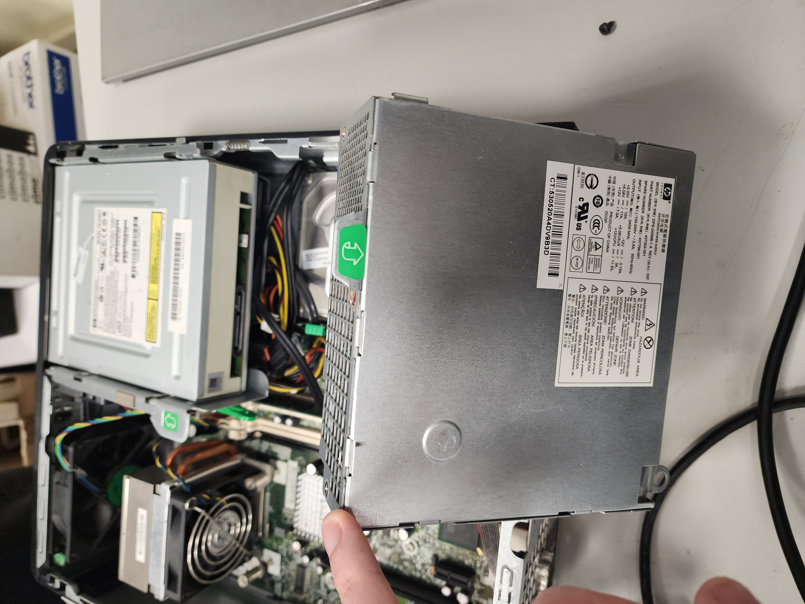
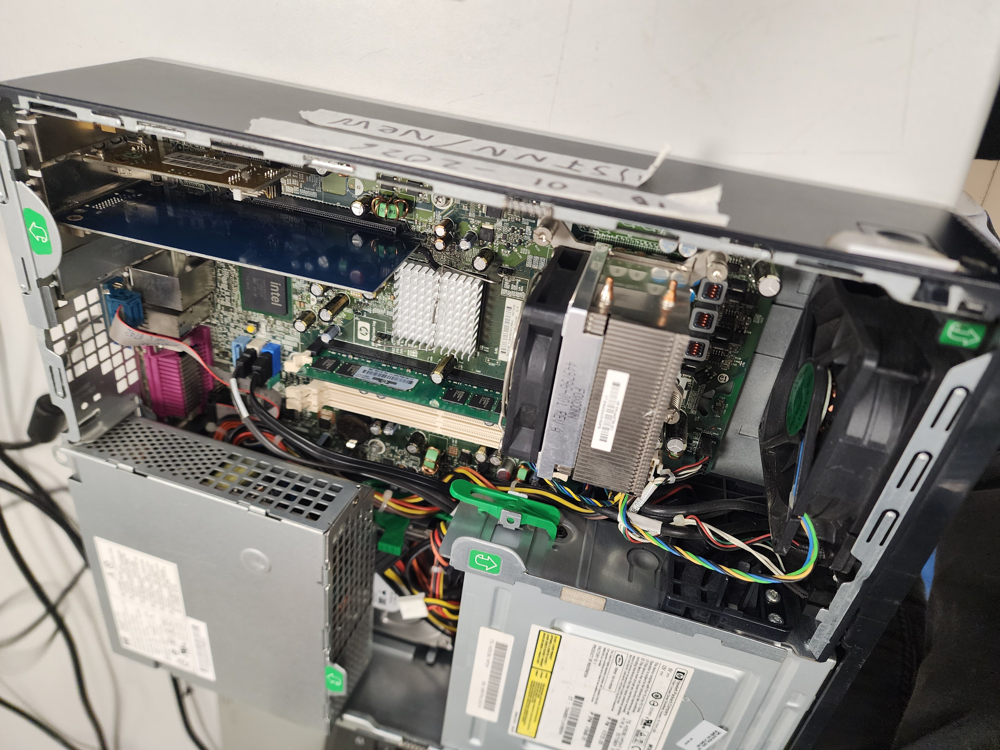
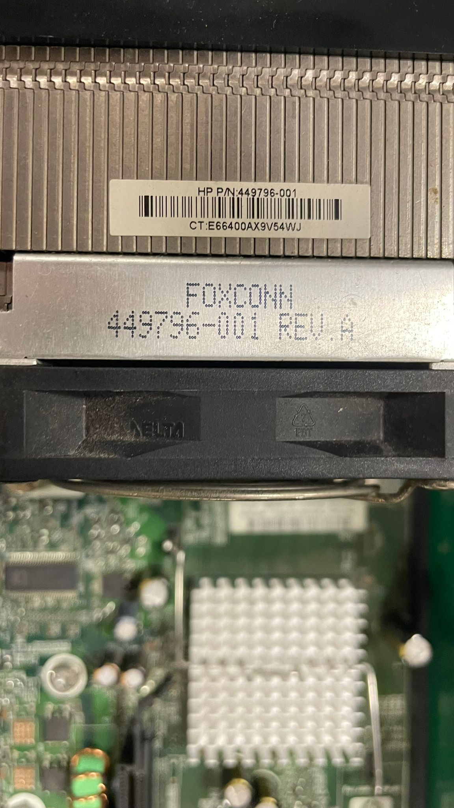

# 10 — Diagnóstico inicial del lote

- Modelo de CPU / RAM / almacenamiento por **5 unidades muestreadas**.(NOTA-PREGUNTA POR LOS DEMAS GRUPOS para obtener estos datos - podeis verlo en sus repositorios.)
- Estado térmico (temperaturas reposo/carga breve).
- Problemas detectados (discos con sectores reasignados, ruido, etc.).

| ID Equipo     | CPU / Socket                    | RAM Instalada / Máx | Almacenamiento       | Ranuras/Bahías Libres      | Observaciones (Estado físico y térmico)                   |
| :-------------- | :-------------------------------- | :--------------------- | :--------------------- | :---------------------------- | :------------------------------------------------------------ |
| **Equipo 01** | Intel Core 2 Duo E6750 / LGA775 | 4 GB DDR2 / 8 GB     | HDD 160 GB (Samsung) | 0 slots RAM / 1 bahía 3.5" | Polvo residual y cables que podrian estar mejor gestionados |
| **Equipo 02** | Intel Core 2 Duo E6750 / LGA775 | 4 GB DDR2 / 8 GB     | HDD 160 GB (Samsung) | 0 slots RAM / 1 bahía 3.5" | Polvo residual y mala gestion de los cables internos        |
| **Equipo 03** | Intel Core 2 Duo E6750 / LGA775 | 1 GB DDR2 / 8 GB     | HDD 160 GB (Seagate) | 3 slots RAM / 1 bahía 3.5" | Fallo en pila CMOS y chasis deformado o atascado            |
| **Equipo 04** | Intel Core 2 Duo E6750 / LGA775 | 1 GB DDR2 / 8 GB     | HDD 160 GB (Seagate) | 3 slots RAM / 1 bahía 3.5" | Pasta térmica muy degradada y suciedad interna             |
| **Equipo 05** | Intel Core 2 Duo E6750 / LGA775 | 1 GB DDR2 / 8 GB     | HDD 160 GB (Seagate) | 2 slots RAM / 1 bahía 3.5" | Mucho polvo acumulado y falta antena wifi                   |

**Capturas:**

