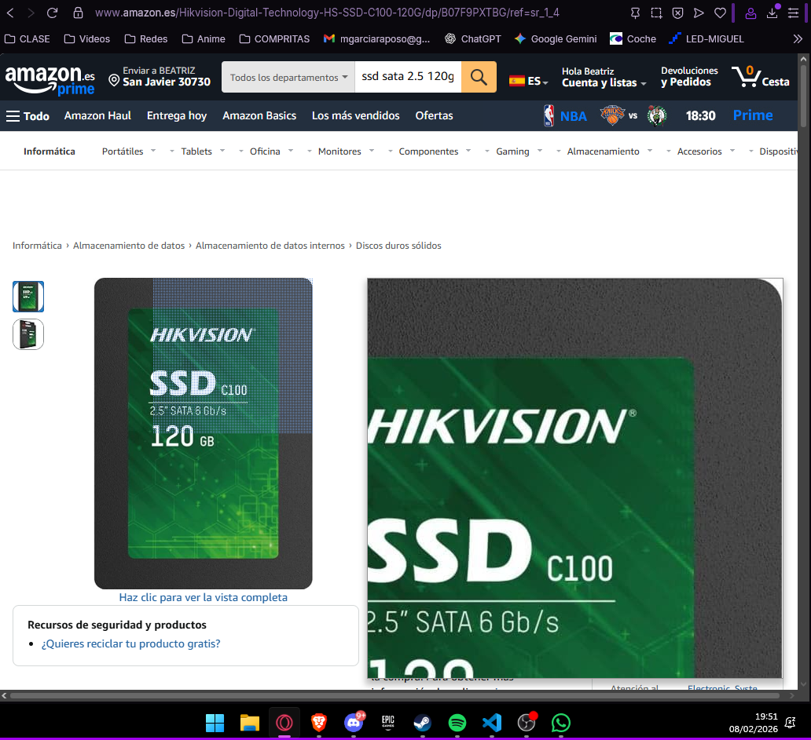
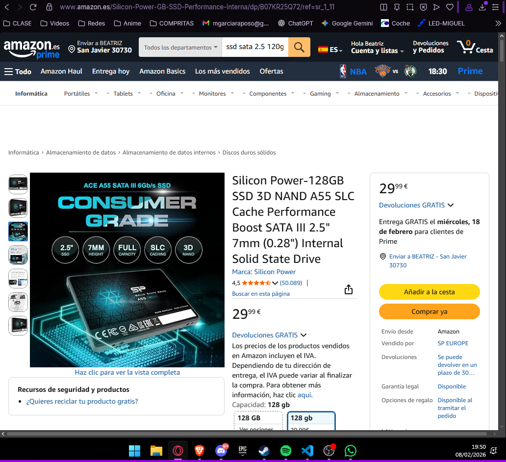
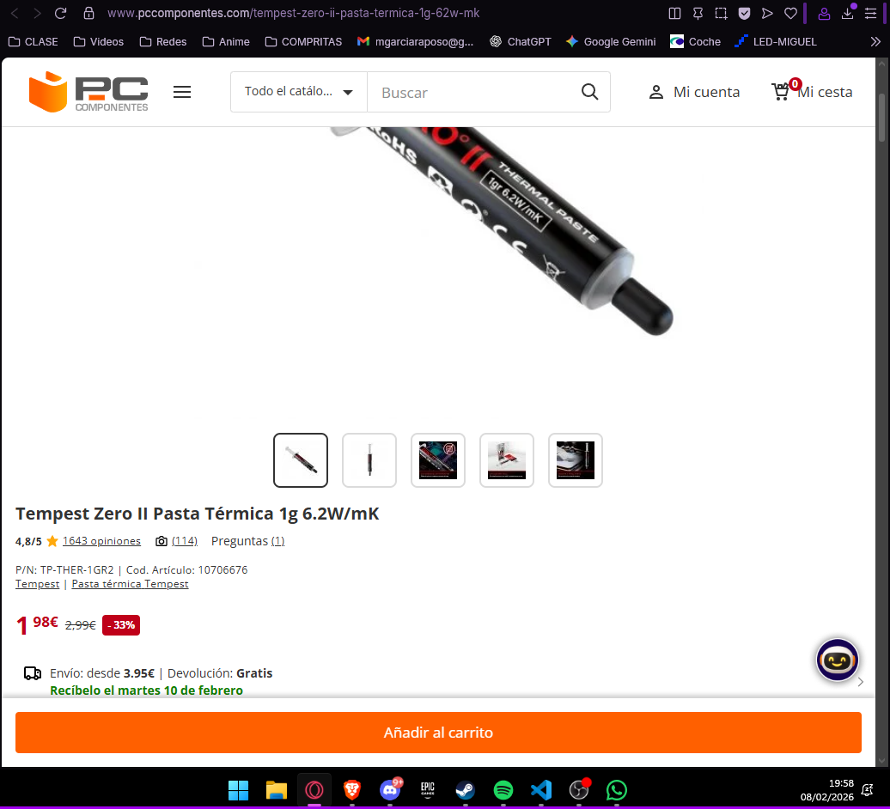
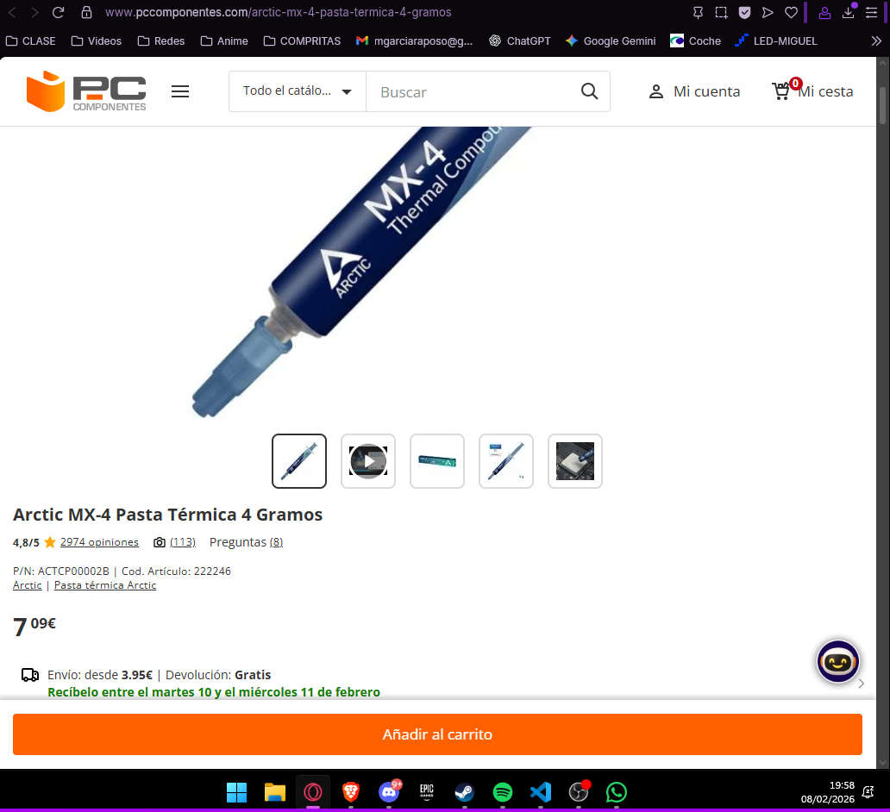

# 30 — Búsqueda y selección de mejoras de **hardware**

> **Objetivo:** Encontrar las **mejoras mínimas** que conviertan cada PC en **usable** para el centro de mayores, **respetando** S0/S1/S2.

## 1) Piezas candidatas (con enlaces y capturas)

Busca en **tiendas online españolas** (PcComponentes, Amazon ES, Coolmod, Wallapop/segunda mano con precaución) y documenta **al menos 2 opciones por categoría** (cuando aplique):

- **Almacenamiento:** SSD 2.5" (120–240 GB) o adaptadores 2.5"→3.5".
- **Memoria RAM:** módulos compatibles (capacidad y MHz soportados por tu placa).
- **Mantenimiento:** pasta térmica económica, filtros de polvo, tornillería o caddy(**adaptador/bandeja (caddy) para montar una unidad de almacenamiento** en un hueco del PC).
- **Otros (si procede):** adaptador Wi-Fi USB de bajo coste, altavoz barato si no hay sonido, etc.

### Almacenamiento (SSD 2.5" SATA)

| Categoría | Marca/Modelo | Capacidad | Precio (€) | Tienda | URL | Captura |
|---|---|---|---|---|---|---|
| SSD | Hikvision Digital | 120 GB | 22,55 | Amazon ES | https://www.amazon.es/Hikvision-Digital-Technology-HS-SSD-C100-120G/dp/B07F9PXTBG/ref=sr_1_4?adgrpid=52058013090&dib=eyJ2IjoiMSJ9.SpPkr6SgtSE4prOx3EPHqBzOhkIFxXvx8N6JiRGIhp9RokH2X8eec9cX3BbEPGBvukD1efU0RM8CCqpfmJWIA9uIzoG1YDmE8r_m0oEgmlNE4dSsWOo5Qs03b0FX7D9AaJrLooCF3Z5zP5n8ZJm9_MevDddenufRf7XNb3Xh0iDTT39omrFhDF0sCZUdanSiRiuAMpsfmI3cwzBCLrksNNucALJk5D4kaBUt16BR4N-Gs6I0D9khlzgVywAIy4Mv-RoCpHQEkrhe3PinAWMe3-6A2LLHZ7ewajv14FHT5MA.7H1D1fS4qnqt61lyfWopJmJmQ10CIvf7cqE4Pbzb56E&dib_tag=se&hvadid=601314682948&hvdev=c&hvexpln=0&hvlocphy=9208723&hvnetw=g&hvocijid=13356261423045380000--&hvqmt=b&hvrand=13356261423045380000&hvtargid=kwd-506959462530&hydadcr=23167_2231449&keywords=ssd%2Bsata%2B2.5%2B120gb&mcid=d7ae5352a32039af98060879ffe380f9&qid=1770576254&sr=8-4&th=1|  |
| SSD | Silicon Power | 128 GB | 29,99 | Amazon ES | https://www.amazon.es/Silicon-Power-GB-SSD-Performance-Interna/dp/B07KR25Q72/ref=sr_1_11?adgrpid=52058013090&dib=eyJ2IjoiMSJ9.SpPkr6SgtSE4prOx3EPHqBzOhkIFxXvx8N6JiRGIhp9RokH2X8eec9cX3BbEPGBvukD1efU0RM8CCqpfmJWIA9uIzoG1YDmE8r_m0oEgmlNE4dSsWOo5Qs03b0FX7D9AaJrLooCF3Z5zP5n8ZJm9_MevDddenufRf7XNb3Xh0iDTT39omrFhDF0sCZUdanSiRiuAMpsfmI3cwzBCLrksNNucALJk5D4kaBUt16BR4N-Gs6I0D9khlzgVywAIy4Mv-RoCpHQEkrhe3PinAWMe3-6A2LLHZ7ewajv14FHT5MA.7H1D1fS4qnqt61lyfWopJmJmQ10CIvf7cqE4Pbzb56E&dib_tag=se&hvadid=601314682948&hvdev=c&hvexpln=0&hvlocphy=9208723&hvnetw=g&hvocijid=13356261423045380000--&hvqmt=b&hvrand=13356261423045380000&hvtargid=kwd-506959462530&hydadcr=23167_2231449&keywords=ssd%2Bsata%2B2.5%2B120gb&mcid=d7ae5352a32039af98060879ffe380f9&qid=1770576426&sr=8-11&th=1 |  |

### Mantenimiento y pasta térmica

| Categoría     | Marca/Modelo                  | Contenido | Precio (€) | Tienda        | URL                                             | Captura             |
|---------------|-------------------------------|-----------:|-----------:|---------------|-------------------------------------------------|---------------------|
| Pasta térmica | Temperst Zero II              | 1 g        | 1,98       | PcComponentes | https://www.pccomponentes.com/tempest-zero-ii-pasta-termica-1g-62w-mk     |  |
| Pasta térmica | Arctic MX-4 4 g               | 4 g        | 7,09       | PcComponentes | https://www.pccomponentes.com/arctic-mx-4-pasta-termica-4-gramos     |  |

## 2) Compatibilidad técnica

Para **cada pieza** elegida, justifica la **compatibilidad** con tu lote:

- **SSD:**  Están en formato 2.5" y utilizan **interfaz SATA III retrocompatible con SATA II**, por lo que se pueden utilizar en bahías libres o con adaptador de 2.5" a 3.5". Las placas estándar de sobremesa con puertos SATA admiten sin problema estos SSD.
- **Pasta térmica:** Es compatible con **cualquier disipador y CPU de sobremesa estándar**, aplicándose entre el procesador y su disipador para mejorar transferencia de calor y disminuir temperaturas.

## 3) Mini‑estimación de impacto (sentido común + referencias)

- **SSD 120 GB:** Cambiar el HDD por un SSD es como asfaltar una carretera de tierra: los datos viajan mucho más rápido. El PC no tendrá más "potencia bruta", pero todo el tráfico de información (abrir Chrome, arrancar Windows) volará.

- **Mantenimiento:** Funciona como el cambio de aceite en un coche. No hace que el motor corra más, pero evita que se queme y asegura que el viaje sea suave y sin ruidos molestos.

## 4) Escenario elegido y desglose de gasto

Se elige el Escenario S2 (Upgrade ligero). Aunque el objetivo ideal era el S1, el precio de mercado actual de los SSDs nuevos disponibles (aprox. 22 €) y la necesidad de mantenimiento térmico sitúan la inversión por encima de los 15 €, pero cumpliendo holgadamente el tope de 30 €.

| Escenario    | Pieza                      | Precio (€) | Unidades | Subtotal (€) | Nota                            |
| :------------- | :--------------------------- | :-----------: | :--------: | :-------------: | :-------------------------------- |
| **S2**       | SSD Hikvision Digital 120GB       |    22,55    |    1    |     22,55     | Opción más económica listada           |
| **S2**       | Pasta térmica Tempest (1g) |    1,98    |    1    |     1,98     | Monodosis (coste completo)      |
|              |                            |             |         |               |                                 |
| **Total HW** | **Coste por Unidad**       |             |         | **24,53 €** | **Objetivo cumplido (≤ 30€)** |
