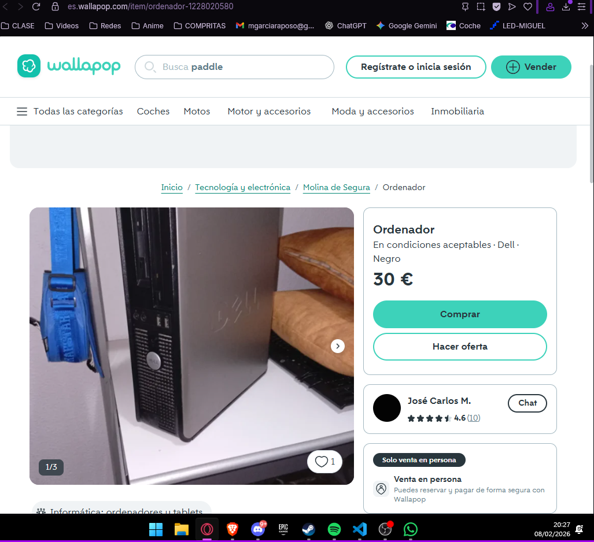
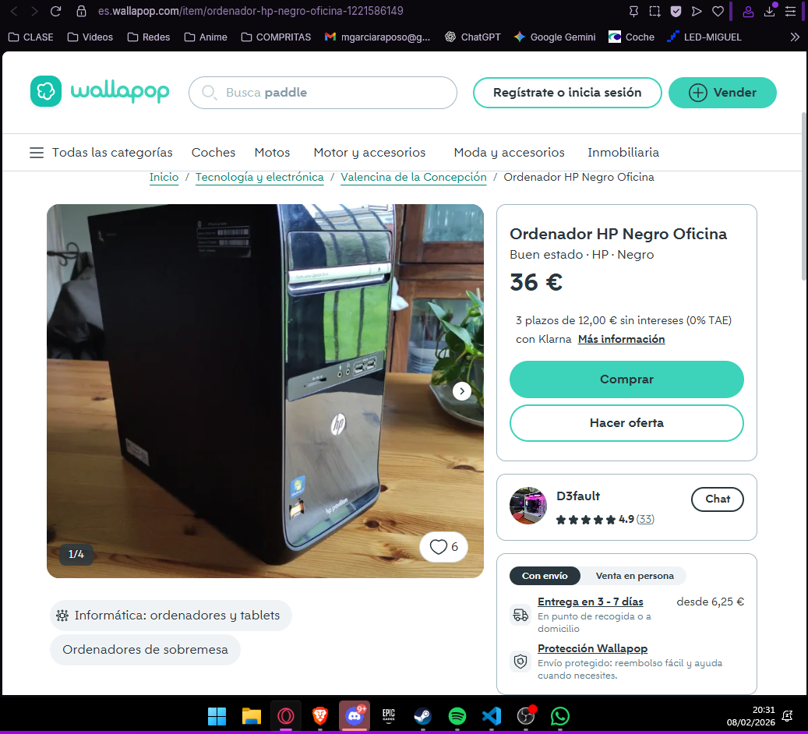
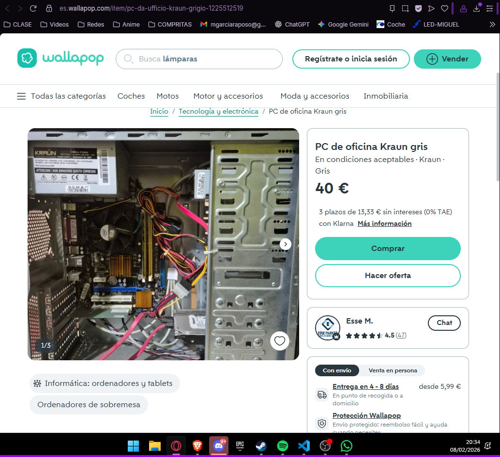

# 65 — Análisis de mercado y PVP

## Comparables (3 mínimos)
| Plataforma | Enlace | Captura | Precio (€) | Especificación | Fecha/Hora |
|---|---|---|---:|---|---|
| Wallapop  |https://es.wallapop.com/item/ordenador-1228020580   |   | 30  |Ordenador de sobremesa para oficina. Sus especificaciones son: Intel Core 2 Duo E7300 2 cores x 2.6Ghz Memoria RAM 2048MB DDR2 667MHz 160 GB SATA Regrabadora DVD±RW Interna Tarjeta de red Broadcom 5787 Gigabit 100/1000MB   | 2026‑02‑08 20:30  |
| Wallapop  | https://es.wallapop.com/item/ordenador-hp-negro-oficina-1221586149  |   | 36  |Ordenador de sobremesa sencillo HP en color negro, ideal para tareas de ofimática. -Lectora de discos DVD -Mantenimiento realizado recientemente -Windows 10 recién instalado -Desperfectos estéticos visibles en las dos últimas imágenes | 2026‑02‑08 20:30  |
| Wallapop  | https://es.wallapop.com/item/pc-da-ufficio-kraun-grigio-1225512519  |   | 40  |Un ordenador de escritorio para la oficina. - Alimentador Kraun. - Tarjeta madre. - Disco duro. - Caja gris| 2026‑02‑08 20:30  |

## PVP objetivo
- Media precios comparables: 35 €  
- Margen de competitividad: 0 %  
- **PVP objetivo:** 35 €
