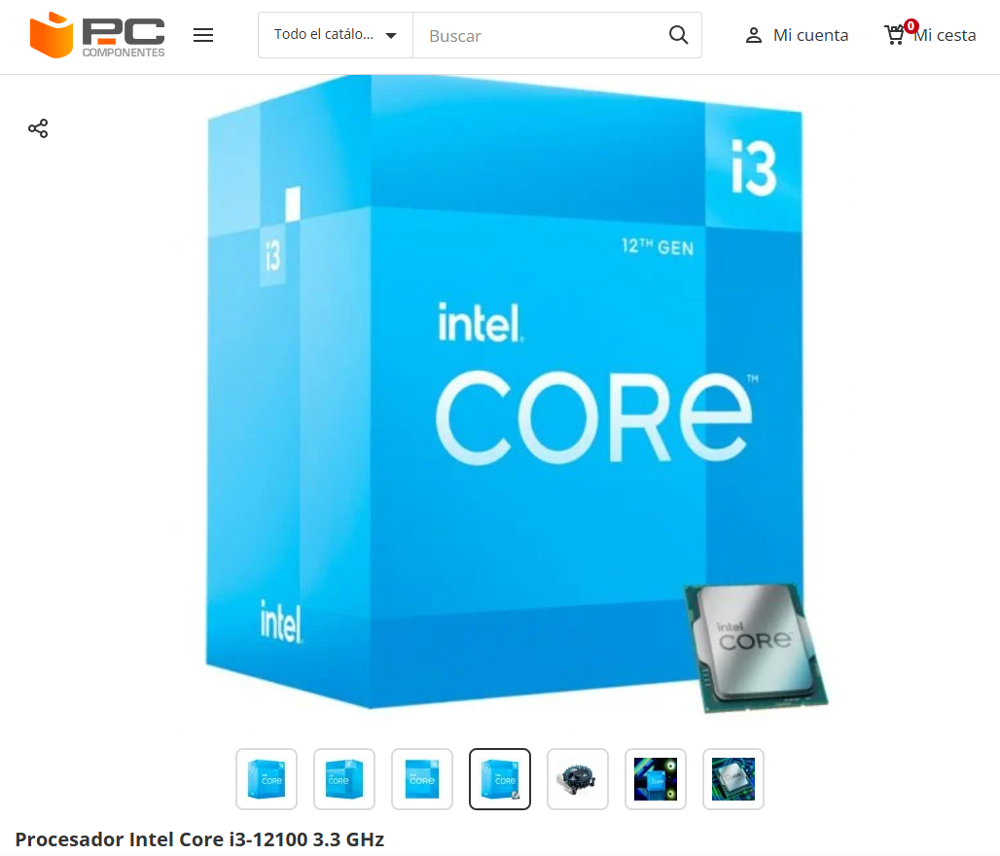
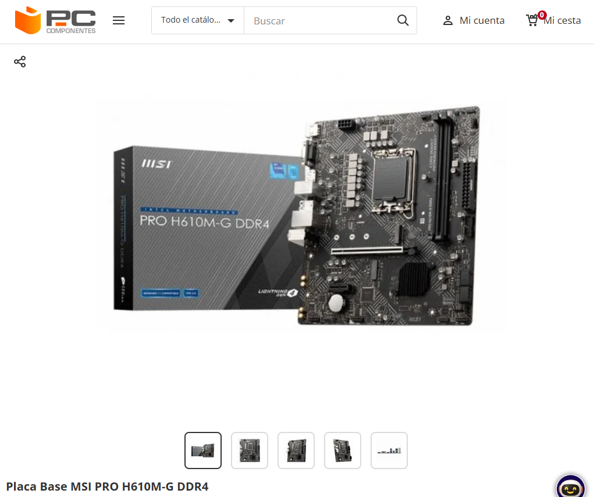
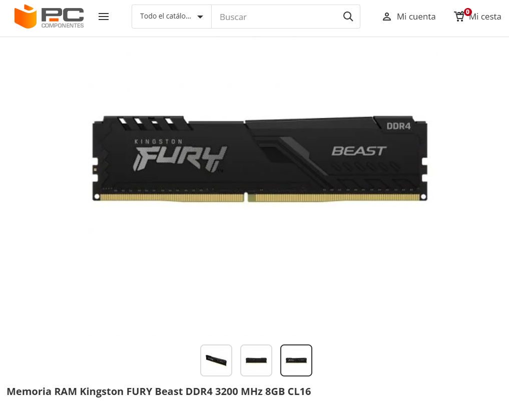
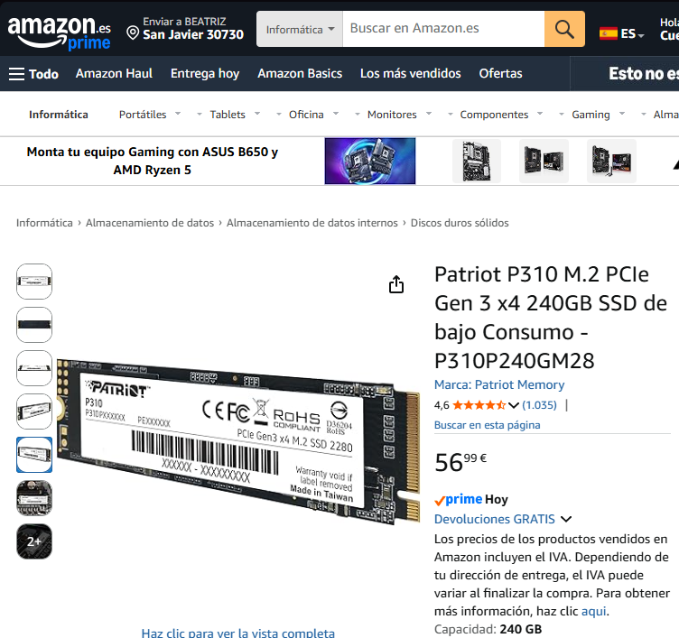
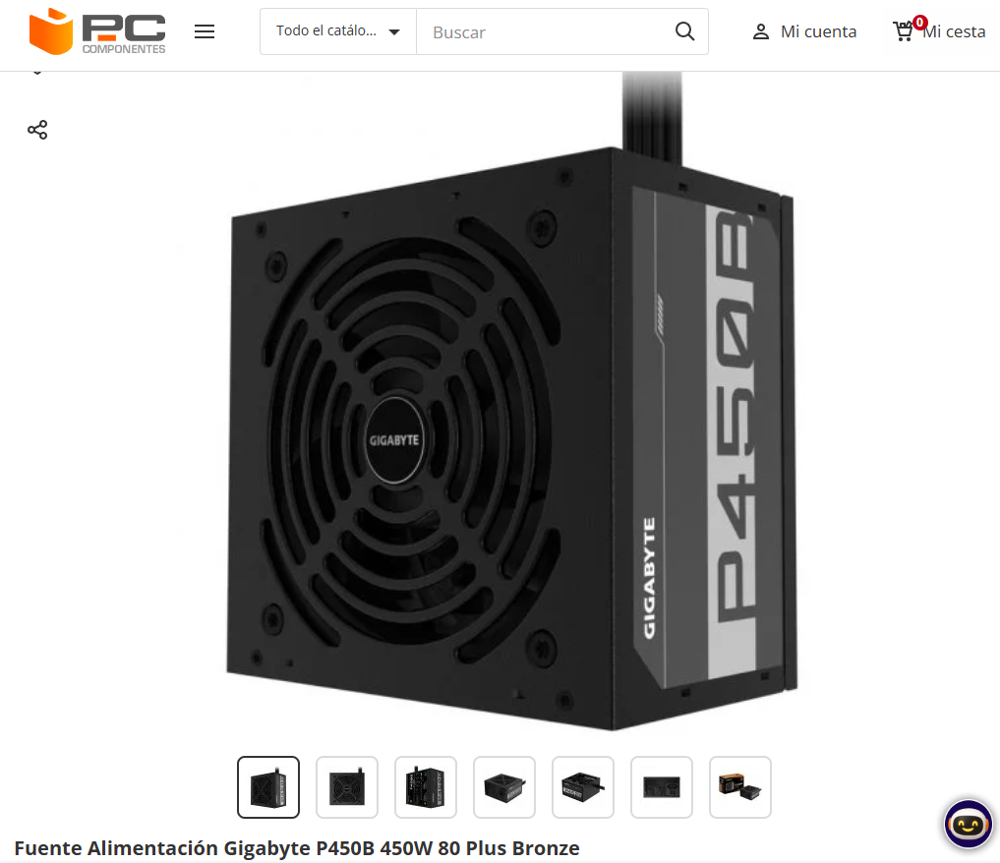
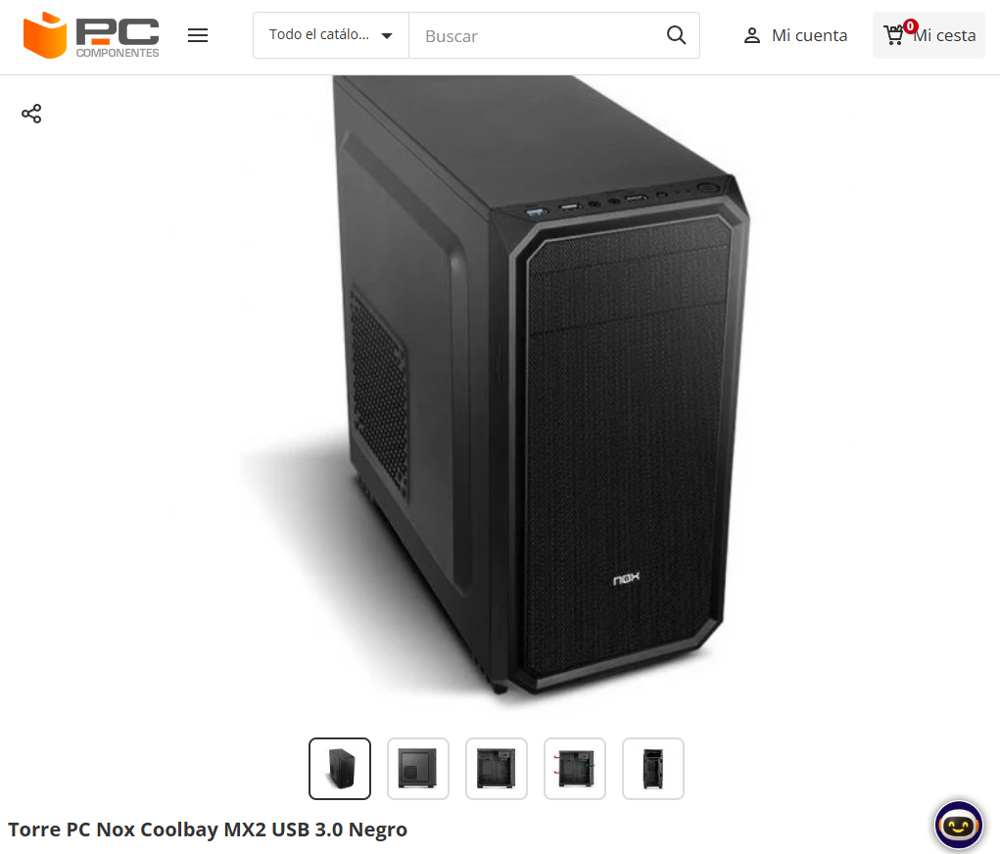

# Reto 03 (UT3)

## 1) Portada

- **Módulo:** Fundamentos de Hardware (FHW)
- **Unidad:** UT3
- **Reto:** 03 — PC de oficina low-cost + Mini PC
- **Alumno/a:** Miguel Raposo García
- **Curso/Grupo:** 1º ASIR — 1º
- **Fecha:** 20/02/2026

## 2) Opción A — PC por piezas (PASO 1–7)

> Objetivo: **oficina**, precio ajustado y componentes razonables.

## PASO 1 — CPU con gráficos integrados

**Componente elegido:**  Intel Core i3-12100 3.3 GHz

- **Marca y modelo:**  Intel Core i3-12100
- **Precio (€):** 158,99€
- **URL tienda:**  https://www.pccomponentes.com/intel-core-i3-12100-33-ghz?srsltid=AfmBOoqvCjgVM_VrjN1GQjCJnp3KAUmAot8CDU8VY7G_ablPrVmNkWir

**Ficha técnica oficial (obligatorio):**

- URL oficial (fabricante/estándar):  https://www.intel.la/content/www/xl/es/products/sku/134584/intel-core-i312100-processor-12m-cache-up-to-4-30-ghz/specifications.html

**Características principales (resumen):**

- Socket: LGA 1700
- P-core Base Frequency (GHz): 3.3
- Intel® Smart Cache (L3) Size: 12MB
- Processor Cores (P-cores + E-cores):  4 (4P+0E)
- Processor Threads: 8
- Maximum Memory Speed (MT/s): DDR5 4800 DDR4 3200
- CPU PCIe 5.0 Lanes: 16
- CPU PCIe 4.0 Lanes: 4
- Chipset Compatability: Intel® 600 Series Chipset
- Processor Graphics: Intel® UHD Graphics 730
- Memory Channels: 2
- Maximum Memory Capacity: 128GB
- Processor Base Power (W): 65

**Justificación (oficina):**
Este procesador Intel es la mejor opción para oficina gracias a que intel ofrece un potente rendimiento mononúcleo, además muchos de los programas usados en utilizan uno o dos núcleos pensando que este procesador ofrece 4 núcleos es mucho más que suficiente. Además gracias a los gráficos integrados se podrán agilizar tareas como la decodificación de video o simplemente agilizar Windows. Por último, en cuanto a su relación calidad precio, esta es excelente gracias a su gran precio, además en comparación con el equivalente de AMD, saldría más caro.

**Compatibilidad (obligatorio, con enlaces):**

- Compatibilidad clave 1:  Socket compatible, LGA 1700
  - Evidencia (URL):  https://www.intel.la/content/www/xl/es/products/sku/134584/intel-core-i312100-processor-12m-cache-up-to-4-30-ghz/specifications.html
- Compatibilidad clave 2:  Máxima velocidad de memoria (MT/s): DDR5 4800 DDR4 3200
  - Evidencia (URL):  https://www.pccomponentes.com/intel-core-i3-12100-33-ghz?srsltid=AfmBOoqvCjgVM_VrjN1GQjCJnp3KAUmAot8CDU8VY7G_ablPrVmNkWir

**Captura (opcional si tu profe lo exige):**

## PASO 2 — Placa base compatible

**Componente elegido:** MSI PRO H610M-G DDR4

- **Marca y modelo:** MSI PRO H610M-G
- **Precio (€):**  73,99€
- **URL tienda:**  https://www.pccomponentes.com/msi-pro-h610m-g-ddr4?s_kwcid=AL!14405!3!!!!x!!&gad_source=1&gad_campaignid=22157318807&gclid=Cj0KCQiAhtvMBhDBARIsAL26pjH_d2AtYqhedEdlw12-XIibXHVSjS_T_MbXMjtM2hFdqKZlIHUjcGgaAobbEALw_wcB

**Ficha técnica oficial (obligatorio):**

- URL oficial (fabricante/estándar):  https://es.msi.com/Motherboard/PRO-H610M-G-DDR4/Overview

**Características principales (resumen):**

- (Ej.: núcleos/hilos, frecuencia, DDR4/DDR5, capacidad, formato, certificación 80+, etc.)
- Procesador
  - Socket de procesador: LGA 1700
  - Procesador compatible: Intel® Core™ i9
- Memoria
  - Tipos de memoria compatibles: DDR4-SDRAM
  - Número de ranuras de memoria: 2
  - Velocidades máxima: 3200 MHz
  - Memoria interna máxima: 64 GB
- Reguladores del almacenaje
  - Interfaces de disco de almacenamiento soportados: M.2,SATA III
- Gráficos
  - Soporte para proceso paralelo: No compatible
  - Versión DirectX: 12.0
- Panel trasero puertos de I/O
  - Cantidad de puertos USB 2.0: 2
  - Cantidad de puertos tipo A USB 3.2 Gen 1 (3.1 Gen 1): 2
  - Cantidad de puertos tipo A USB 3.2 Gen 2 (3.1 Gen 2): 2
  - Ethernet LAN (RJ-45) cantidad de puertos: 1
  - Cantidad de puertos VGA (D-Sub): 1
  - Número de puertos HDMI: 1
  - Cantidad de DisplayPorts: 1
- Características
  - Chipset: Intel H610
  - Chip de sonido: Realtek ALC897
  - Factor de forma: micro ATX
  - Sistema operativo Windows soportado: Windows 10,Windows 11
- Peso y dimensiones
  - Ancho: 236 mm
  - Profundidad: 202 mm

**Justificación (oficina):**
Esta es una gran opción gracias a su bajo precio, al ser el modelo DDR4, nos permite utilizar RAM más barata pero igual de funcional ya que no buscamos tanta velocidadad. Tiene salidas tanto HDMI y DiplayPort para monitores más actuales, como VGA para los más antiguos. Por último, al ser Micro-ATX se reduce el costo en el chasis.

**Compatibilidad (obligatorio, con enlaces):**

- Compatibilidad clave 1 : Socket soportado: LGA 1700
  - Evidencia (URL):  https://es.msi.com/Motherboard/PRO-H610M-G-DDR4/Overview
- Compatibilidad clave 2:  Soporta memoria RAM DDR4
  - Evidencia (URL):  https://es.msi.com/Motherboard/PRO-H610M-G-DDR4/Overview

**Captura (opcional si tu profe lo exige):**

## PASO 3 — Memoria RAM (mínimo 8 GB)

**Componente elegido:** Goodram IRDM Pro DDR4 3600MHz 8GB CL18

- **Marca y modelo:**  Goodram IRDM Pro DDR4
- **Precio (€):** 82,95€
- **URL tienda:**  https://www.pccomponentes.com/goodram-irdm-pro-ddr4-3600mhz-8gb-cl18

**Ficha técnica oficial (obligatorio):**

- URL oficial (fabricante/estándar):  https://www.goodram.com/es/productos/irdm-pro-ddr4-deep-black/

**Características principales (resumen):**

- Capacidad 8 GB
- Frecuencia(s) memoria DDR4 3600 MHz
- Número de módulos de memoria 1
- CAS Latency 18

**Justificación (oficina):**
Está es muy buena opción ya que se aprovecha al máximo la velocidad que soporta la placa base, aunque hay algo de cuello de botella. También se elige por su baja latencia CL18. Por último, al ser solo una de 8GB se puede ampliar a futuro si fuera necesario ya que aún queda otro zócalo vacio.
**Compatibilidad (obligatorio, con enlaces):**

- Compatibilidad clave 1 : DDR4
  - Evidencia (URL):  https://www.goodram.com/es/productos/irdm-pro-ddr4-deep-black/
- Compatibilidad clave 2:  Frecuencia de 3600 MHz
  - Evidencia (URL):  https://www.goodram.com/es/productos/irdm-pro-ddr4-deep-black/

**Captura (opcional si tu profe lo exige):**

## PASO 4 — Almacenamiento (SSD)

**Componente elegido:** Patriot P310 M.2 PCIe Gen 3 x4 240GB SSD

- **Marca y modelo:**  Patriot P310 M.2 PCIe Gen 3 x4 240GB SSD
- **Precio (€):**  56,99€
- **URL tienda:**  https://www.amazon.es/Patriot-P310-PCIe-240GB-Consumo/dp/B09KY7PMCS/ref=asc_df_B09KY7PMCS?mcid=0461745d23c33311bdaad47c81063f0c&tag=googshopes-21&linkCode=df0&hvadid=699858699962&hvpos=&hvnetw=g&hvrand=6036154613346416529&hvpone=&hvptwo=&hvqmt=&hvdev=c&hvdvcmdl=&hvlocint=&hvlocphy=9208723&hvtargid=pla-1667599466084&hvocijid=6036154613346416529-B09KY7PMCS-&hvexpln=0&th=1

**Ficha técnica oficial (obligatorio):**

- URL oficial (fabricante/estándar):  https://content.ekatalog.biz/katalog/20505071/P310P240GM28.pdf

**Características principales (resumen):**

- Capacidad de almacenamiento digital: 240 GB
- Tecnología de conectividad: NVMe PCIe M.2 Gen3 x 4
- Factor de forma del disco duro: 2,5 Pulgadas

**Justificación (oficina):**
Esta opción es realmente buena ya que su velocidad es la justa para la placa base ya que esta soporta hasta PCIe 3.0 x4, evitando así el cuello de botella. Además he elegido 240GB ya que me parece lo mínimo para un oficinista, aunque gran parte de los documentos se guarden en la nube, Windows se reserva mucho espacio para el mismo, además de luego lo que ocupen todas las aplicaciones de ofimática.
**Compatibilidad (obligatorio, con enlaces):**

- Compatibilidad clave 1 :  PCIe Gen3 x 4
  - Evidencia (URL):  https://content.ekatalog.biz/katalog/20505071/P310P240GM28.pdf
- Compatibilidad clave 2:  M.2
  - Evidencia (URL):  https://content.ekatalog.biz/katalog/20505071/P310P240GM28.pdf

**Captura (opcional si tu profe lo exige):**

## PASO 5 — Fuente (PSU)

**Componente elegido:**  Gigabyte P450B 450W 80 Plus Bronze

- **Marca y modelo:**  Gigabyte P450B 450W 80 Plus Bronze
- **Precio (€):**  51,03€
- **URL tienda:**  https://www.pccomponentes.com/gigabyte-p450b-450w-80-plus-bronze

**Ficha técnica oficial (obligatorio):**

- URL oficial (fabricante/estándar):  https://www.gigabyte.com/es/Power-Supply/GP-P450B

**Características principales (resumen):**

- Potencia total: 450 W
- 80 PLUS Bronze certified
- Factor de forma de fuente de alimentación (PSU): ATX
- Single +12V rail
- Protección OVP/OPP/SCP/UVP/OCP/OTP

**Justificación (oficina):**
Esta opción es perfecta ya que con los 450W va sobrado para lo que gastan los otros componentes, permitiendola trabajar a su mayor eficiencia. Además de poseer la certificación 80 Plus Bronce y varias protecciones como la OVP y OPP.
**Compatibilidad (obligatorio, con enlaces):**

- Compatibilidad clave 1: Conector principal ATX 24 pines
  - Evidencia (URL):  https://www.gigabyte.com/es/Power-Supply/GP-P450B
- Compatibilidad clave 2: Conector de la CPU EPS 8 pines
  - Evidencia (URL):  https://www.gigabyte.com/es/Power-Supply/GP-P450B

**Captura (opcional si tu profe lo exige):**

## PASO 6 — Chasis

**Componente elegido:**  Nox Coolbay MX2

- **Marca y modelo:**  Nox Coolbay MX2 USB 3.0 Negro
- **Precio (€):**  27,99€
- **URL tienda:**  https://www.pccomponentes.com/nox-coolbay-mx2-usb-30-negro?_gl=1*1105x1i*_up*MQ..*_gs*MQ..&gclid=Cj0KCQiAqeDMBhDcARIsAJEbU9RIQRLdAlEGO17VBMbi37a5EqyKNalC8uMHr4nucxA46Va_NpDacCsaAvuuEALw_wcB

**Ficha técnica oficial (obligatorio):**

- URL oficial (fabricante/estándar):  https://www.nox-xtreme.com/cajas/coolbay-mx2

**Características principales (resumen):**

- Tipo Mini torre
- Placa base Micro ATX
- Sistema ventilación (incluido) • Frontal: 1x 120 mm
- Sistema ventilación (opcional)
  - Trasero: 1x 120 mm (no incluido)
  - Lateral: 1x 120/140 mm (no incluido)
- Opciones refrigeración líquida
  - Frontal: 120/240 mm
  - Trasero: 120 mm
- Bahías
  - Externas: 1x 5.25"
  - Internas: 2x 3.5"; 2x 2.5"
- Slots de expansión 4
  - 1x USb 3.0
  - 2 x USB 2.0
  - Hd Audio
  - Mic
  - Lector de tarjetas: SD/micro SD
- Dimensiones 198 x 396 x 400 mm (an x al x pr)
- Peso 2.4 Kg
  **Justificación (oficina):**
  Esta es la mejor opción ya que cabe justo la placa base micro-ATX, como tambíen la fuente de alimnetación ATX, y todo por un precio bajo. También posee varios puertos USB, y un lector de tarjetas SD muy util.
  **Compatibilidad (obligatorio, con enlaces):**
- Compatibilidad clave 1:  Placa base Micro ATX
  - Evidencia (URL):  https://www.nox-xtreme.com/cajas/coolbay-mx2
- Compatibilidad clave 2: fuente de alimentación estándar ATX
  - Evidencia (URL):  https://www.pccomponentes.com/nox-coolbay-mx2-usb-30-negro?_gl=1*1105x1i*_up*MQ..*_gs*MQ..&gclid=Cj0KCQiAqeDMBhDcARIsAJEbU9RIQRLdAlEGO17VBMbi37a5EqyKNalC8uMHr4nucxA46Va_NpDacCsaAvuuEALw_wcB

**Captura (opcional si tu profe lo exige):**

## PASO 7 — Presupuesto final

- Suma total de la Opción A (por piezas).
- Justifica si priorizas precio, consumo o posibilidad de ampliación.
- Incluye una mini tabla resumen.

He priorizado el precio principalmente y hay posibilidad de ampliación en la RAM para ponerle un modulo más y así ampliarlo hasta los 16GB o incluirle alguna tarjeta de expansión.

| Componente | Modelo                                   | Precio (€) | URL tienda                                                                                                                                                                                                                                                                                                                                                                           |
| ------------ | ------------------------------------------ | ------------: | -------------------------------------------------------------------------------------------------------------------------------------------------------------------------------------------------------------------------------------------------------------------------------------------------------------------------------------------------------------------------------------- |
| CPU        | Intel Core i3-12100 3.3 GHz              |      158,99 | https://www.pccomponentes.com/intel-core-i3-12100-33-ghz?srsltid=AfmBOoqvCjgVM_VrjN1GQjCJnp3KAUmAot8CDU8VY7G_ablPrVmNkWir                                                                                                                                                                                                                                                            |
| Placa base | MSI PRO H610M-G DDR4                     |       73,99 | https://www.pccomponentes.com/msi-pro-h610m-g-ddr4?s_kwcid=AL!14405!3!!!!x!!&gad_source=1&gad_campaignid=22157318807&gclid=Cj0KCQiAhtvMBhDBARIsAL26pjH_d2AtYqhedEdlw12-XIibXHVSjS_T_MbXMjtM2hFdqKZlIHUjcGgaAobbEALw_wcB                                                                                                                                                              |
| RAM        | Goodram IRDM Pro DDR4                    |       64,90 | https://www.pccomponentes.com/goodram-irdm-pro-ddr4-3600mhz-8gb-cl18                                                                                                                                                                                                                                                                                                                 |
| SSD        | Patriot P310 M.2 PCIe Gen 3 x4 240GB SSD |       56,99 | https://www.amazon.es/Patriot-P310-PCIe-240GB-Consumo/dp/B09KY7PMCS/ref=asc_df_B09KY7PMCS?mcid=0461745d23c33311bdaad47c81063f0c&tag=googshopes-21&linkCode=df0&hvadid=699858699962&hvpos=&hvnetw=g&hvrand=6036154613346416529&hvpone=&hvptwo=&hvqmt=&hvdev=c&hvdvcmdl=&hvlocint=&hvlocphy=9208723&hvtargid=pla-1667599466084&hvocijid=6036154613346416529-B09KY7PMCS-&hvexpln=0&th=1 |
| PSU        | Gigabyte P450B 450W 80 Plus Bronze       |       51,03 | https://www.pccomponentes.com/gigabyte-p450b-450w-80-plus-bronze                                                                                                                                                                                                                                                                                                                     |
| Chasis     | Nox Coolbay MX2                          |       27,99 | https://www.pccomponentes.com/nox-coolbay-mx2-usb-30-negro?_gl=1*1105x1i*_up*MQ..*_gs*MQ..&gclid=Cj0KCQiAqeDMBhDcARIsAJEbU9RIQRLdAlEGO17VBMbi37a5EqyKNalC8uMHr4nucxA46Va_NpDacCsaAvuuEALw_wcB                                                                                                                                                                                        |
| **TOTAL**  |                                          |  **433,89** |                                                                                                                                                                                                                                                                                                                                                                                      |

## 3) Opción B — Mini PC (PASO 8)

Elige **1 Mini PC** ya montado y complétalo con enlaces y justificación.

## PASO 8 — Mini PC

**Producto elegido:**  Beelink Mini S12 Intel N95/8GB/256GB SSD

- **Marca y modelo exacto:**  Beelink Mini S12 Intel N95/8GB/256GB SSD
- **Precio (€):**  269,00€
- **URL tienda:** https://www.amazon.es/Beelink-MINI-S12-procesador-computadora-Professional/dp/B0B81QKZ4R?th=1 (Más barato)
  - https://www.pccomponentes.com/mini-pc-beelink-mini-s12-intel-n95-8gb-256gb-ssd

**Ficha técnica oficial (obligatorio):**

- URL oficial del fabricante: https://manuals.plus/asin/B0C89TQ1YF.pdf

**Especificaciones:**

- CPU: Intel 12th Gen Alder Lake-N95 (4C/4T, 6M Cache, 1.7GHz a 3.4GHz)
- RAM: 8 GB
- SSD/almacenamiento: 256 GB
- Conectividad (Wi‑Fi/Ethernet/USB/vídeo):
  - 1x Bluetooth 4.2
  - 1x DC In
  - 4x USB 3.2
  - 2x HDMI 4K
  - 1x RJ45 1000 Mbps LAN
  - 1x micrófono de 3.5 mm 1x LED de encendido 1x reinicio
  - WiFi 5 (802.11ac) 5.8 GHz
  - Ethernet de 1000M
- Tamaño / consumo (si aparece en ficha):
  - Dimensiones: 11.5 x 10.2 x 3.9 cm

**Ventajas (mínimo 4):**

- Precio, el precio es menor al del PC por partes.
- Tamaño, el tamaño del producto le permite engancharse a la parte posterior de la pantalla o dejarlo en la mesa sin ocupar mucho espacio.
- Posee la capacidad de aumentar la RAM ya que tiene otra ranura para DDR4.
- Posee la capacidad de aumentar el almacenamiento ya que tiene otra ranura para un M.2 PCIe x1 y otra ranura para un SATA HDD/SDD de 2.5 pulgadas.

**Contras (mínimo 4):**

- Tiene menos potencia ya que los núcleos del procesador de este mini PC están pensados para que consuman poco mientras que los del i3-12100 tiene unos núcleos enfocados en la potencia. Por lo que para tareas pesadas o multitarea el mini PC puede llegar a ir más lento.
- Este mini PC no tiene Dual Channel mientras que el pc por partes si que lo tiene, por lo que la conexión entre la RAM y la CPU, la velocidad va a ser el doble de rápida.
- El PC por piezas tiene la posibilidad de añadirle una tarjeta gráfica o una tarjeta de expansión mientras que el mini PC no.
- El mini PC tiene un disipador muy pequeño por lo que si se está trabajando a máxima potencia mucho tiempo se calentará bastante.

**¿Para qué oficina SÍ / para qué NO?**

- Sí: Para todas las oficinas en las que se trabaja de manera liviana como recepción al cliente o para administrativos o becarios.
- No: Para todas las oficinas en las que se trabaja con multitarea, diseño gráfico, contabilidad y finanzas (Por los excel de muchas líneas)

**Compatibilidad/ampliación (con enlaces):**

- ¿Se puede ampliar RAM? evidencia:
- ¿Se puede ampliar SSD? evidencia:
- Conexiones de almacenamiento interno:
  - Ranura DDR4 x1
  - Ranura M.2 PCIe x1
  - Ranura SATA HDD/SSD de 2.5 pulgadas x1
    https://www.pccomponentes.com/mini-pc-beelink-mini-s12-intel-n95-8gb-256gb-ssd?srsltid=AfmBOorFktFje_9Y2eP-8KI1QTDT5CeKraUxZi2oPJFDu5l-m8J_kLbK

## Comparación rápida A vs B

| Aspecto                        | Opción A (por piezas)                                                   | Opción B (Mini PC)                                                                            |
| -------------------------------- | -------------------------------------------------------------------------- | ------------------------------------------------------------------------------------------------ |
| Precio total                   | 433,89€                                                                 | 269,00€                                                                                       |
| Rendimiento esperado (oficina) | Excelente, buena potencia y permite multitarea y mucha fluidez en Office | Suficiente, ideal para realizar una solo tarea, en multitarea muy lento                        |
| Ampliación (RAM/SSD)          | SI                                                                       | SI                                                                                             |
| Consumo/ruido/espacio          | ~150W / ruido leve por ventiladores / Mini Tower(medio)                  | ~15W / silencioso / muy poco espacio, posibilidad de colocarlo en el anclaje VESA tras monitor |
| Facilidad de despliegue        | Requiere montaje, gestión de cables e instalación de S.O. y drivers    | Viene montado, con S.O. preinstalado y listo para usar                                         |
| Garantía/soporte              | Por componentes (3 años)                                                | Equipo completo (2 años)                                                                      |

## 4) Checklist de compatibilidad

Piensa en esto como un **“enchufe y llaves”**:

- El **socket** es la “cerradura” de la placa base.
- La **CPU** es la “llave”.
  Si no coincide, no entra.

Rellena con ✅ + enlaces de evidencia.

## Opción A (por piezas)

| Compatibilidad                                      | Evidencia (enlace)                                                                                                                                                                              | OK |
| ----------------------------------------------------- | ------------------------------------------------------------------------------------------------------------------------------------------------------------------------------------------------- | :--: |
| CPU ↔ Placa base (socket/chipset soportado)        | https://www.intel.la/content/www/xl/es/products/sku/134584/intel-core-i312100-processor-12m-cache-up-to-4-30-ghz/specifications.html / https://es.msi.com/Motherboard/PRO-H610M-G-DDR4/Overview | ✅ |
| RAM ↔ Placa base (DDR4/DDR5, velocidad soportada)  | https://es.msi.com/Motherboard/PRO-H610M-G-DDR4/Overview /  https://www.goodram.com/es/productos/irdm-pro-ddr4-deep-black/                                                                      | ✅ |
| SSD ↔ Placa base (SATA o M.2; NVMe vs SATA)        | https://content.ekatalog.biz/katalog/20505071/P310P240GM28.pdf / https://es.msi.com/Motherboard/PRO-H610M-G-DDR4/Overview                                                                       | ✅ |
| PSU ↔ Placa base (24-pin ATX, EPS 8-pin si aplica) | https://es.msi.com/Motherboard/PRO-H610M-G-DDR4/Overview / https://www.gigabyte.com/es/Power-Supply/GP-P450B                                                                                    | ✅ |
| Chasis ↔ Placa base (ATX/mATX/ITX)                 | https://es.msi.com/Motherboard/PRO-H610M-G-DDR4/Overview / https://www.nox-xtreme.com/cajas/coolbay-mx2                                                                                         | ✅ |
| Chasis ↔ PSU (ATX/SFX/TFX)                         |                                                                                                                                                                                                 | ✅ |

## Opción B (Mini PC)

| Punto a verificar                          | Evidencia (enlace)                                                                                                                              | OK |
| -------------------------------------------- | ------------------------------------------------------------------------------------------------------------------------------------------------- | :--: |
| RAM ampliable (sí/no, máximo)            | https://www.pccomponentes.com/mini-pc-beelink-mini-s12-intel-n95-8gb-256gb-ssd?srsltid=AfmBOorFktFje_9Y2eP-8KI1QTDT5CeKraUxZi2oPJFDu5l-m8J_kLbK | ✅ |
| SSD ampliable (sí/no, M.2/SATA)           | https://www.pccomponentes.com/mini-pc-beelink-mini-s12-intel-n95-8gb-256gb-ssd?srsltid=AfmBOorFktFje_9Y2eP-8KI1QTDT5CeKraUxZi2oPJFDu5l-m8J_kLbK | ✅ |
| Conectividad (Wi‑Fi/Ethernet/USB/HDMI/DP) | https://www.pccomponentes.com/mini-pc-beelink-mini-s12-intel-n95-8gb-256gb-ssd?srsltid=AfmBOorFktFje_9Y2eP-8KI1QTDT5CeKraUxZi2oPJFDu5l-m8J_kLbK | ✅ |

## 5) Conclusión final

- ¿Qué opción elegirías para una oficina real y por qué?
  - Para una oficina en la que solo se va a utilizar Office y no se va ha realizar mucha multitarea compraría la opción del mini PC ya que tiene un gran precio y capacidad de mejora en la que se puede invertir gracias a su precio.
  - Para una oficina en la que se vaya a realizar multitarea o trabajar con excel o documentos gigantes si que me decantaría por la opción del PC por partes ya que permitirá una mejor velocidad y se le podría añadir algún componente más si fuera necesario. Aunque para ello habría que tener un buen presupuesto.
- ¿Qué has aprendido sobre **compatibilidad**?
  - Es muy importante fijarse bien en todos los componentes porque puede darse el caso de que haya incompatibilidad o que se forme algún cuello de botella debido a que escoges un componente mejor que lo que tu placa base puede soportar.
