# Ejercicio 2: Preparación y Software

## Activación de Windows

Tengo este repositorio que te trae una forma de activar Windows de manera totalmente gratuita y facil. También viene con la opción de descargar y activar Microsoft 365.

Página web: https://massgrave.dev
Repositorio: https://github.com/massgravel/Microsoft-Activation-Scripts

Ejecutamos la PowerShell como administradores y copiamos el primer código que aparece

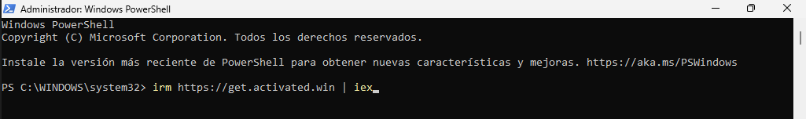

Para activar Windows solo hay que clicar el en 1 de nuestro teclado y se ejecutará un codigo pra activarlo de manera gratuita.

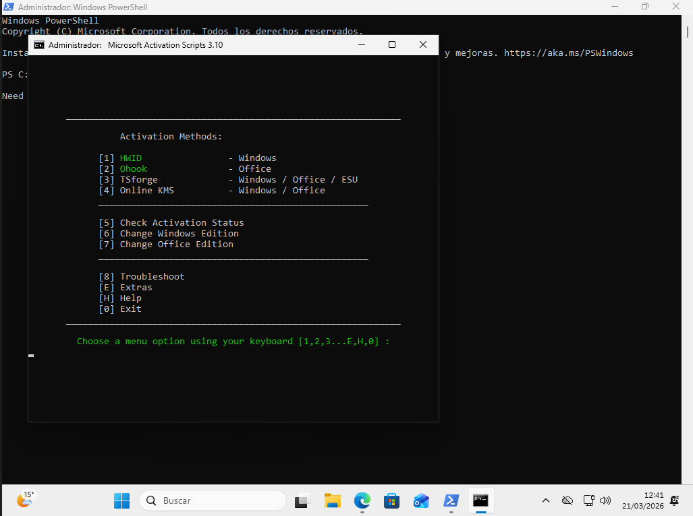
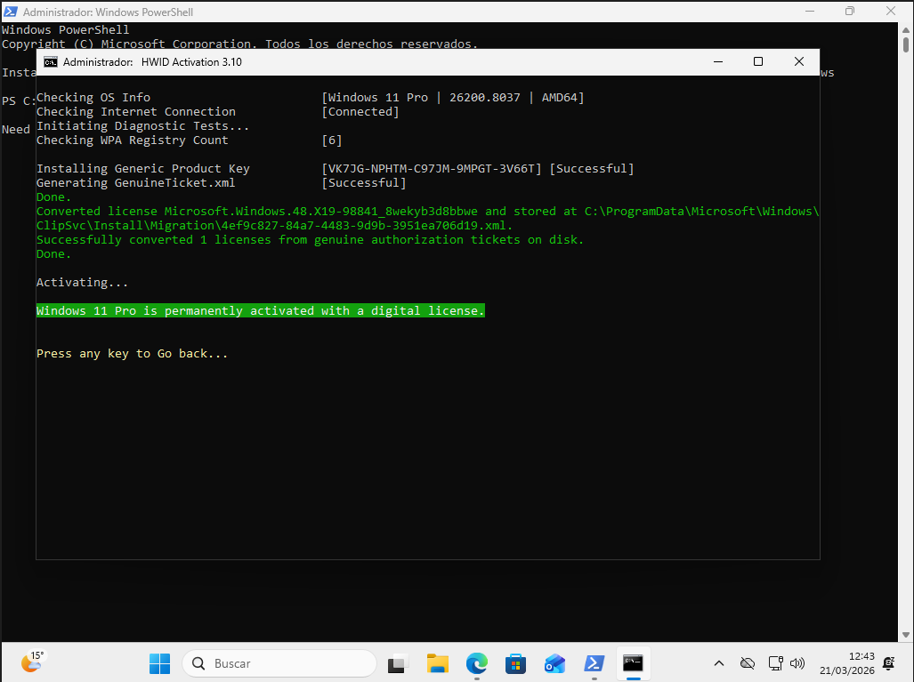
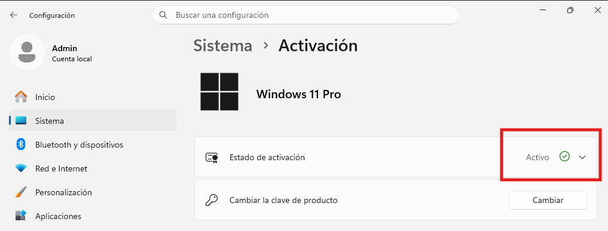

## Instalación de software

Para esto vamos a usar esta otra página la cual nos permite descargar todas los softwares que queramos de una unica vez, de manera muy sencilla. Además te da una explicación de cada software y está ordenado por categorías. También viene con una opción para quitar todas las opciones que vienen por defecto en Windows 11 que consumen mucha memoria para agilizar el ordenador.

Página web: https://christitus.com/windows-tool/

Ejecutamos la PowerShell como administrador y copiamos el primer código de la web y lko ejecutamos en la PowerShell. Esto nos abre una el servicio mencionado anteriormente.

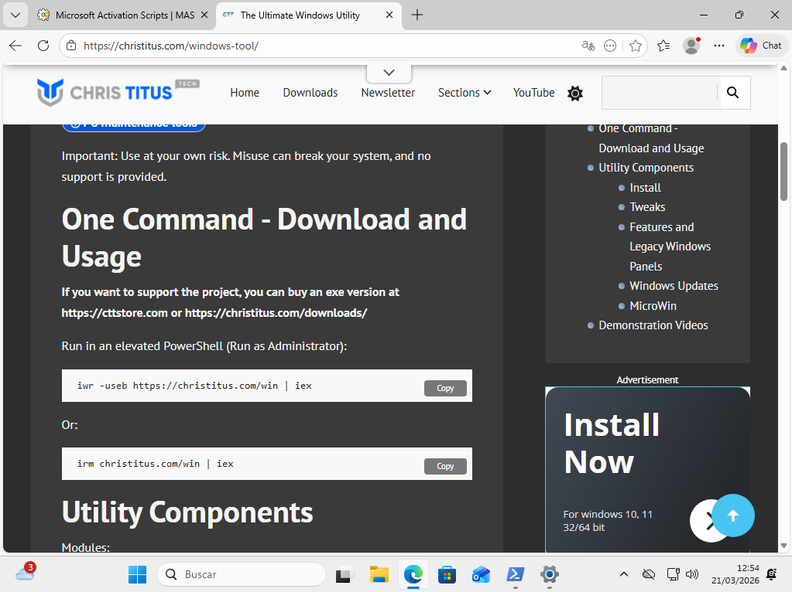
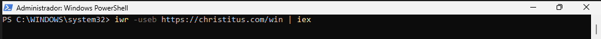
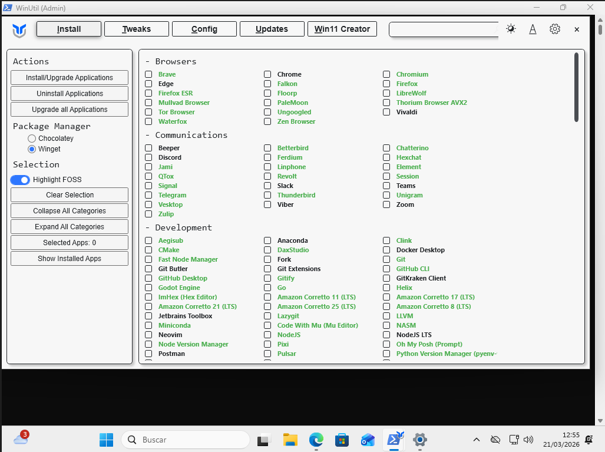

### Debloat Windows
Lo primero que voy a realizar es un debloat de Windows, para quitar muchas de las opciones que hacen que el sistemas vaya más lento y que no se utilizan. Como es el caso de la telemetría o los widgets. Solo selecciono esas casillas porque son las que no comprometen al sistemas, en "Advance Tweaks" hay opciones que comprometen al SO. Para ejecutarlo solo hay que darle a "Run Tweaks" abajo a la izquierda. En "Cuustomize Preference" he dejado seleccionadas esas ya que para un oficinista va a ser lo más comodo y visual.

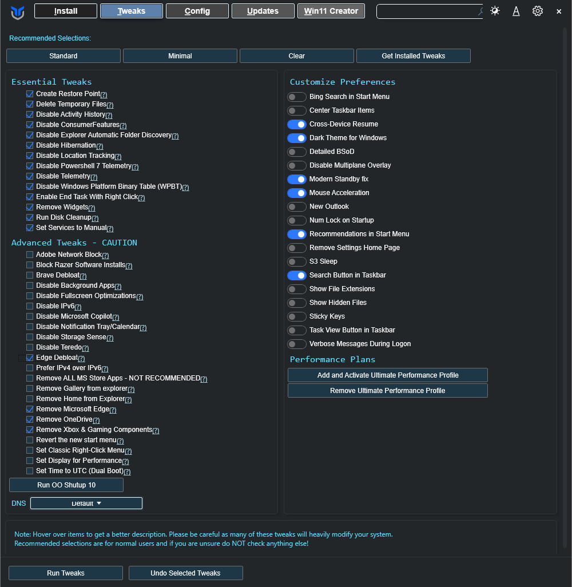

### Instalación de software

#### Navegador:

- **Nombre:** Chrome
- **Función:** Navegador web
- **Motivo:** Es un buen navegador web y te da facil acceso a las herramientas de Google con las que se va a trabajar.
- **Ventajas:** Buena velociada, simple para el trabajador e integración con los servicios de Google
- **Evidencia:** 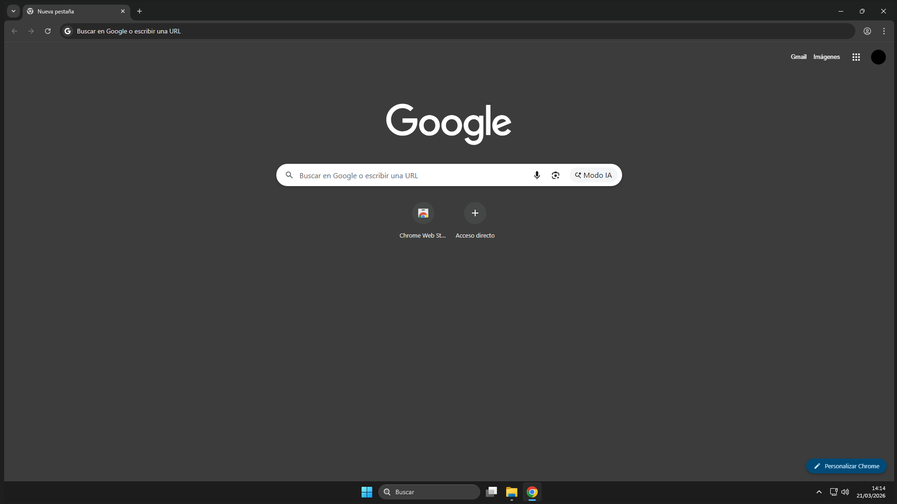

#### Utilidades básicas

- **Nombre:** Zoom
- **Función:** Video conferencias
- **Motivo:** Permite hacer video conferencias y presentar pantalla para explicar proyectos. Es una aplicación muy utilizada en oficina.
- **Ventajas:** Permite presentar pantalla para conferencias o proyectos colaborativos.
- **Evidencia:** 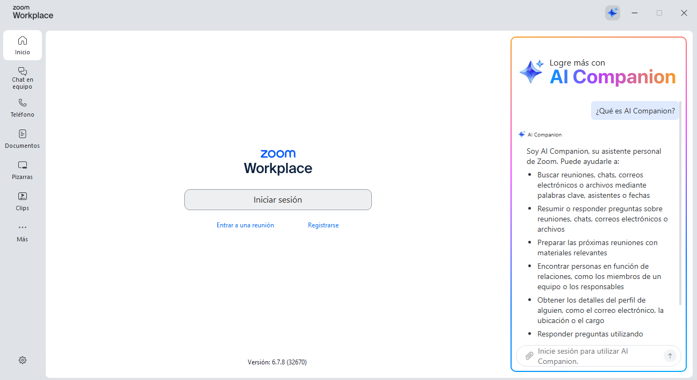

- **Nombre:** Telegram
- **Función:** App de mensajería
- **Motivo:** Para consultar los mensajes desde el ordenador, esta aplicación es muy utilizada.
- **Ventajas:** Buena seguridad, velocidad y simplicidad
- **Evidencia:** 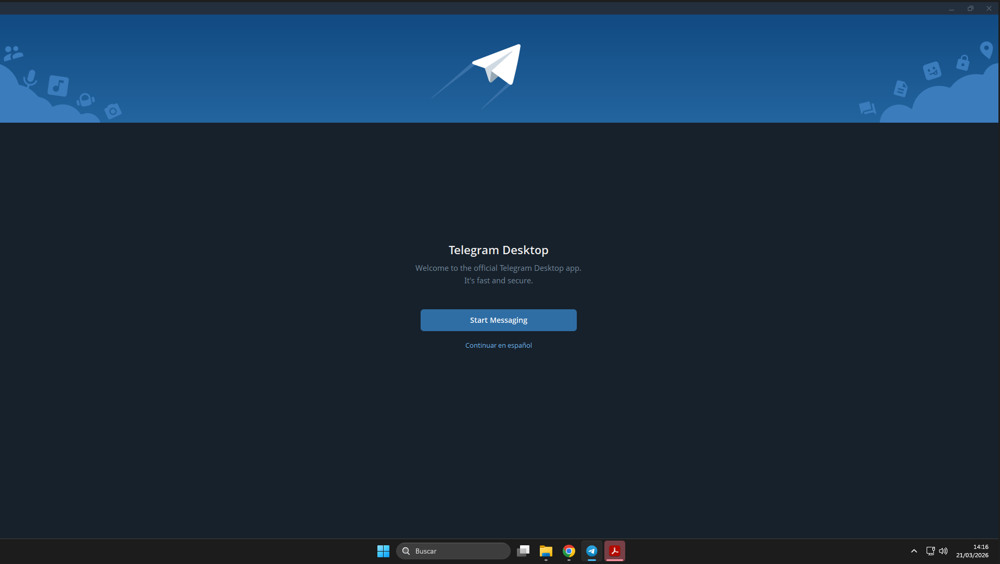

- **Nombre:** Adobe Acrobat Reader
- **Función:** Visualizador de PDF
- **Motivo:** Es un buen visualizador de PDF, los cuales son muy usados en la documentación de las empresas.
- **Ventajas:** Buen visualizador e impresor de PDF, además de permitir anotación en estos mismos.
- **Evidencia:** 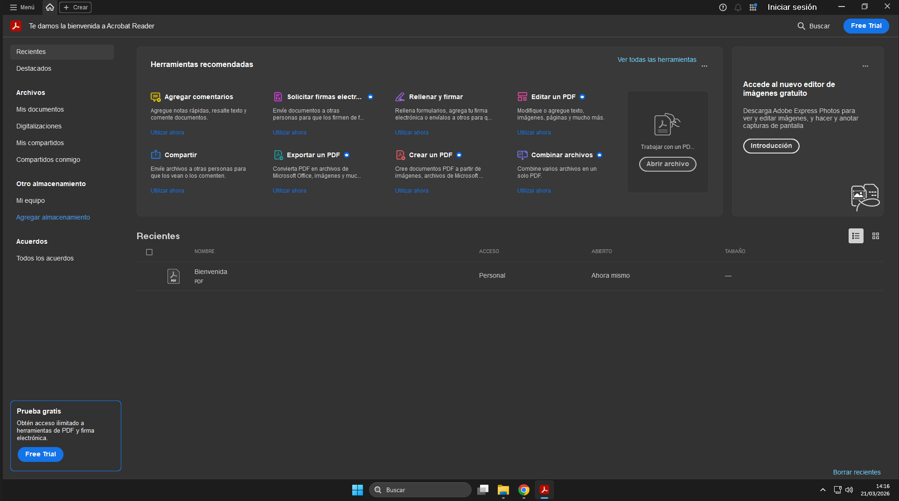

- **Nombre:** 7-Zip
- **Función:** Compresor de archivos open-source y gratuito
- **Motivo:** Es uno de los compresores de archivos más populares debido a su posibilidad de compresión en multiples formatos, con un alto ratio de compresión.
- **Ventajas:** Open-source y gratuito, alto ratio de compresión, cifrado empresarial, compresión en practicamente todos los formatos.
- **Evidencia:** 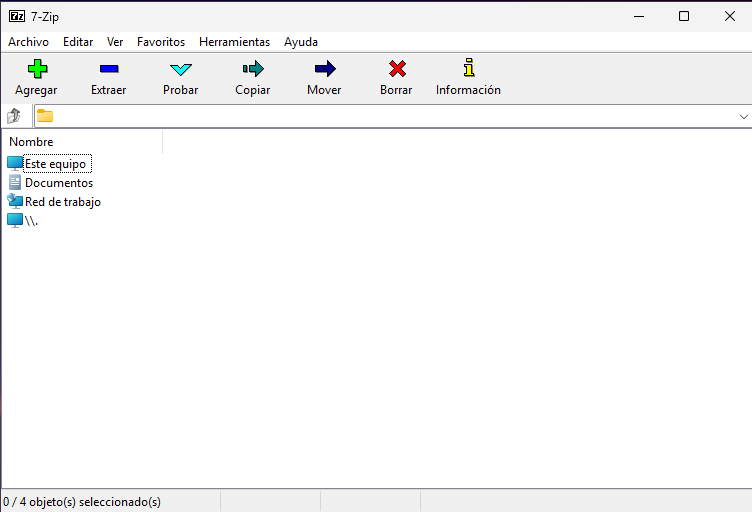

- **Nombre:** Google Drive
- **Función:** Guardado en la nube
- **Motivo:** Como se van a utilizar las herramientas de Google, lo mejor es tener Drive para guardar los archivos.
- **Ventajas:** Perfecta integración con las herramientas que se van a utilizar.
- **Evidencia:** 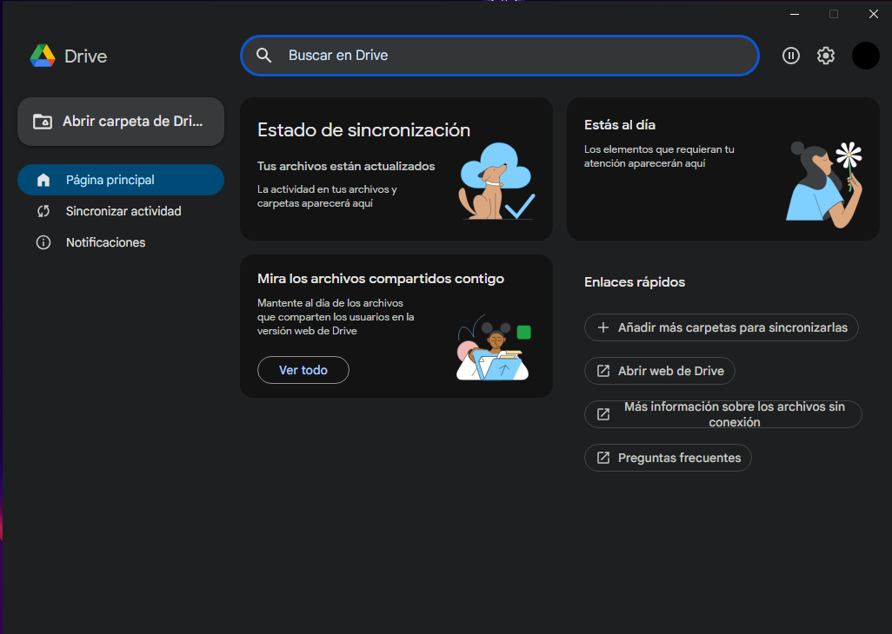

Por último, he añadido las Gmail, Docs, Sheets y Slides como aplicaciones para tener un acceso más comodo a ellas.

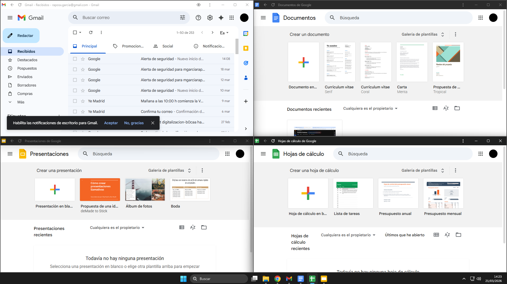

Esta es la vista final del escritorio. He puesto un fondo básico que no molesta a la vista y el tema en oscuro para que no canse tanto la vista.

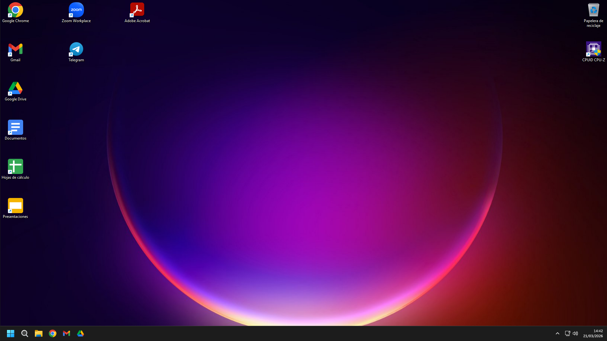
