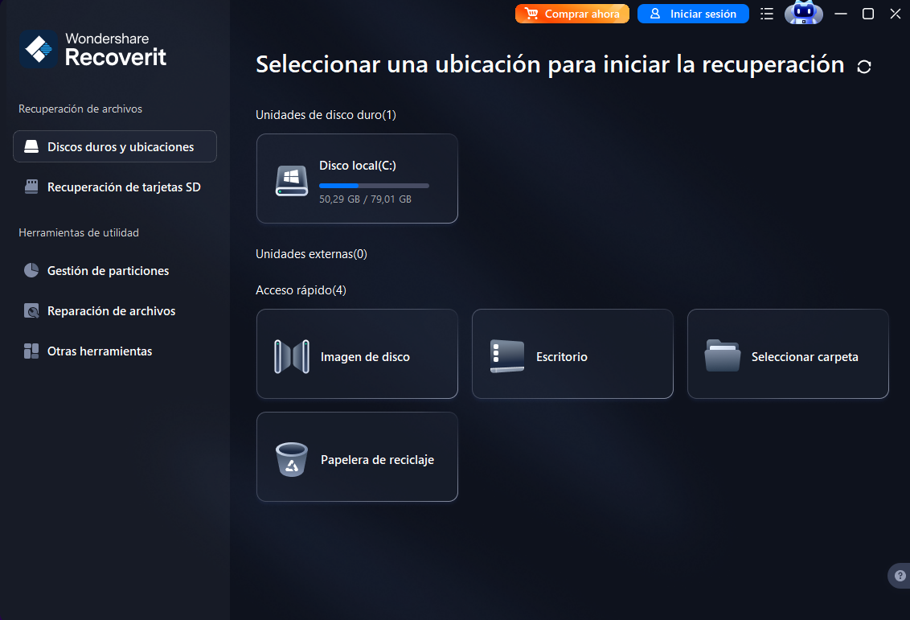
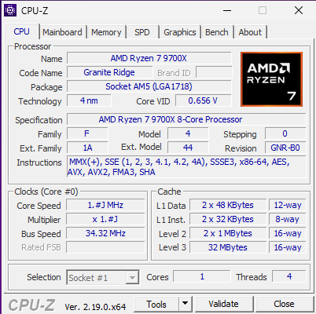
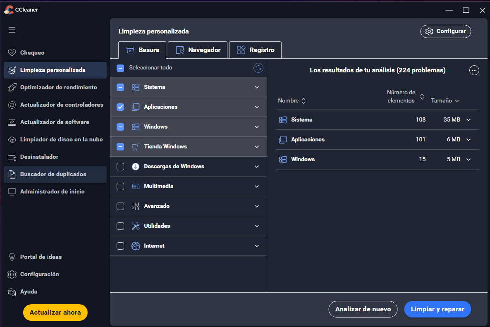
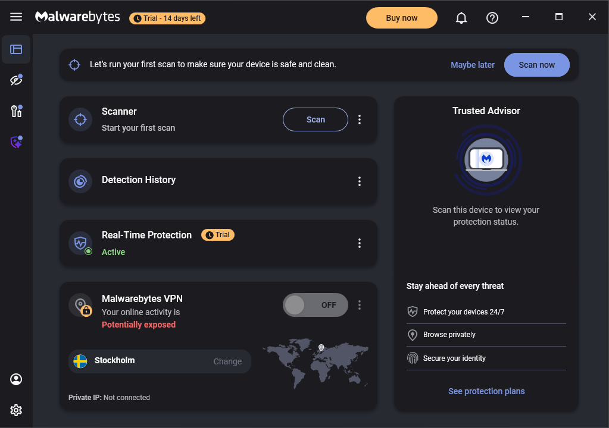
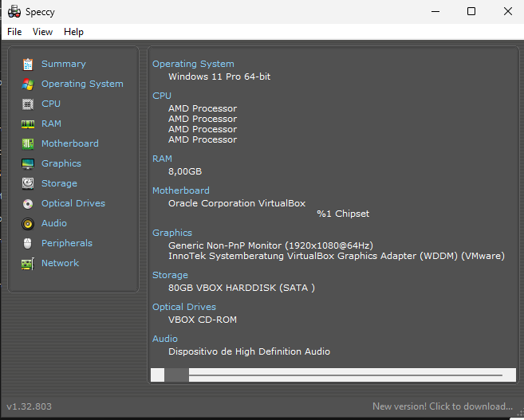
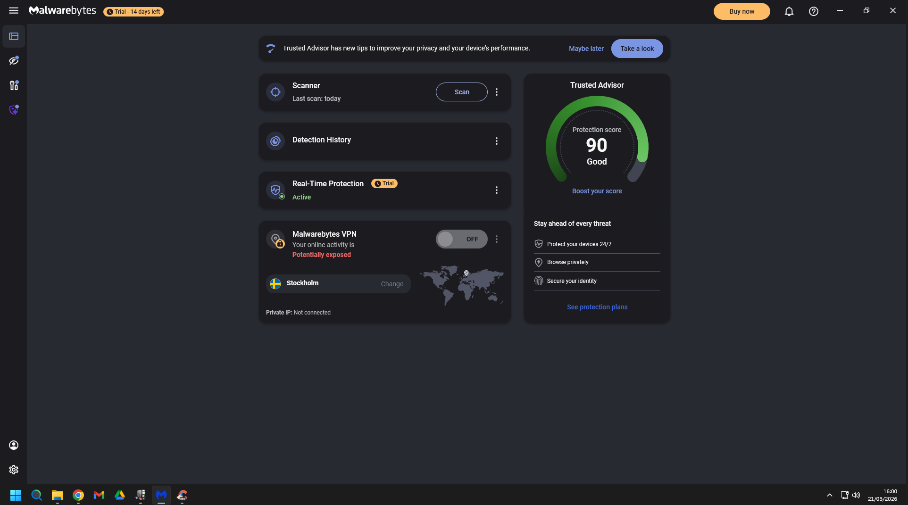
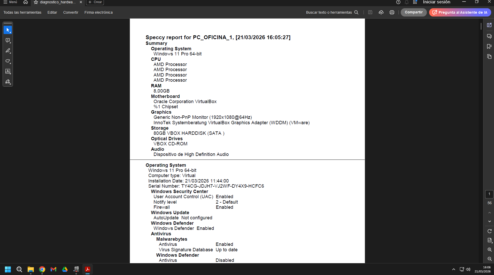
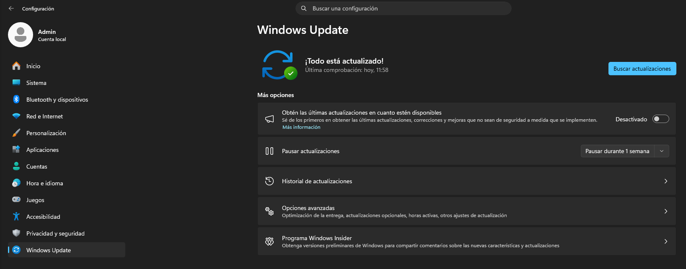
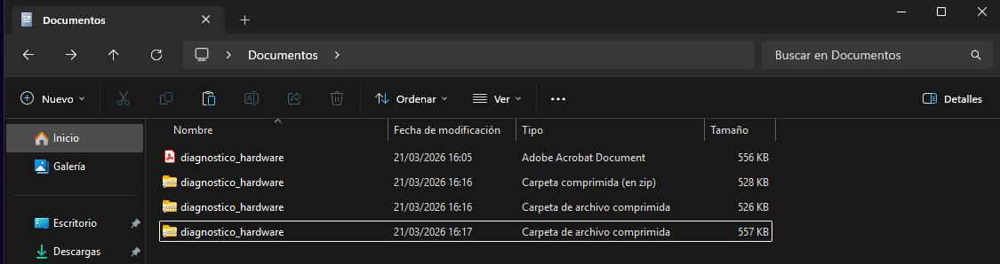

# Ejercicio 3: Seguridad y Pruebas

## Aplicaciones instaladas

Aplicaciones instaladas para comprobar la seguridad, mantenimiento y diagnóstico.

- **Nombre:** Recoverit
- **Función:** Recuperación de archivos borrados
- **Motivo:** Es una de las herramientas más conocidas y utilizadas  para recuperar archivos borrados en sistemas Windows.
- **Ventajas:** Se puede escanear discos duros, USB, SSD y SD o microSD. También tiene una versión portable.
- **Evidencia:** 

- **Nombre:** CPU-Z
- **Función:** Herramienta de diagnóstico, auditoría y monitorización de hardware.
- **Motivo:** Es un software gratuito y reconocido en el sector informático.
- **Ventajas:** Permite conocer las especificaciones físicas exactas del equipo sin necesidad de abrir la carcasa del ordenador. Permite diagnosticar cuellos de botella en el rendimiento.
- **Evidencia:** 

- **Nombre:** CCleaner (Versión gratis)
- **Función:** Herramienta de mantenimiento, limpieza de archivos temporales y optimización del sistema
- **Motivo:** Es una herramienta famosa y consolidada que permite la limpiar el cachés, historiales de todos los navegadores instalados y archivos residuales del sistema operativo.
- **Ventajas:** Ayuda a liberar espacio en el disco duro de forma rápida. Además, incluye herramientas muy prácticas para un técnico, como un gestor rápido de los programas que se inician con el sistema para mejorar los tiempos de arranque.
- **Evidencia:** 

- **Nombre:** Malwarebytes
- **Función:** Software antimalware
- **Motivo:** Es muy buena por su alta eficacia detectando amenazas modernas, especialmente ransomware, spyware y PUPs.
- **Ventajas:** Está diseñado para coexistir sin conflictos con Microsoft Defender. También, aporta una capa de seguridad extra mediante análisis exhaustivos bajo demanda, sin ralentizar el equipo.
- **Evidencia:** 

- **Nombre:** Speccy
- **Función:** Herramienta de auditoría de hardware y monitorización del sistema
- **Motivo:** Es un software de lectura rápida que muestra un resumen detallado de las especificaciones del equipo y su estado operativo en tiempo real.
- **Ventajas:** Permite al técnico revisar de un solo vistazo todos los componentes instalados en la máquina y monitorizar sensores como la temperatura. Es ideal para documentar el estado físico del equipo.
- **Evidencia:** 

## Comprobaciones

- Comprobación de seguridad

- Diagnostico de hardware: pdf del diagnostico entero en doc

- Windows actualizado

- Compresión de archivos

